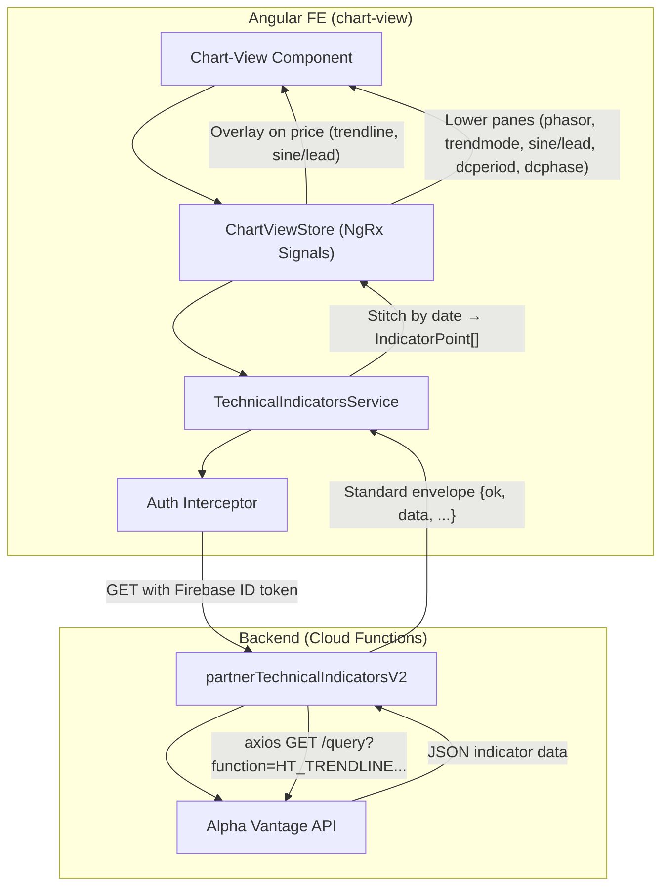

**Topic:** SA UI — AV Hilbert Transform Endpoint Integration  
**Issue:** #17  
**Domain:** AV-ENDPOINTS  
**Type:** PRD  
**Status:** Complete  
**Created:** 2026-08-15  
**Last Updated:** 2026-08-16  

---

# PRD: SA UI — AV Hilbert Transform Endpoint Integration

## Problem

The SA UI chart-view computes Hilbert Transform indicators client-side using a DSP approximation. The approximation's own code comment states: "Values here will be close but not identical. Sufficient for visual investigation — not for production signal generation."

The user is researching whether any of the 6 Hilbert Transform indicators are useful as filters for an existing signal generator that produces too many signals. This research requires **exact** Alpha Vantage values, not approximations. A deployed backend endpoint (`partnerTechnicalIndicatorsV2`) already returns exact AV values, but the UI is not wired to it.

## Solution

Wire the chart-view to call `partnerTechnicalIndicatorsV2` for all 6 Hilbert Transform indicators. The user toggles indicators on, the UI fetches exact values from the endpoint, stitches them to the chart's candle data by date, and plots them — either as overlays on the price chart or in dedicated lower panes. Multiple indicators can be displayed simultaneously. Cached in memory for the current symbol/interval session.

This is a **research tool**, not a production feature. The goal is visual inspection of indicator coincidence with swing highs/lows across multiple symbols over a ~1 month research period. No persistence, no analysis tooling, no signal filtering logic — just plot the exact AV values on the chart.

## User Stories

### US1: Toggle HT indicators on the chart

**As a researcher**, I can toggle any of the 6 Hilbert Transform indicators on/off on the chart, so I can visually inspect their coincidence with swing highs/lows.

**Acceptance criteria:**
- 6 toggle controls are visible in the chart-view UI: HT_TRENDLINE, HT_SINE, HT_DCPERIOD, HT_DCPHASE, HT_TRENDMODE, HT_PHASOR
- Toggling an indicator ON fetches data from `partnerTechnicalIndicatorsV2` and plots it
- Toggling an indicator OFF hides the plot but retains cached data (toggling back ON is instant, no refetch)
- Multiple indicators can be toggled ON simultaneously, each in its own pane or overlay
- While an indicator is fetching, a loading state is visible on its toggle
- If the fetch fails, a toast displays the AV error message (e.g., rate limit, upstream error)

**Indicator display locations:**

| Indicator | Display | Notes |
|-----------|---------|-------|
| HT_TRENDLINE | Overlay on price chart | Smoothed price line, same scale as price |
| HT_SINE | Lower pane, price overlay (dual y-axis), or both | User can choose; sine + lead sine plot together |
| HT_DCPERIOD | Lower pane | Cycle length in bars |
| HT_DCPHASE | Lower pane | Degrees 0-360 |
| HT_TRENDMODE | Lower pane (~50px tall) | Binary 0/1, short pane |
| HT_PHASOR | Lower pane | In-phase + Quadrature components together |

**Lower pane stacking order (top to bottom, below price chart):**
1. HT_PHASOR
2. HT_TRENDMODE (~50px)
3. HT_SINE (if displayed in lower pane, not overlay)
4. HT_DCPERIOD
5. HT_DCPHASE

**Layout constraint:** All panes (price + lower panes) must fit within the viewport. No vertical scrollbar to reach lower panes. The price chart has a max height (~50% of viewport); lower panes share the remaining space. Only toggled panes are rendered.

**Verification:** Toggle each indicator on a tracked symbol (e.g., IBM). Confirm each plots in the correct location (overlay or lower pane), panes stack in the specified order, and all fit within the viewport without a scrollbar.

### US2: Select price series for indicator computation

**As a researcher**, I can select which price series (open/high/low/close) the indicator is computed from, so I can test whether different price series produce better filter signals.

**Acceptance criteria:**
- A dropdown selector is visible in the chart-view UI with 4 options: Close (default), Open, High, Low
- Changing the selection re-fetches all currently-toggled indicators with the new `series_type` parameter
- The current selection is displayed and persists for the session (no page reload persistence needed)

**Verification:** Toggle HT_TRENDLINE with series_type=close, then switch to series_type=high. Confirm the plot changes (values differ).

### US3: HT_SINE display mode — overlay, lower pane, or both

**As a researcher**, I can choose to display HT_SINE/HT_LEAD_SINE as an overlay on the price chart (dual y-axis), in a lower pane, or both simultaneously, so I can compare the oscillator against price directly, view it in isolation, or see both views at once.

**Acceptance criteria:**
- HT_SINE toggle has a display mode option: "Overlay", "Lower Pane", or "Both"
- "Overlay" mode plots sine + lead sine on the price chart with a secondary y-axis (-1 to +1), sharing the candle x-axis
- "Lower Pane" mode plots sine + lead sine in the lower pane (position 3 in the stacking order)
- "Both" mode plots sine + lead sine on the price chart AND in a lower pane simultaneously
- Switching display modes does not re-fetch data (cached values are reused)
- Default display mode: Lower Pane (cleaner for research with multiple indicators)

**Verification:** Toggle HT_SINE in overlay mode — confirm dual y-axis appears on the price chart. Switch to lower pane mode — confirm sine/lead moves to a lower pane. Switch to both — confirm sine/lead appears in both locations simultaneously.

### US4: Indicator data aligns with chart candles

**As a researcher**, indicator plots align perfectly with the candlestick x-axis categories, so I can visually compare indicator values to specific candles.

**Acceptance criteria:**
- Indicator data is stitched to candle data by date string (e.g., "2025-12-08")
- If an indicator value has no matching candle date, it is dropped (AV data quality issue, not handled)
- If a candle has no matching indicator value (warmup period), the indicator line starts at the first available date
- No gaps or extra bars in the indicator plot relative to the candle x-axis
- This alignment applies to both overlay indicators and lower pane indicators — all share the same x-axis categories

**Verification:** Load a symbol with daily interval, toggle HT_TRENDLINE. Confirm the trendline line starts a few bars after the first candle (warmup) and has no gaps through the last candle. Toggle HT_DCPERIOD in a lower pane — confirm it shares the same x-axis alignment.

### US5: Interval matches chart timeframe

**As a researcher**, indicators are computed for the same timeframe as the chart, so the analysis is consistent.

**Acceptance criteria:**
- The chart's current `selectedInterval` (daily/weekly/monthly) is passed to the endpoint as the `interval` parameter
- Changing the chart interval clears all cached indicator data and re-fetches any currently-toggled indicators for the new interval
- Intraday intervals are not supported (chart doesn't support them currently)

**Verification:** Toggle HT_TRENDLINE on daily, switch chart to weekly. Confirm the plot updates with weekly-interval indicator values.

## Technical Context

### Auth path
The endpoint uses `authenticateRequestEither` (dual-auth) — it accepts both service-account OIDC tokens and Firebase ID tokens. The FE calls the endpoint directly with the user's Firebase ID token. The existing `authInterceptor` adds the Bearer token to requests matching its `backendUrls` list. The partner endpoint URL must be added to this list (or to `API_BASES`) so the interceptor includes the auth header.

### Latency
Each indicator toggle triggers one AV API call (~1-2 seconds round trip). This is acceptable for a research tool where the user toggles an indicator and studies the chart. No pre-fetching or batch fetching.

### Rate limits
AV rate limit is 75 req/min, but automated refresh runs consume most of this allotment during market hours. Manual research must fit in the remaining capacity. When AV returns a rate limit error, the endpoint returns 429 with the AV message — the UI surfaces this in a toast. The user waits for an open moment and retries.

### Data volume
AV returns 20+ years of daily indicator data per call (~5000 data points). This is ~30 bytes per point, ~150KB per indicator, ~900KB for all 6 indicators. Negligible for in-memory signal state.

### Client-side approximation
The existing `hilbert-indicators.ts` client-side approximation is **not removed**. It is preserved for Topic #19 (accuracy validation). This Topic uses the endpoint exclusively — the approximation code is not called during this Topic's user stories.

### Data alignment
AV indicator data is date-keyed (`{"2025-12-08": {"HT_TRENDLINE": "51.23"}}`). Firestore candle data uses `b.d` (`"2025-12-08"`). Both originate from Alpha Vantage, so date keys should match 1:1. The service layer stitches by date string lookup.

## System Context Diagram

## Out of Scope

- Accuracy validation / comparison with client-side calcs (Topic #19)
- Analysis tooling (statistical comparison, signal filtering, correlation analysis)
- Intraday intervals
- Pre-fetching or batch fetching of indicators
- Persistence / caching beyond in-memory signal state
- Removing or modifying the existing `hilbert-indicators.ts` approximation
- Adding new indicators beyond the 6 HT indicators the endpoint supports
