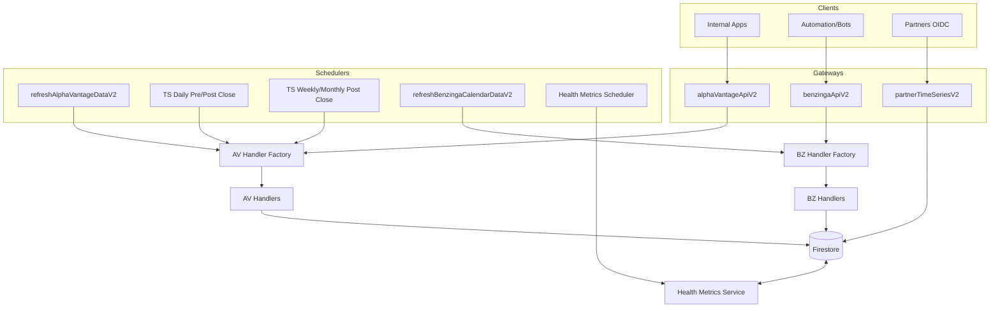

# Backend Functions Overview

This document provides a mid–high level overview of the backend Cloud Functions implementation for the Alpha Vantage + Benzinga data service. Use it as a guide for code reviews and onboarding.

- Repo root: `functions/`
- Runtime: Firebase/Cloud Functions (Gen2)
- Node: 22
- TypeScript: target `es2020`, `module: commonjs`

---

## Purpose and Responsibilities

- Centralized ingestion and refresh of financial market data from Alpha Vantage (AV) and Benzinga (BZ).
- Source-of-truth persistence in Firestore with normalized schemas.
- Scheduled refresh cycles driven by endpoint TTLs.
- Secure HTTPS gateways for internal use and a partner-only endpoint for server-to-server access.
- Health metrics and request logs for visibility.

---

## Directory Structure (Functions)

- `functions/src/`
  - `v2/alpha-vantage/`
    - Gateways (HTTPS), Refresh managers (scheduled), Handlers, Triggers
  - `v2/benzinga/`
    - Gateway (HTTPS), Calendar/News refresh managers, Handlers
  - `v2/partner/`
    - Partner time-series HTTPS endpoint
  - `v2/common/`
    - Cron schedules (`function-schedules.ts`), firestore path utils, list/save symbol utilities
    - TTL adapter (`common/config/ttl-adapter.ts`) for future UI/Firestore overrides
  - `v2/health-metrics/`
    - Health endpoints (HTTPS) and scheduler
  - `v2/services/`, `v2/utils/`
    - Shared services (refresh logger/info) and utilities (logging, time, firestore helpers)
- `functions/scripts/`
  - Emulator/test helpers, backfills, and admin scripts (run with `ts-node`) with dedicated READMEs

---

## Invocation Types

- HTTPS (internal/partner):
  - `alphaVantageApiV2`, `benzingaApiV2`, `partnerTimeSeriesV2`
  - Health: `getHealthSummary`, `getRequestLogs`, `getSymbolStatus`, `getSymbolMetrics`, `getHealthMetrics`
- Scheduled (Cloud Scheduler):
  - AV refresh manager and time-series cadences
  - BZ calendar refresh manager
  - Health metrics scheduler and cleanup jobs
- Firestore Triggers:
  - `onSymbolAdded` for symbol initialization flows

Refer to `functions/src/index.ts` for the authoritative export surface.

---

## Mermaid Architecture Diagram

How to view/edit this diagram:
- Use Mermaid Live Editor: https://mermaid.live
  - Copy the fenced code block (```mermaid ... ```), paste into the editor, and it will render.
  - You can export as PNG/SVG from the site.
- In VS Code, install a Mermaid preview extension or use Markdown preview with Mermaid support.



---

## Function Usage Map (What calls what)

- __Gateways__
  - `functions/src/v2/alpha-vantage/alpha-vantage-gateway.ts` → `AlphaVantageHandlerFactory.createHandler()` → AV handlers under `functions/src/v2/alpha-vantage/handlers/`
  - `functions/src/v2/benzinga/benzinga-gateway.ts` → `BenzingaHandlerFactory.createHandler()` → BZ handlers under `functions/src/v2/benzinga/handlers/`
  - `functions/src/v2/partner/time-series-partner.ts` → reads from Firestore time-series shards per request

- __Schedulers__
  - `functions/src/v2/alpha-vantage/data-refresher/av-refresh-manager.ts`
    - `refreshAlphaVantageDataV2` (non-time-series) → `AlphaVantageHandlerFactory` → AV handlers
    - `refreshAvDailyTimeSeriesPreClose`/`PostClose`/`WeeklyMonthlyPostClose` → `refreshForEndpoints()` → AV handlers (time-series)
  - `functions/src/v2/benzinga/data-refresher/bz-calendar-refresh-manager.ts`
    - `refreshBenzingaCalendarDataV2` → `BenzingaHandlerFactory` → BZ handlers
  - `functions/src/v2/health-metrics/health-metrics.scheduler.ts`
    - `checkAllEndpoints` and `purgeOldHealthHistory` → Health metrics service writes

- __Triggers__
  - `functions/src/v2/alpha-vantage/triggers/on-symbol-added.function.ts` → initializes symbol data paths and forward flows as needed

---

## Refresher Flows

### Non-Time-Series (Alpha Vantage)

File: `functions/src/v2/alpha-vantage/data-refresher/av-refresh-manager.ts`

- Enumerates tracked symbols: `tracked_symbols/`
- Iterates implemented endpoints (excluding time-series and temporarily skipping `HISTORICAL_OPTIONS`).
- Resolves endpoint config (`AV_ENDPOINT_CONFIGS`), reads `ttl`.
- Firestore freshness gate:
  - Reads doc at resolved path (from `firestorePath` + symbol via `resolveFirestorePath()`)
  - If missing or `metadata.nextRefreshAt` ≤ now, refresh proceeds
- Fetch + Persist:
  - Calls `AlphaVantageHandlerFactory.createHandler(endpoint).fetch(params)`
  - On success, writes:
    - `data: <payload>`
    - `metadata.lastUpdated = now`
    - `metadata.nextRefreshAt = now + ttlSeconds`
    - `metadata.ttlSeconds = ttl`
  - Records refresh history at `.../history/{eventId}` and logs via Health Metrics

### Time-Series (Alpha Vantage: Daily/Weekly/Monthly)

Files:
- `functions/src/v2/alpha-vantage/data-refresher/av-refresh-manager.ts` (schedulers + `refreshForEndpoints()`)
- Handlers under `functions/src/v2/alpha-vantage/handlers/`

- Pre/Post Close Cadence:
  - `refreshAvDailyTimeSeriesPreClose`: PRE phase (daily). Writes intraday snapshot fields only; no finalized bar.
  - `refreshAvDailyTimeSeriesPostClose`: POST phase (daily). Writes finalized daily bar and bumps parent metadata.
  - `refreshAvWeeklyMonthlyTimeSeriesPostClose`: POST phase (weekly+monthly). Writes finalized bars and bumps metadata.
- Storage Model (Sharded):
  - Parent doc: `symbol-data/{SYMBOL}/time-series/av-daily-adjusted` holds metadata (`latestBarTimestamp`, freshness)
  - Year doc: `symbol-data/{SYMBOL}/time-series/av-daily-adjusted/years/{YYYY}` with fields `{ bars: CompactBar[], count, firstBarTs, lastBarTs, updatedAt }`
  - Compact bar schema (from writers' `CompactBar`):
    - `t`: epoch milliseconds (UTC)
    - `d?`: UTC date `YYYY-MM-DD`
    - `o`: open
    - `h`: high
    - `l`: low
    - `c`: close
    - `v`: volume (defaults to 0 if missing)
    - `ac`: adjusted close (defaults to `c` if not provided)
    - `dv`: dividend amount (defaults to 0)
    - `sc`: split coefficient (defaults to 1)
    - `pc?`: previous close for the bar’s day (if computed)
    - `ch?`: absolute change vs previous close
    - `cp?`: percent change vs previous close
    - `ip?`: intraday last price snapshot (PRE phase)
    - `io?`: intraday observed-at timestamp (epoch ms)
    - `it?`: intraday observed-at clock string (HH:mm ET) derived from `io`
    - `ic`: intraday absolute change vs previous close (nullable)
    - `ipc`: intraday percent change vs previous close (nullable)
  - Daily parent doc fields:
    - Path: `symbol-data/{SYMBOL}/time-series/av-daily-adjusted`
    - Fields written by writers/bumpers:
      - `metadata`: `{ symbol, interval, histStartDate, histEndDate, lastUpdated, nextRefreshAt, ttlSeconds, vendor, endpoint, histStartTs, histEndTs }`
      - `latestBarTimestamp`: Firestore `Timestamp` of most recent finalized daily bar
    - Note: intraday snapshot and previous-close details live on bar entries (see CompactBar), not on the parent doc.
- Weekly and monthly follow the same sharded scheme using their respective parent docs:
  - Weekly parent: `symbol-data/{SYMBOL}/time-series/av-weekly-adjusted`
  - Monthly parent: `symbol-data/{SYMBOL}/time-series/av-monthly-adjusted`

### Benzinga Calendar (and News)

NOTE: Benzinga integration is currently deprecated due to subscription unavailability. Calls will error with API key issues.

TODOs:
- Remove/disable Calendar views and any BZ-triggered actions in the UI until a subscription is restored.
- Remove/guard BZ refresh jobs and gateways to avoid noisy errors.

File: `functions/src/v2/benzinga/data-refresher/bz-calendar-refresh-manager.ts`

- Enumerates tracked symbols
- Iterates calendar endpoints from `@shared/benzinga.BZ_CALENDAR_REQUEST_CONFIGS`
- Resolves `ttl` from endpoint config; computes doc path (symbol or market-wide based on `symbolUsage`)
- Freshness gate via `metadata.nextRefreshAt`; fetches using the appropriate BZ handler
- Writes payload + refresh metadata via `RefreshInfoService.updateDocumentWithRefreshInfo()` and logs via refresh logger + Health Metrics

---

## Symbol Added Flow

File: `functions/src/v2/alpha-vantage/triggers/on-symbol-added.function.ts`

- Trigger: Firestore onCreate under `tracked_symbols/{SYMBOL}`
- Responsibilities:
  - Initialize required symbol-level collections/docs (e.g., `symbol-data/{SYMBOL}/...`)
  - Triggers initial fetch of time-series data so that daily/weekly/monthly parent docs exist and shards are created
  - Ensure canonical time-series parent docs exist so scheduled writers can proceed without path checks
- Result: After symbol creation, scheduled refreshers can process the symbol seamlessly according to TTL and cadence

---

## Health Metrics and Request Logs

Files:
- `functions/src/v2/health-metrics/health-metrics.service.ts`
- `functions/src/v2/health-metrics/health-metrics.scheduler.ts`
- `functions/src/v2/services/refresh-logger.service.ts`

- What is tracked:
  - Per-symbol refresh events with `status` (SUCCESS/FAILURE), `durationMs`, error details, and trigger type (SCHEDULER, AV_REFRESH_MANAGER)
  - Endpoint-level summaries and last run status
  - Historical refresh events written under `.../history/{eventId}` for audit
- Why it matters:
  - Drives the UI Health View to show freshness, failures, and last activity. Per your preference, timestamps are displayed in PT in the UI.
- Cleanup:
  - `purgeOldHealthHistory` removes aged-out history docs to control storage

---

## Clarifying: Where Functions Are Used

- `alphaVantageApiV2` / `benzingaApiV2`: internal HTTPS gateways used by your app. The refreshers do NOT call these gateways; refreshers invoke provider handlers directly.
  - `alphaVantageApiV2` is used by the Data Maintainer view (internal admin tooling).
  - `benzingaApiV2` is used by the Calendars view (deprecated until BZ subscription resumes).
- `partnerTimeSeriesV2`: partner-only HTTPS endpoint for time-series reads served from Firestore shards (OIDC allowlist; no direct AV rate impact for partners).
- `refreshAlphaVantageDataV2`: non-time-series freshness engine; runs via cron; writes data + metadata when stale.
- `TS_*` schedules: time-series-only cadence respecting trading phases; bars written by handlers, parent docs updated.
- `refreshBenzingaCalendarDataV2`: BZ calendar refresh cadence.
- Health endpoints and scheduler: power your `Health View` and backend observability.

---

## Architecture Diagram (ASCII)

```
                +------------------------+
                |   Client/Automation    |
                +-----------+------------+
                            |
                            | HTTPS (dual-auth, IAM allowlist)
                            v
     +-----------------------------+          +-----------------------+
     |  AV Gateway (alphaVantage) |          | BZ Gateway (benzinga) |
     +-------------+---------------+          +-----------+-----------+
                   |                                   |
                   | handler factory                    | handler factory
                   v                                   v
            +----------------+                  +----------------+
            | AV Handlers    |                  | BZ Handlers    |
            +-------+--------+                  +-------+--------+
                    |                                   |
                    | sharded writes / normalized docs  |
                    v                                   v
             +-----------------------------------------------+
             |                 Firestore                     |
             |  symbol-data/{symbol}/... (normalized)       |
             |  time-series (sharded bars)                  |
             +------------------+----------------------------+
                                ^
                                | metadata + nextRefreshAt
                                |
+-------------------------+     |     +-------------------------------+
| Cloud Scheduler (cron)  +-----+-----+ AV/BZ Refresh Managers        |
+-------------------------+           | (checks TTL, writes, logs)    |
                                      +-------------------------------+
                                              |
                                              | Health Metrics & Logs
                                              v
                                   +---------------------------+
                                   | Health Metrics Scheduler  |
                                   +---------------------------+

                    +----------------------------------------+
                    | Partner HTTPS (time-series reads)      |
                    | partnerTimeSeriesV2 (allowlisted OIDC) |
                    +----------------------------------------+
```

---

## Data Storage Model (Firestore)

- __Time-series (AV Daily/Weekly/Monthly)__
  - Sharded writes; no large arrays stored by refreshers
  - Parent doc: `symbol-data/{SYMBOL}/time-series/av-daily-adjusted` holds metadata (`latestBarTimestamp`, freshness)
  - Year doc: `symbol-data/{SYMBOL}/time-series/av-daily-adjusted/years/{YYYY}` with fields `{ bars: CompactBar[], count, firstBarTs, lastBarTs, updatedAt }`
  - Compact bar schema (from writers' `CompactBar`):
    - `t`: epoch milliseconds (UTC)
    - `d?`: UTC date `YYYY-MM-DD`
    - `o`: open
    - `h`: high
    - `l`: low
    - `c`: close
    - `v`: volume (defaults to 0 if missing)
    - `ac`: adjusted close (defaults to `c` if not provided)
    - `dv`: dividend amount (defaults to 0)
    - `sc`: split coefficient (defaults to 1)
    - `pc?`: previous close for the bar’s day (if computed)
    - `ch?`: absolute change vs previous close
    - `cp?`: percent change vs previous close
    - `ip?`: intraday last price snapshot (PRE phase)
    - `io?`: intraday observed-at timestamp (epoch ms)
    - `it?`: intraday observed-at clock string (HH:mm ET) derived from `io`
    - `ic`: intraday absolute change vs previous close (nullable)
    - `ipc`: intraday percent change vs previous close (nullable)
  - Daily parent doc fields:
    - Path: `symbol-data/{SYMBOL}/time-series/av-daily-adjusted`
    - Fields written by writers/bumpers:
      - `metadata`: `{ symbol, interval, histStartDate, histEndDate, lastUpdated, nextRefreshAt, ttlSeconds, vendor, endpoint, histStartTs, histEndTs }`
      - `latestBarTimestamp`: Firestore `Timestamp` of most recent finalized daily bar
    - Note: intraday snapshot and previous-close details live on bar entries (see CompactBar), not on the parent doc.
- __Non-time-series endpoints__
  - Single document per `{symbol}/{endpoint}`
  - `metadata.lastUpdated`, `metadata.nextRefreshAt`, `metadata.ttlSeconds` used by refreshers

Notes:
- The legacy `{ data, metadata }` shape is deprecated for AV daily time series; all new writes use the normalized schema.

---

## TTL Source of Truth

- TTLs are defined on endpoint configuration objects (defaults):
  - AV: `@shared/alpha-vantage` (`AV_ENDPOINT_CONFIGS`, `AV_TIME_SERIES_ENDPOINT_CONFIGS`)
  - BZ: `@shared/benzinga` (e.g., `BZ_CALENDAR_REQUEST_CONFIGS`)
- `functions/src/v2/common/function-schedules.ts` defines only cron schedules and enums; it does not define TTLs.
- A TTL adapter exists at `functions/src/v2/common/config/ttl-adapter.ts` to unify lookups today and serve as the extension point for UI-driven Firestore overrides later.

---

## Security and Auth

- __IAM lockdown__: Cloud Run invokers limited; `allUsers` removed.
- __Dual-auth gateways__: Either Firebase ID token OR Google OIDC from allowlisted service accounts (`ALLOWED_SERVICE_ACCOUNT_EMAILS`).
- __Partner endpoint__: OIDC allowlist; no static keys; CORS allowlist where applicable.

---

## Concise Function Inventory

- __HTTPS__
  - `alphaVantageApiV2` — AV gateway (dual-auth); routes to AV handlers.
  - `benzingaApiV2` — BZ gateway (dual-auth); routes to BZ handlers.
  - `partnerTimeSeriesV2` — Partner-only time-series read from Firestore.
  - Health: `getHealthSummary`, `getRequestLogs`, `getSymbolStatus`, `getSymbolMetrics`, `getHealthMetrics`.
  - Utilities: `listCollections`, `saveTrackedSymbol`, `listSymbolsV2`, `requestBenzingaNews`.

- __Scheduled (Cloud Scheduler)__
  - `refreshAlphaVantageDataV2` — AV non-time-series refresh manager; gating by TTL.
  - `refreshAvDailyTimeSeriesPreClose` — Pre-close daily writes (snapshot fields only, no finalize).
  - `refreshAvDailyTimeSeriesPostClose` — Post-close daily finalized bar writes.
  - `refreshAvWeeklyMonthlyTimeSeriesPostClose` — Post-close weekly+monthly finalized writes.
  - `refreshBenzingaCalendarDataV2` — BZ calendar refresh cadence.
  - Health: `healthMetricsScheduler` (check all endpoints), `purgeOldHealthHistory`.

- __Firestore Trigger__
  - `onSymbolAdded` — reacts to `tracked_symbols` changes (initialization flows).

Refer to `functions/src/index.ts` for the definitive list and to `v2/common/function-schedules.ts` for cron expressions.

---

## Implementation Notes & Recent Cleanups

- __TTL SOT__: Removed legacy `ENDPOINT_TTLS`; refreshers read `ttl` from endpoint configs.
- __Emulator/test-only exports__: HTTP wrappers moved to `functions/scripts/` and excluded from deploy.
- __Imports__: Extensionless imports in TS source (CommonJS + Node resolution).

---

## Build & Deploy

- Build shared libs and functions:
  ```bash
  # From repo root
  npm run build:shared
  
  # From functions/
  npm run build
  ```
- Deploy functions:
  ```bash
  firebase deploy --only functions
  ```

---

## Future Enhancements

- UI-driven TTL overrides persisted in Firestore; TTL adapter checks override first, then defaults.
- Consider Cloud Tasks for dispatch fan-out and retry policies (optional robustness layer).
- Switch to ESM only if there is a strong driver (ESM-only deps or monorepo standard); otherwise CommonJS remains simplest.
