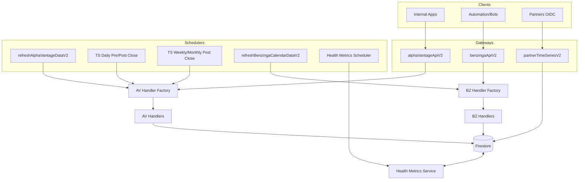

# Backend Functions Overview

This document provides a mid–high level overview of the backend Cloud Functions implementation for the Alpha Vantage + Benzinga data service. Use it as a guide for code reviews and onboarding.

- Repo root: `functions/`
- Runtime: Firebase/Cloud Functions (Gen2)
- Node: 22
- TypeScript: target `es2020`, `module: commonjs`

---

## Purpose and Responsibilities

- Centralized ingestion and refresh of financial market data from Alpha Vantage (AV) and Benzinga (BZ).
- Source-of-truth persistence in Firestore with normalized schemas.
- Scheduled refresh cycles driven by endpoint TTLs.
- Secure HTTPS gateways for internal use and a partner-only endpoint for server-to-server access.
- Health metrics and request logs for visibility.

---

## Directory Structure (Functions)

- `functions/src/`
  - `v2/alpha-vantage/`
    - Gateways (HTTPS), Refresh managers (scheduled), Handlers, Triggers
  - `v2/benzinga/`
    - Gateway (HTTPS), Calendar/News refresh managers, Handlers
  - `v2/partner/`
    - Partner time-series HTTPS endpoint
  - `v2/common/`
    - Cron schedules (`function-schedules.ts`), firestore path utils, list/save symbol utilities
    - TTL adapter (`common/config/ttl-adapter.ts`) for future UI/Firestore overrides
  - `v2/health-metrics/`
    - Health endpoints (HTTPS) and scheduler
  - `v2/services/`, `v2/utils/`
    - Shared services (refresh logger/info) and utilities (logging, time, firestore helpers)
- `functions/scripts/`
  - Emulator/test helpers, backfills, and admin scripts (run with `ts-node`) with dedicated READMEs

---

## Invocation Types

- HTTPS (internal/partner):
  - `alphaVantageApiV2`, `benzingaApiV2`, `partnerTimeSeriesV2`
  - Health: `getHealthSummary`, `getRequestLogs`, `getSymbolStatus`, `getSymbolMetrics`, `getHealthMetrics`
- Scheduled (Cloud Scheduler):
  - AV refresh manager and time-series cadences
  - BZ calendar refresh manager
  - Health metrics scheduler and cleanup jobs
- Firestore Triggers:
  - `onSymbolAdded` for symbol initialization flows

Refer to `functions/src/index.ts` for the authoritative export surface.

---

## Mermaid Architecture Diagram

How to view/edit this diagram:
- Use Mermaid Live Editor: https://mermaid.live
  - Copy the fenced code block (```mermaid ... ```), paste into the editor, and it will render.
  - You can export as PNG/SVG from the site.
- In VS Code, install a Mermaid preview extension or use Markdown preview with Mermaid support.



---

## Function Usage Map (What calls what)

- __Gateways__
  - `functions/src/v2/alpha-vantage/alpha-vantage-gateway.ts` → `AlphaVantageHandlerFactory.createHandler()` → AV handlers under `functions/src/v2/alpha-vantage/handlers/`
  - `functions/src/v2/benzinga/benzinga-gateway.ts` → `BenzingaHandlerFactory.createHandler()` → BZ handlers under `functions/src/v2/benzinga/handlers/`
  - `functions/src/v2/partner/time-series-partner.ts` → reads from Firestore time-series shards per request (supports `adjusted=true` for split-adjusted data)

- __Schedulers__
  - `functions/src/v2/alpha-vantage/data-refresher/av-refresh-manager.ts`
    - `refreshAlphaVantageDataV2` (non-time-series) → `AlphaVantageHandlerFactory` → AV handlers
    - `refreshAvDailyTimeSeriesPreClose`/`PostClose`/`WeeklyMonthlyPostClose` → `refreshForEndpoints()` → AV handlers (time-series)
  - `functions/src/v2/benzinga/data-refresher/bz-calendar-refresh-manager.ts`
    - `refreshBenzingaCalendarDataV2` → `BenzingaHandlerFactory` → BZ handlers
  - `functions/src/v2/health-metrics/health-metrics.scheduler.ts`
    - `checkAllEndpoints` and `purgeOldHealthHistory` → Health metrics service writes

- __Triggers__
  - `functions/src/v2/alpha-vantage/triggers/on-symbol-added.function.ts` → initializes symbol data paths and forward flows as needed

---

## Refresher Flows

### Non-Time-Series (Alpha Vantage)

File: `functions/src/v2/alpha-vantage/data-refresher/av-refresh-manager.ts`

- Enumerates tracked symbols: `tracked_symbols/`
- Iterates implemented endpoints (excluding time-series and temporarily skipping `HISTORICAL_OPTIONS`).
- Resolves endpoint config (`AV_ENDPOINT_CONFIGS`), reads `ttl`.
- No doc-level freshness gate. Refreshers run strictly on schedules.
- Fetch + Persist:
  - Calls `AlphaVantageHandlerFactory.createHandler(endpoint).fetch(params)`
  - On success, writes:
    - `data: <payload>`
    - `metadata.lastUpdated = now`
  - Records refresh history at `.../history/{eventId}` and logs via Health Metrics

### Time-Series (Alpha Vantage: Daily/Weekly/Monthly)

Files:
- `functions/src/v2/alpha-vantage/data-refresher/av-refresh-manager.ts` (schedulers + `refreshForEndpoints()`)
- Handlers under `functions/src/v2/alpha-vantage/handlers/`

#### Cadence Overview

- **Daily (TIME_SERIES_DAILY_ADJUSTED)**
  - `refreshAvDailyTimeSeriesIntradayHourly`: PRE phase. Writes intraday snapshot fields only (`ip/io/it/ic/ipc`) into the latest daily bar; does not finalize OHLC.
  - `refreshAvDailyTimeSeriesPreClose`: PRE phase. Same intent as above, closer to the bell.
  - `refreshAvDailyTimeSeriesPostClose`: POST phase. Writes the finalized daily bar (OHLC, `ac`, `dv`, `sc`, `pc`, `ch`, `cp`) for **today only** and bumps parent metadata.
  - Evening + morning retry jobs re‑attempt POST writes for symbols that failed or were late.

- **Weekly / Monthly (TIME_SERIES_WEEKLY_ADJUSTED, TIME_SERIES_MONTHLY_ADJUSTED)**
  - `refreshAvWeeklyMonthlyTimeSeriesPostClose`: POST phase. Runs **daily** on trading days.
  - Intended behavior:
    - Treat Alpha Vantage as the **source of truth** for weekly/monthly over the most recent compact window (~100 bars).
    - For the compact cadence, update only the **most recent year shard** for weekly and the most recent segment of the monthly `all` document. Older years are reconciled by separate full-refresh workflows (see below).
    - Within that most recent shard, recent completed periods and the current in‑progress period (week‑to‑date / month‑to‑date) are kept in sync with AV.

#### Storage Model (Sharded)

> **Note (2026-01):** AV OHLCV time-series are now stored **only** under the split-adjusted collection `sa-time-series`. The legacy `time-series` collection for AV OHLCV has been wiped in prod via the `wipe-raw-timeseries.ts` admin script and is no longer written to by writers or triggers.

##### Production Dataset Baseline (2026-01-04)

- The production Firestore dataset is treated as a **stable API surface** for partner consumption. Time-series backfills are no longer ad hoc; any destructive reseeds must follow the documented admin scripts and be treated as change-managed operations.
- For the current tracked universe:
  - `tracked-symbols` contains the canonical symbol list (696 symbols as of 2026-01-04).
  - There is a 1:1 mapping between `tracked-symbols/{symbol}` and `symbol-data/{symbol}` (no missing or empty `symbol-data` docs).
  - For each tracked symbol, the following AV split-adjusted time-series parents exist under `symbol-data/{symbol}/sa-time-series` and have at least one shard/all document:
    - `av-daily-adjusted`
    - `av-weekly-adjusted`
    - `av-monthly-adjusted`
- Completeness checks for this baseline are performed via the admin script:
  - `functions/scripts/find-incomplete-sa-timeseries.ts`
    - Default mode: verifies `symbol-data` presence/emptiness for all tracked symbols and emits a JSON report.
    - Deep mode (`DEEP_SA_CHECK=1`): additionally asserts the presence of non-empty `sa-time-series` parents and shard/all documents for the three AV adjusted intervals.

Consumers should assume this baseline guarantees **existence and basic structural completeness** of the AV adjusted time-series for all tracked symbols. Freshness guarantees still derive from the scheduled refresh flows and Data‑Ready notifications described below.

- **Daily (Adjusted only)**
  - Parent doc: `symbol-data/{SYMBOL}/sa-time-series/av-daily-adjusted` holds metadata (`latestBarTimestamp`, freshness).
  - Year doc: `symbol-data/{SYMBOL}/sa-time-series/av-daily-adjusted/years/{YYYY}` with fields:
    - `bars: CompactBar[]`
    - `count`
    - `firstBarTs`
    - `lastBarTs`
    - `latest` (most recent non‑placeholder bar)
    - `latestUtcIso`, `latestEtDateTime`
    - `updatedAt`

- **Weekly (Adjusted only)**
  - Parent doc: `symbol-data/{SYMBOL}/sa-time-series/av-weekly-adjusted` (top‑level metadata and latest bar timestamp).
  - Year doc: `symbol-data/{SYMBOL}/sa-time-series/av-weekly-adjusted/years/{YYYY}` with the same general shape as daily (`bars`, `count`, `firstBarTs`, `lastBarTs`, `latest`, `latestUtcIso`, `latestEtDateTime`, `updatedAt`).
  - The daily compact cadence is intended to **merge** the latest weekly bars (from AV’s compact response) into the **current year** shard only, keeping the most recent weeks in sync while leaving older years to periodic full refreshes.

- **Monthly (Adjusted only)**
  - Parent doc: `symbol-data/{SYMBOL}/sa-time-series/av-monthly-adjusted` (top‑level metadata and latest bar timestamp).
  - Single `all` doc: `symbol-data/{SYMBOL}/sa-time-series/av-monthly-adjusted/all` that stores the full `bars` array plus aggregate fields similar to the weekly/daily shards.
  - The compact cadence is intended to merge the latest monthly bars (from AV’s compact response) into the tail of this `all` document; older months are refreshed by full‑history workflows.

#### Compact Bar Schema

All intervals (daily/weekly/monthly) share a common **CompactBar** shape written by Firestore helpers:

- `t`: epoch milliseconds (UTC)
- `d?`: UTC date `YYYY-MM-DD`
- `o`: open
- `h`: high
- `l`: low
- `c`: close
- `v`: volume (defaults to 0 if missing)
- `ac`: adjusted close (defaults to `c` if not provided)
- `dv`: dividend amount (defaults to 0)
- `sc`: split coefficient (defaults to 1)
- `pc?`: previous close for the bar’s day/period (if computed)
- `ch?`: absolute change vs previous close
- `cp?`: percent change vs previous close
- `ip?`: intraday last price snapshot (PRE phase, daily only)
- `io?`: intraday observed-at timestamp (epoch ms)
- `it?`: intraday observed-at clock string (HH:mm ET) derived from `io`
- `ic`: intraday absolute change vs previous close (nullable)
- `ipc`: intraday percent change vs previous close (nullable)

Daily parent doc fields:

- Path: `symbol-data/{SYMBOL}/time-series/av-daily-adjusted`
- Fields written by writers/bumpers:
  - `metadata`: `{ symbol, interval, histStartDate, histEndDate, lastUpdated, vendor, endpoint, histStartTs, histEndTs }`
  - `latestBarTimestamp`: Firestore `Timestamp` of most recent finalized daily bar
- Note: intraday snapshot and previous-close details live on bar entries (see CompactBar), not on the parent doc.

Weekly and monthly parent docs follow the same pattern, with `interval` and `endpoint` reflecting their respective AV endpoints.

#### EOD change fields (Daily Adjusted)

- Purpose
  - Persist end-of-day deltas alongside each daily bar for quick reads without recomputation.
- Fields
  - `ch`: absolute change vs prior trading day’s close (prefers adjusted close)
  - `cp`: percent change vs prior trading day’s close (prefers adjusted close)
- Computation rules
  - Baseline: previous bar’s `ac` (adjusted close) if present, otherwise `c` (close)
  - Rounding: 2 decimals for both `ch` and `cp`
  - Missing/zero baseline: omit `ch`/`cp` (first available bar or gaps)
- Where computed in code
  - Writer (full series): `functions/src/v2/alpha-vantage/firestore/av-firestore-helper.ts`
    - `computeChCpForBarsAscending(bars)` used by `saveAvTimeSeriesData()`
  - Writer (single day): same file
    - `computeChCpForTargetIndex(bars, index)` used by `upsertAvDailyBar()`
- Backfill
  - Script: `functions/scripts/backfill-timeseries-chcp.ts`
  - Behavior: prefers `ac` over `c`, omits `ch`/`cp` when baseline missing/zero
  - Examples:
    - Dry run: `npx ts-node -r tsconfig-paths/register -r module-alias/register functions/scripts/backfill-timeseries-chcp.ts --dry-run`
    - Daily only: `... backfill-timeseries-chcp.ts --interval=daily`
    - Specific symbol: `... backfill-timeseries-chcp.ts --interval=daily --symbol=GOOGL`

### Data readiness semantics (PRE vs POST)

The Data‑Ready Pub/Sub message indicates “what is safe to consume now.” Use the `runType` attribute to distinguish runs (see above). Guarantees per run:

- PRE (Daily) — `runType=ts_daily_pre`
  - For each tracked symbol’s daily series, the parent doc `symbol-data/{SYMBOL}/time-series/av-daily-adjusted` exists.
  - The latest bar entry in the appropriate year shard may include intraday snapshot fields (`ip`, `io`, `it`, `ic`, `ipc`).
  - The bar is NOT finalized; OHLC may still be the previous bar until POST. No parent freshness bump.
  - Intended for early/pre-close RS computation that can tolerate intraday snapshots.

- POST (Daily) — `runType=ts_daily_post`
  - Finalized daily bar (OHLC, `ac`, `dv`, `sc`, derived deltas like `pc`, `ch`, `cp`) is written to the shard for each tracked symbol.
  - Parent doc has freshness updated (`metadata.lastUpdated`) and `latestBarTimestamp` set to the most recent finalized bar.
  - This is the canonical time to compute RS on daily data with end‑of‑day correctness.

- POST (Weekly) — `runType=ts_weekly_post`
  - Finalized weekly bar written for each tracked symbol under `symbol-data/{SYMBOL}/time-series/av-weekly-adjusted` shards.
  - Parent metadata updated accordingly.

- POST (Monthly) — `runType=ts_monthly_post`
  - Finalized monthly bar written for each tracked symbol under `symbol-data/{SYMBOL}/time-series/av-monthly-adjusted` shards.
  - Parent metadata updated accordingly.

Notes
- Compact bar field reference is in this doc above under “Data Storage Model (Firestore) → Compact bar schema.”
- PRE uses snapshot fields on the latest daily bar entry and does not finalize OHLC.
- POST finalizes bars and bumps parent freshness; readers depending on finalized data should filter to POST runTypes.

### Benzinga Calendar (and News)

NOTE: Benzinga integration is currently deprecated due to subscription unavailability. Calls will error with API key issues.

TODOs:
- Remove/disable Calendar views and any BZ-triggered actions in the UI until a subscription is restored.
- Remove/guard BZ refresh jobs and gateways to avoid noisy errors.

File: `functions/src/v2/benzinga/data-refresher/bz-calendar-refresh-manager.ts`

- Enumerates tracked symbols
- Iterates calendar endpoints from `@shared/benzinga.BZ_CALENDAR_REQUEST_CONFIGS`
- Resolves `ttl` from endpoint config; computes doc path (symbol or market-wide based on `symbolUsage`)
  - Scheduled-only; no doc-level freshness gate; fetches using the appropriate BZ handler
  - Writes payload + refresh metadata via `RefreshInfoService.updateDocumentWithRefreshInfo()` and logs via refresh logger + Health Metrics

#### Operational: Pause or disable Benzinga scheduled refreshers (production)

NOTE: Jobs are currently PAUSED.  See below for instructions to unpause.  Functions remain deployed however.
To remove deployed functions, comment out or remove their entries from functions/src/index.ts.  You will be prompted
to delete the functions during the next deployment.

- __Unpause the Cloud Scheduler jobs (immediate, no deploy)__

- Unpause (resume) the jobs:
    ```bash
    gcloud scheduler jobs resume firebase-schedule-refreshBenzingaCalendarDataV2-us-central1 --location=us-central1
    gcloud scheduler jobs resume firebase-schedule-requestBenzingaNews-us-central1            --location=us-central1
    ```
    Verify they are ACTIVE:
    ```bash
    gcloud scheduler jobs describe firebase-schedule-refreshBenzingaCalendarDataV2-us-central1 --location=us-central1 --format="value(state)"
    gcloud scheduler jobs describe firebase-schedule-requestBenzingaNews-us-central1            --location=us-central1 --format="value(state)"
    ```

If you need to immediately stop all Benzinga refreshes in production, use one of the following options.

- __Pause the Cloud Scheduler jobs (immediate, no deploy)__
  - Project: `alpha-vantage-proxy-api`
  - Region: `us-central1` (per current deployment)
  - List jobs and confirm names:
    ```bash
    gcloud scheduler jobs list --location=us-central1 \
      --format="table(name,location)" \
      --filter="name~firebase-schedule|refreshBenzinga|requestBenzinga"
    ```
  - Pause the two Benzinga jobs:
    ```bash
    gcloud scheduler jobs pause firebase-schedule-refreshBenzingaCalendarDataV2-us-central1 --location=us-central1
    gcloud scheduler jobs pause firebase-schedule-requestBenzingaNews-us-central1            --location=us-central1
    ```
  - Current state: As of 2025-10-13, BOTH of the above jobs are PAUSED in `us-central1`.
  - Verify state:
    ```bash
    gcloud scheduler jobs describe firebase-schedule-refreshBenzingaCalendarDataV2-us-central1 --location=us-central1 --format="value(state)"
    gcloud scheduler jobs describe firebase-schedule-requestBenzingaNews-us-central1            --location=us-central1 --format="value(state)"
    ```
  

- __Kill-switch via env var (requires redeploy; jobs still trigger but no-op)__
  - Both scheduled handlers check `DISABLE_BENZINGA_UPDATERS`:
    - `functions/src/v2/benzinga/data-refresher/bz-calendar-refresh-manager.ts`
    - `functions/src/v2/benzinga/data-refresher/bz-news-request-manager.ts`
  - Set the runtime env var and redeploy:
    ```bash
    # Firebase Console → Build → Functions → Runtime environment variables
    # Add: DISABLE_BENZINGA_UPDATERS=true
    npm --prefix functions run deploy
    ```

- __Remove scheduled exports (permanent; deletes jobs on deploy)__
  - Edit `functions/src/index.ts` and remove:
    ```ts
    export { refreshBenzingaCalendarDataV2 } from './v2/benzinga/data-refresher/bz-calendar-refresh-manager';
    export { requestBenzingaNews } from './v2/benzinga/data-refresher/bz-news-request-manager';
    ```
  - Deploy:
    ```bash
    npm --prefix functions run deploy
    ```
  - Firebase will delete the corresponding `firebase-schedule-*` jobs automatically when the functions are no longer exported.

- __Verification__
  - Logs: no more "Benzinga Calendar Data Refresh Cycle" or "Benzinga News Request Manager triggered" entries.
  - Firestore: `system-info/bz-news-request-tracking.lastRefreshTimestamp` stops updating; `news/` no longer receives new docs.

> Note: If cleaning up production data, you may safely delete BZ-specific collections/documents (e.g., `news`, any `market-data/benzinga/*` paths) after pausing or disabling the jobs above to avoid repopulation.

---

## Symbol Added Flow

File: `functions/src/v2/alpha-vantage/triggers/on-symbol-added.function.ts`

- Trigger: Firestore onCreate under `tracked_symbols/{SYMBOL}`
- Responsibilities:
  - Initialize required symbol-level collections/docs (e.g., `symbol-data/{SYMBOL}/...`)
  - Triggers initial fetch of time-series data so that daily/weekly/monthly parent docs exist and shards are created
  - Ensure canonical time-series parent docs exist so scheduled writers can proceed without path checks
- Result: After symbol creation, scheduled refreshers can process the symbol seamlessly according to TTL and cadence

---

## Health Metrics and Request Logs

Files:
- `functions/src/v2/health-metrics/health-metrics.service.ts`
- `functions/src/v2/health-metrics/health-metrics.scheduler.ts`
- `functions/src/v2/services/refresh-logger.service.ts`

- What is tracked:
  - Per-symbol refresh events with `status` (SUCCESS/FAILURE), `durationMs`, error details, and trigger type (SCHEDULER, AV_REFRESH_MANAGER)
  - Endpoint-level summaries and last run status
  - Historical refresh events written under `.../history/{eventId}` for audit
- Why it matters:
  - Drives the UI Health View to show freshness, failures, and last activity. Per your preference, timestamps are displayed in PT in the UI.
- Cleanup:
  - `purgeOldHealthHistory` removes aged-out history docs to control storage

### Cloud Logging query examples

Use the Logs Explorer with the following filters to find specific flows. The structured logger writes a single JSON object per line with fields like `component`, `event`, `level`, and your payload.

- By component and level:
  ```
  resource.type="cloud_run_revision"
  jsonPayload.component="auth" AND jsonPayload.level="warn"
  ```

- Health endpoint traffic (info and above):
  ```
  resource.type="cloud_run_revision"
  (resource.labels.service_name="gethealthsummary" OR 
   resource.labels.service_name="getrequestlogs" OR 
   resource.labels.service_name="getsymbolstatus" OR 
   resource.labels.service_name="getsymbolmetrics" OR 
   resource.labels.service_name="gethealthmetrics")
  jsonPayload.level!="debug"
  ```

- AV refresh errors only:
  ```
  resource.type="cloud_run_revision"
  jsonPayload.component="av.refresh" AND jsonPayload.level="error"
  ```

- Partner endpoint auth denials:
  ```
  resource.type="cloud_run_revision"
  resource.labels.service_name="partnertimeseriesv2"
  (jsonPayload.event="either.google.denied" OR jsonPayload.event="either.firebase.denied")
  ```

- Rate limit warnings from Alpha Vantage:
  ```
  resource.type="cloud_run_revision"
  (jsonPayload.event="ut_fSD_rate_limit_note" OR jsonPayload.event="ut hAE Rate Limit Exceeded")
  ```

Tips

- `service_name` is the lowercase Cloud Run service name (e.g., `gethealthsummary`).
- The `level` field is independent of Cloud Logging `severity`. We log at `console.log`, so use `jsonPayload.level` for filtering by verbosity.
- For ad hoc debugging, temporarily set `LOG_LEVEL=debug` on a single service and narrow queries by `service_name`.

---

## Partner Data-Ready Notifications (Pub/Sub)

- Topic: `partner-data-ready`
- Publisher: `functions/src/v2/partner/data-ready.handler.ts` via `enqueueDataReadyInternal()`
- Emission points:
  - Non-time-series cycle completion: `functions/src/v2/alpha-vantage/data-refresher/av-refresh-manager.ts` → end of `runRefreshAlphaVantageDataV2()`
  - Time-series scheduler completion: same file, after each of:
    - `refreshAvDailyTimeSeriesPreClose` (PRE, daily)
    - `refreshAvDailyTimeSeriesPostClose` (POST, daily)
    - `refreshAvWeeklyMonthlyTimeSeriesPostClose` (POST, weekly+monthly)

### Message format

- Data (JSON): `DataReadyPayloadV1` (`functions/src/v2/partner/schemas/data-ready.schema.ts`)
  - Required
    - `version`: "v1"
    - `runId`: `YYYY-MM-DD-pre|post`
    - `phase`: `pre` | `post` (see `PartnerPhase`)
    - `intervals`: e.g., `["DAILY"]`, `["WEEKLY"]`, `["MONTHLY"]`
    - `time`: epoch ms
  - Optional
    - `marketDate`: `YYYY-MM-DD`
    - `env`: environment tag
    - `symbolsUpdatedCount`, `baselinesUpdatedCount`, etc.

- Attributes (string key/values)
  - Always
    - `runId`, `version`, `phase`
    - Optionally `marketDate`, `env`
  - Explicit run classification
    - `runType`: see `PartnerRunType` in `functions/src/v2/partner/constants.ts`
      - `non_time_series`
      - `ts_daily_pre`
      - `ts_daily_post`
      - `ts_weekly_post`
      - `ts_monthly_post`

Notes:
- Time-series schedulers emit one message per interval (e.g., daily and weekly/monthly are separate messages).
- Non-time-series emits with `runType=non_time_series`.

### Consumer guidance (filtered subscriptions)

Use Pub/Sub subscription filters to target only the events you need. Example filters:

- Time-series only (all phases):
  - `attributes.runType = "ts_daily_pre" OR attributes.runType = "ts_daily_post" OR attributes.runType = "ts_weekly_post" OR attributes.runType = "ts_monthly_post"`

- Finalized bars only (post-close):
  - `attributes.runType = "ts_daily_post" OR attributes.runType = "ts_weekly_post" OR attributes.runType = "ts_monthly_post"`

- Exclude non-time-series entirely:
  - `attributes.runType != "non_time_series"`

IAM
- Grant consumer service accounts `roles/pubsub.subscriber` on the subscription and appropriate topic visibility.
- For cross-team setups, we (publisher project) typically create the subscription and bind the consumer SA to it.

---

## Logging: Structured Logger and Levels

The Functions code uses a lightweight, structured logger exposed by `createLogger()` in `functions/src/v2/utils/utils.ts`.

- Location: `functions/src/v2/utils/utils.ts`
- Entry points: `createLogger(component: string)` returns `info/warn/error/debug` methods that emit single JSON objects for clean Cloud Run/Cloud Logging queries.
- Level control: set via environment variable `LOG_LEVEL`.
  - Supported values: `error`, `warn`, `info`, `debug`.
  - Default (when unset): `info`.

Examples

- Set debug temporarily on a single service:
  ```bash
  gcloud run services update partnerTimeSeriesV2 \
    --region=us-central1 \
    --set-env-vars=LOG_LEVEL=debug
  ```
- Restore to info:
  ```bash
  gcloud run services update partnerTimeSeriesV2 \
    --region=us-central1 \
    --set-env-vars=LOG_LEVEL=info
  ```

Human‑readable log helpers

- Toggle with `HUMAN_LOGS=true` (default: false).
- Functions: `hr(component, message, ...args)` and `hrBlank()` print plain strings for quick local debugging.
- Recommendation: leave `HUMAN_LOGS` unset in production to keep logs fully structured.

Querying logs

- Because logs are single JSON objects, you can filter on fields like `component`, `event`, and `level` in Cloud Logging to find specific flows (e.g., `component="auth" AND jsonPayload.level="warn"`).

---

## ENABLE_RS_SUBSCRIBER (status)

- Purpose (historical): toggle for a Relative Strength (RS) subscriber/consumer that reacts to Data‑Ready Pub/Sub notifications (see “Partner Data‑Ready Notifications”).
- Current status: not used by any deployed Cloud Function code today. It only appears in scripts/docs and has no effect at runtime.
- Action: it is safe to remove `ENABLE_RS_SUBSCRIBER` from Cloud Run service environment variables. If an RS subscriber is introduced in the future, it will be implemented as a dedicated service with its own configuration and documentation.

---

## Architecture Diagram (ASCII)

```
                +------------------------+
                |   Client/Automation    |
                +-----------+------------+
                            |
                            | HTTPS (dual-auth, IAM allowlist)
                            v
     +-----------------------------+          +-----------------------+
     |  AV Gateway (alphaVantage) |          | BZ Gateway (benzinga) |
     +-------------+---------------+          +-----------+-----------+
                   |                                   |
                   | handler factory                    | handler factory
                   v                                   v
            +----------------+                  +----------------+
            | AV Handlers    |                  | BZ Handlers    |
            +-------+--------+                  +-------+--------+
                    |                                   |
                    | sharded writes / normalized docs  |
                    v                                   v
             +-----------------------------------------------+
             |                 Firestore                     |
             |  symbol-data/{symbol}/... (normalized)       |
             |  time-series (sharded bars)                  |
             +------------------+----------------------------+
                                ^
                                | metadata (freshness only)
                                |
+-------------------------+     |     +-------------------------------+
| Cloud Scheduler (cron)  +-----+-----+ AV/BZ Refresh Managers        |
+-------------------------+           | (checks TTL, writes, logs)    |
                                      +-------------------------------+
                                              |
                                              | Health Metrics & Logs
                                              v
                                   +---------------------------+
                                   | Health Metrics Scheduler  |
                                   +---------------------------+

                    +----------------------------------------+
                    | Partner HTTPS (time-series reads)      |
                    | partnerTimeSeriesV2 (allowlisted OIDC) |
                    +----------------------------------------+
```

---

## Data Storage Model (Firestore)

- __Time-series (AV Daily/Weekly/Monthly)__
  - Sharded writes; no large arrays stored by refreshers
  - Parent doc: `symbol-data/{SYMBOL}/time-series/av-daily-adjusted` holds metadata (`latestBarTimestamp`, freshness)
  - Year doc: `symbol-data/{SYMBOL}/time-series/av-daily-adjusted/years/{YYYY}` with fields `{ bars: CompactBar[], count, firstBarTs, lastBarTs, updatedAt }`
  - Compact bar schema (from writers' `CompactBar`):
    - `t`: epoch milliseconds (UTC)
    - `d?`: UTC date `YYYY-MM-DD`
    - `o`: open
    - `h`: high
    - `l`: low
    - `c`: close
    - `v`: volume (defaults to 0 if missing)
    - `ac`: adjusted close (defaults to `c` if not provided)
    - `dv`: dividend amount (defaults to 0)
    - `sc`: split coefficient (defaults to 1)
    - `pc?`: previous close for the bar’s day (if computed)
    - `ch?`: absolute change vs previous close
    - `cp?`: percent change vs previous close
    - `ip?`: intraday last price snapshot (PRE phase)
    - `io?`: intraday observed-at timestamp (epoch ms)
    - `it?`: intraday observed-at clock string (HH:mm ET) derived from `io`
    - `ic`: intraday absolute change vs previous close (nullable)
    - `ipc`: intraday percent change vs previous close (nullable)
  - Daily parent doc fields:
    - Path: `symbol-data/{SYMBOL}/time-series/av-daily-adjusted`
    - Fields written by writers/bumpers:
      - `metadata`: `{ symbol, interval, histStartDate, histEndDate, lastUpdated, ttlSeconds, vendor, endpoint, histStartTs, histEndTs }`
      - `latestBarTimestamp`: Firestore `Timestamp` of most recent finalized daily bar
    - Note: intraday snapshot and previous-close details live on bar entries (see CompactBar), not on the parent doc.
- __Non-time-series endpoints__
  - Single document per `{symbol}/{endpoint}`
  - `metadata.lastUpdated` maintained by scheduled refreshers (no doc-level nextRefreshAt gate)

Notes:
- The legacy `{ data, metadata }` shape is deprecated for AV daily time series; all new writes use the normalized schema.
- Top-level time-series metadata (`histStartTs`, `histEndTs`, `availableYears`, `latestBarTimestamp`) is maintained by writers via `bumpTimeSeriesTopLevelMetadata`, which now derives its values from the actual stored shards/all-docs rather than guessing from the last refresh date.

For operational **manual backfill and split-adjusted data maintenance workflows** (e.g., `sync-splits.ts`, reseed scripts such as `backfill-av-daily-adjusted.ts`, `verify-data.ts`, `diagnose-timeseries.ts`, `repair-timeseries-metadata.ts`, and future window-merge tooling), see:

- `planning/backfill-and-split-toolkit.md`

> Note: an earlier experimental script `backfill-data.ts` combined backfill and split injection but mixed date-window filtering with a full-series overwrite writer and caused a real data-loss incident. It has been removed and must not be reintroduced; new flows must follow the reseed vs window-merge model described in the toolkit.

---

## TTL Source of Truth

- TTLs are defined on endpoint configuration objects (defaults):
  - AV: `@shared/alpha-vantage` (`AV_ENDPOINT_CONFIGS`, `AV_TIME_SERIES_ENDPOINT_CONFIGS`)
  - BZ: `@shared/benzinga` (e.g., `BZ_CALENDAR_REQUEST_CONFIGS`)
- `functions/src/v2/common/function-schedules.ts` defines only cron schedules and enums; it does not define TTLs.
- A TTL adapter exists at `functions/src/v2/common/config/ttl-adapter.ts` to unify lookups today and serve as the extension point for UI-driven Firestore overrides later.

---

## Security and Auth

- __IAM lockdown__: Cloud Run invokers limited; `allUsers` removed.
- __Dual-auth gateways__: Either Firebase ID token OR Google OIDC from allowlisted service accounts (`ALLOWED_SERVICE_ACCOUNT_EMAILS`).
- __Partner endpoint__: OIDC allowlist; no static keys; CORS allowlist where applicable.

---

## Concise Function Inventory

- __HTTPS__
  - `alphaVantageApiV2` — AV gateway (dual-auth); routes to AV handlers.
  - `benzingaApiV2` — BZ gateway (dual-auth); routes to BZ handlers.
  - `partnerTimeSeriesV2` — Partner-only time-series read from Firestore.
  - Health: `getHealthSummary`, `getRequestLogs`, `getSymbolStatus`, `getSymbolMetrics`, `getHealthMetrics`.
  - Utilities: `listCollections`, `saveTrackedSymbol`, `listSymbolsV2`, `requestBenzingaNews`.

- __Scheduled (Cloud Scheduler)__
  - `refreshAlphaVantageDataV2` — AV non-time-series refresh manager; gating by TTL.
  - `refreshAvDailyTimeSeriesPreClose` — Pre-close daily writes (snapshot fields only, no finalize).
  - `refreshAvDailyTimeSeriesPostClose` — Post-close daily finalized bar writes.
  - `refreshAvWeeklyMonthlyTimeSeriesPostClose` — Post-close weekly+monthly finalized writes.
  - `refreshBenzingaCalendarDataV2` — BZ calendar refresh cadence.
  - Health: `healthMetricsScheduler` (check all endpoints), `purgeOldHealthHistory`.

- __Firestore Trigger__
  - `onSymbolAdded` — reacts to `tracked_symbols` changes (initialization flows).

Refer to `functions/src/index.ts` for the definitive list and to `v2/common/function-schedules.ts` for cron expressions.

---

## Implementation Notes & Recent Cleanups

- __TTL SOT__: Removed legacy `ENDPOINT_TTLS`; refreshers read `ttl` from endpoint configs.
- __Emulator/test-only exports__: HTTP wrappers moved to `functions/scripts/` and excluded from deploy.
- __Imports__: Extensionless imports in TS source (CommonJS + Node resolution).

---

## Build & Deploy

- Build shared libs and functions:
  ```bash
  # From repo root
  npm run build:shared
  
  # From functions/
  npm run build
  ```
- Deploy functions:
  ```bash
  firebase deploy --only functions
  ```

---

## Future Enhancements

- UI-driven TTL overrides persisted in Firestore; TTL adapter checks override first, then defaults.
- Consider Cloud Tasks for dispatch fan-out and retry policies (optional robustness layer).
- Switch to ESM only if there is a strong driver (ESM-only deps or monorepo standard); otherwise CommonJS remains simplest.
