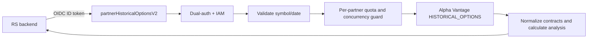
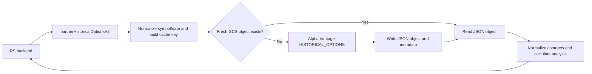

# PRD: Partner Historical Options On-Demand Proxy

**Status:** Proposed  
**Owner:** Savant API  
**Audience:** Savant API engineering, RS engineering, partner administrators  
**Last updated:** 2026-07-20

---

## 1. Summary

Deliver a partner-facing, server-to-server HTTPS endpoint that returns Alpha Vantage `HISTORICAL_OPTIONS` data for one equity symbol and an optional historical trading date.

The initial release is an authenticated **on-demand proxy**. It fetches data from Alpha Vantage during the request and returns a normalized response. It does not persist the raw options chain in Firestore.

## 2. Problem

The existing historical-options handler can fetch and analyze data internally, but the scheduled refresher intentionally skips it because a full chain can exceed Firestore's 1 MiB document limit. The current single-document write model is therefore unsafe for production use. No partner endpoint currently exposes historical options.

RS needs access before a durable options-data storage design is available.

## 3. Goals

- Expose a secure partner endpoint named `partnerHistoricalOptionsV2`.
- Keep the Alpha Vantage API key server-side.
- Require `symbol`; support optional historical `date` in `YYYY-MM-DD` format.
- Return normalized contracts and aggregate analysis in a stable response envelope.
- Prevent a partner from exhausting Alpha Vantage quota or Cloud Function capacity.
- Avoid Firestore writes for raw chains in the initial release.
- Provide an additive migration path to Google Cloud Storage caching without changing the public request or response contract.

## 4. Non-Goals

- Browser-to-provider or browser-to-partner-endpoint access.
- Scheduled refreshes, Firestore backfills, or a complete historical options archive.
- Firestore storage of raw option contracts.
- Querying across multiple symbols or dates in one request.
- Delivering an implied guarantee of a particular Alpha Vantage response size, coverage date, or vendor availability.

## 5. Consumer Contract

| Property | Initial-release value |
|---|---|
| Function | `partnerHistoricalOptionsV2` |
| Method | `GET` |
| Caller | Allowlisted server-side partner service account or approved Firebase identity |
| Parameters | `symbol` required; `date` optional |
| Source | Live Alpha Vantage `HISTORICAL_OPTIONS` request |
| Persistence | None for raw payloads |
| Caching | None in v1; GCS cache is a follow-up |
| Freshness | Response is fetched for this request; vendor timestamp is not independently verified |

### Request validation

- `symbol` is trimmed, uppercased, and must be non-empty.
- `date`, if supplied, must exactly match `YYYY-MM-DD` and represent a valid calendar date.
- Unknown parameters are ignored or rejected consistently; the implementation decision must be documented before release.
- Requests use `GET` only. `OPTIONS` is retained solely for framework/CORS handling.

### Success response

```json
{
  "ok": true,
  "symbol": "AAPL",
  "date": "2026-07-17",
  "source": "alpha_vantage",
  "endpoint": "HISTORICAL_OPTIONS",
  "data": {
    "endpoint": "Historical Options",
    "message": "success",
    "data": [
      {
        "contractID": "AAPL260717C00200000",
        "symbol": "AAPL",
        "expiration": "2026-07-17",
        "strike": "200",
        "type": "call",
        "last": "12.3",
        "bid": "12.1",
        "ask": "12.4",
        "volume": "155",
        "open_interest": "1002",
        "date": "2026-07-17",
        "implied_volatility": "0.24",
        "delta": "0.51",
        "gamma": "0.02",
        "theta": "-0.04",
        "vega": "0.11",
        "rho": "0.03"
      }
    ]
  },
  "analysis": {
    "summary": {
      "totalContracts": 1,
      "totalVolume": 155,
      "totalOpenInterest": 1002,
      "callContracts": 1,
      "putContracts": 0,
      "uniqueStrikes": 1,
      "avgVolumePerContract": 155,
      "avgOpenInterest": 1002
    },
    "expirations": [],
    "strikes": []
  },
  "timestamp": "2026-07-20T23:00:00.000Z",
  "processingTimeMs": 420
}
```

Contract numeric fields remain strings where supplied by Alpha Vantage. Consumers must parse values defensively.

## 6. Security and Abuse Controls

- Use the existing partner dual-auth middleware and the `ALLOWED_SERVICE_ACCOUNT_EMAILS` / `EXPECTED_GOOGLE_AUDIENCE` secrets.
- Lock down Cloud Run IAM: remove `allUsers`; grant `roles/run.invoker` only to authorized partner service accounts.
- Do not add the endpoint to the internal browser-facing Alpha Vantage gateway.
- Do not log access tokens, API keys, complete response bodies, or unbounded query strings.
- Use an explicit per-partner request quota and concurrency limit before production release.
- Return `429` with `Retry-After` when the service rejects a request due to its quota or concurrency guard.

## 7. Error Contract

| HTTP status | Code | Meaning |
|---|---|---|
| 400 | `BAD_REQUEST` | Missing or invalid `symbol` or `date` |
| 401 | `UNAUTHORIZED` | Missing or invalid authentication |
| 403 | `FORBIDDEN` | Caller is not allowlisted or lacks invoker permission |
| 405 | `METHOD_NOT_ALLOWED` | Method is not `GET` |
| 413 | `RESPONSE_TOO_LARGE` | Upstream chain cannot be safely returned |
| 429 | `RATE_LIMITED` | Partner or service guard denied the request |
| 502 | `UPSTREAM_ERROR` | Alpha Vantage returned an invalid or failed response |
| 504 | `UPSTREAM_TIMEOUT` | Alpha Vantage did not respond within the configured deadline |
| 500 | `INTERNAL_ERROR` | Unexpected service failure |

All errors return `{ "ok": false, "error": string, "code": string, "timestamp": string }`. Do not relay upstream API keys or unfiltered provider errors.

## 8. Architecture



The endpoint must call the existing historical-options fetch/transform logic without invoking its Firestore persistence path. The implementation should place partner HTTP concerns, request validation, response serialization, quota behavior, and AV retrieval in separate single-purpose modules.

## 9. Reliability and Observability

Emit structured logs for request ID, authenticated principal identifier, normalized symbol, requested date, HTTP status, upstream duration, contract count, response byte count, and failure category. Never log the complete chain.

Add endpoint-specific metrics for request count, success/failure counts, latency, upstream latency, rate-limit denials, invalid requests, response-size rejections, and vendor failures.

## 10. Rollout Plan

1. Confirm Alpha Vantage account terms permit the intended partner redistribution/use.
2. Implement the endpoint and automated tests for valid, invalid, unauthenticated, vendor-failure, and quota-denial cases.
3. Deploy with IAM restricted and a conservative quota/concurrency configuration.
4. Allowlist RS in a non-production environment and validate a known symbol/date.
5. Monitor request volume, vendor errors, response size, and latency.
6. Enable production access for RS after acceptance.

## 11. Future: GCS Cache

Google Cloud Storage (GCS) is the preferred persistence target for raw historical-options payloads because it is object storage and does not impose Firestore's 1 MiB document limit.

This is a **post-v1 enhancement**. The on-demand endpoint remains the initial release; introducing GCS must not change its public request or response contract.

### Proposed architecture



### Cache key and object layout

The cache key must include every request property that can change the provider response. For the initial endpoint contract, the canonical key is the normalized uppercase symbol and the requested date, or a distinct provider-default-session marker when `date` is omitted.

```text
historical-options/v1/{SYMBOL}/{YYYY-MM-DD}.json
historical-options/v1/{SYMBOL}/provider-default.json
```

Objects must contain the raw provider response and a small metadata envelope, including the normalized symbol, requested date, object schema version, fetched-at timestamp, provider name, content byte size, and a checksum. Do not rely on an object path alone as evidence of freshness.

### Cache semantics

- A request is a cache hit only when the object exists, passes schema/checksum validation, and is younger than the configured TTL.
- Cache misses, expired objects, and invalid objects fetch from Alpha Vantage.
- A successful provider response replaces the previous object atomically.
- A provider failure must not overwrite a previously valid object.
- The initial cache TTL must be explicitly configured and documented before activation. It may vary by requested date: immutable historical dates can have a much longer TTL than the provider-default session.
- The endpoint response should disclose cache state through non-sensitive metadata such as `cache: { status: "hit" | "miss", fetchedAt }` once this feature is released.

### Firestore role

Firestore is optional for this phase. If used, it stores only small queryable metadata such as cache key, `fetchedAt`, `expiresAt`, response byte size, contract count, and the GCS generation number. Firestore must not store the raw contracts or full vendor payload.

### Security and data governance

- The bucket is private; only the Cloud Functions service account and designated operational principals receive object access.
- Consumers continue to access data only through `partnerHistoricalOptionsV2`; no signed GCS URLs or direct bucket access are part of this design.
- Enable encryption at rest using Google-managed encryption by default; assess a customer-managed encryption key only if required by the data-governance policy.
- Configure retention and lifecycle rules to delete or transition objects after the approved retention period.
- Log object key, generation, byte size, and cache result, but never log raw options payloads, authorization tokens, or API keys.
- Confirm the Alpha Vantage account agreement permits the proposed retention and partner redistribution before storing or serving payloads.

### Rollout and acceptance criteria

1. Define bucket name, region, lifecycle/retention policy, IAM policy, TTLs, and cache-key versioning.
2. Add tests for cache hit, cache miss, expired object, corrupt object, write failure, and vendor failure with a pre-existing valid object.
3. Validate that large chains can be stored and retrieved without Firestore writes.
4. Verify the endpoint returns the same normalized response contract for cache hits and cache misses.
5. Measure cache-hit ratio, GCS read/write latency, object sizes, upstream AV call reduction, and storage growth.
6. Roll out behind a configuration flag and retain the ability to bypass or disable the cache without exposing direct bucket access.
