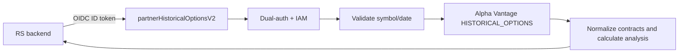
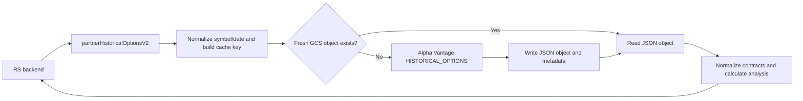

# PRD: Partner Historical Options On-Demand Proxy

**Status:** Deployed; Savant production smoke test passed; RS acceptance pending
**Owner:** Savant API  
**Audience:** Savant API engineering, RS engineering, partner administrators  
**Last updated:** 2026-07-21

---

## 1. Summary

Deliver a partner-facing, server-to-server HTTPS endpoint that returns Alpha Vantage `HISTORICAL_OPTIONS` data for one equity symbol and an optional historical trading date.

The initial release is an authenticated **on-demand proxy**. It fetches data from Alpha Vantage during the request and returns a normalized response. It does not persist the raw options chain in Firestore.

## 2. Problem

The existing historical-options handler can fetch and analyze data internally, but the scheduled refresher intentionally skips it because a full chain can exceed Firestore's 1 MiB document limit. The current single-document write model is therefore unsafe for production use. The implemented partner endpoint provides on-demand access without persisting raw chains.

RS needs access before a durable options-data storage design is available.

## 3. Goals

- Expose a secure partner endpoint named `partnerHistoricalOptionsV2`.
- Keep the Alpha Vantage API key server-side.
- Require `symbol`; support optional historical `date` in `YYYY-MM-DD` format.
- Return normalized contracts and aggregate analysis in a stable response envelope.
- Apply configured Cloud Function capacity limits and reserve Alpha Vantage throttling for a future shared provider-level mechanism.
- Avoid Firestore writes for raw chains in the initial release.
- Provide an additive migration path to Google Cloud Storage caching without changing the public request or response contract.

## 4. Non-Goals

- Browser-to-provider or browser-to-partner-endpoint access.
- Scheduled refreshes, Firestore backfills, or a complete historical options archive.
- Firestore storage of raw option contracts.
- Querying across multiple symbols or dates in one request.
- Delivering an implied guarantee of a particular Alpha Vantage response size, coverage date, or vendor availability.

## 5. Consumer Contract

| Property | Initial-release value |
|---|---|
| Function | `partnerHistoricalOptionsV2` |
| Method | `GET` |
| Caller | Allowlisted server-side partner service account |
| Parameters | `symbol` required; `date` optional |
| Source | Live Alpha Vantage `HISTORICAL_OPTIONS` request |
| Persistence | None for raw payloads |
| Caching | None in v1; GCS cache is a follow-up |
| Freshness | Response is fetched for this request; vendor timestamp is not independently verified |

### Request validation

- `symbol` is trimmed, uppercased, and must be non-empty.
- `date`, if supplied, must exactly match `YYYY-MM-DD` and represent a valid calendar date.
- Unknown parameters are ignored.
- Requests use `GET` only; browser CORS is not enabled for this endpoint.

### Success response

```json
{
  "ok": true,
  "symbol": "AAPL",
  "date": "2026-07-17",
  "source": "alpha-vantage",
  "endpoint": "HISTORICAL_OPTIONS",
  "data": {
    "endpoint": "HISTORICAL_OPTIONS",
    "message": "success",
    "data": [
      {
        "contractID": "AAPL260717C00200000",
        "symbol": "AAPL",
        "expiration": "2026-07-17",
        "strike": "200",
        "type": "call",
        "last": "12.3",
        "bid": "12.1",
        "ask": "12.4",
        "volume": "155",
        "open_interest": "1002",
        "date": "2026-07-17",
        "implied_volatility": "0.24",
        "delta": "0.51",
        "gamma": "0.02",
        "theta": "-0.04",
        "vega": "0.11",
        "rho": "0.03"
      }
    ]
  },
  "analysis": {
    "summary": {
      "totalContracts": 1,
      "totalVolume": 155,
      "totalOpenInterest": 1002,
      "callContracts": 1,
      "putContracts": 0,
      "uniqueStrikes": 1,
      "avgVolumePerContract": 155,
      "avgOpenInterest": 1002
    },
    "expirations": [],
    "strikes": []
  },
  "timestamp": "2026-07-20T23:00:00.000Z",
  "processingTimeMs": 420
}
```

Contract numeric fields remain strings where supplied by Alpha Vantage. Consumers must parse values defensively. `analysis.summary.totalContracts` equals the number of returned normalized contracts. Directional and grouped analysis fields include only contracts with the fields required for that calculation.

## 6. Security and Abuse Controls

- Use the existing partner dual-auth middleware and the `ALLOWED_SERVICE_ACCOUNT_EMAILS` / `EXPECTED_GOOGLE_AUDIENCE` secrets. The endpoint fails closed when `EXPECTED_GOOGLE_AUDIENCE` is empty; the token audience must be in this shared allowlist and accepted by the Cloud Functions/Run target.
- Lock down Cloud Run IAM: remove `allUsers`; grant `roles/run.invoker` only to authorized partner service accounts.
- Do not add the endpoint to the internal browser-facing Alpha Vantage gateway.
- Do not log access tokens, API keys, complete response bodies, or unbounded query strings.
- Enforce configured function capacity limits and a maximum serialized response size.
- Design any Alpha Vantage request throttling as a shared global provider concern rather than endpoint-specific Firestore accounting.

## 7. Error Contract

| HTTP status | Code | Meaning |
|---|---|---|
| 400 | `BAD_REQUEST` | Missing or invalid `symbol` or `date` |
| 401 / 403 | Authentication middleware envelope | Missing, invalid, or unauthorized authentication; see the envelope contract below. |
| 403 | `FORBIDDEN` | A valid Firebase identity was presented instead of the required service-account identity. |
| 405 | `METHOD_NOT_ALLOWED` | Method is not `GET` |
| 413 | `RESPONSE_TOO_LARGE` | Upstream chain cannot be safely returned |
| 429 | `RATE_LIMITED` | Alpha Vantage rejected the request because its provider limit was reached |
| 502 | `UPSTREAM_ERROR` | Alpha Vantage returned an invalid or failed response |
| 504 | `UPSTREAM_TIMEOUT` | Alpha Vantage did not respond within the configured deadline |
| 500 | `INTERNAL_ERROR` | Unexpected service failure |

Endpoint-generated errors return `{ "ok": false, "error": string, "code": string, "timestamp": string }`. Authentication middleware failures return its existing `{ "error": string, "message": string }` envelope without `code` or `timestamp`. Do not relay upstream API keys or unfiltered provider errors.

## 8. Architecture



The endpoint must call the existing historical-options fetch/transform logic without invoking its Firestore persistence path. The implementation keeps partner HTTP concerns, request validation, response serialization, and AV retrieval in separate single-purpose modules.

## 9. Reliability and Observability

Emit structured logs for request ID, authenticated principal identifier, normalized symbol, requested date, HTTP status, upstream duration, contract count, response byte count, and failure category. Never log the complete chain.

Create deployment-managed log-based metrics from these structured events for request count, success/failure counts, latency, upstream latency, provider rate-limit responses, invalid requests, response-size rejections, and vendor failures.

## 10. Rollout Plan

1. Confirm Alpha Vantage account terms permit the intended partner redistribution/use.
2. Implement the endpoint and automated tests for valid, invalid, unauthenticated, vendor-failure, and response-size rejection cases.
3. Deploy with IAM restricted and the configured function capacity limits.
4. Allowlist RS in a non-production environment and validate a known symbol/date.
5. Monitor request volume, vendor errors, response size, and latency.
6. Enable production access for RS after acceptance.

## 11. Future: GCS Cache

Google Cloud Storage (GCS) is the preferred persistence target for raw historical-options payloads because it is object storage and does not impose Firestore's 1 MiB document limit.

This is a **post-v1 enhancement**. The on-demand endpoint remains the initial release; introducing GCS must not change its public request or response contract.

### Proposed architecture



### Cache key and object layout

The cache key must include every request property that can change the provider response. For the initial endpoint contract, the canonical key is the normalized uppercase symbol and the requested date, or a distinct provider-default-session marker when `date` is omitted.

```text
historical-options/v1/{SYMBOL}/{YYYY-MM-DD}.json
historical-options/v1/{SYMBOL}/provider-default.json
```

Objects must contain the raw provider response and a small metadata envelope, including the normalized symbol, requested date, object schema version, fetched-at timestamp, provider name, content byte size, and a checksum. Do not rely on an object path alone as evidence of freshness.

### Cache semantics

- A request is a cache hit only when the object exists, passes schema/checksum validation, and is younger than the configured TTL.
- Cache misses, expired objects, and invalid objects fetch from Alpha Vantage.
- A successful provider response replaces the previous object atomically.
- A provider failure must not overwrite a previously valid object.
- The initial cache TTL must be explicitly configured and documented before activation. It may vary by requested date: immutable historical dates can have a much longer TTL than the provider-default session.
- The endpoint response should disclose cache state through non-sensitive metadata such as `cache: { status: "hit" | "miss", fetchedAt }` once this feature is released.

### Firestore role

Firestore is optional for this phase. If used, it stores only small queryable metadata such as cache key, `fetchedAt`, `expiresAt`, response byte size, contract count, and the GCS generation number. Firestore must not store the raw contracts or full vendor payload.

### Security and data governance

- The bucket is private; only the Cloud Functions service account and designated operational principals receive object access.
- Consumers continue to access data only through `partnerHistoricalOptionsV2`; no signed GCS URLs or direct bucket access are part of this design.
- Enable encryption at rest using Google-managed encryption by default; assess a customer-managed encryption key only if required by the data-governance policy.
- Configure retention and lifecycle rules to delete or transition objects after the approved retention period.
- Log object key, generation, byte size, and cache result, but never log raw options payloads, authorization tokens, or API keys.
- Confirm the Alpha Vantage account agreement permits the proposed retention and partner redistribution before storing or serving payloads.

### Rollout and acceptance criteria

1. Define bucket name, region, lifecycle/retention policy, IAM policy, TTLs, and cache-key versioning.
2. Add tests for cache hit, cache miss, expired object, corrupt object, write failure, and vendor failure with a pre-existing valid object.
3. Validate that large chains can be stored and retrieved without Firestore writes.
4. Verify the endpoint returns the same normalized response contract for cache hits and cache misses.
5. Measure cache-hit ratio, GCS read/write latency, object sizes, upstream AV call reduction, and storage growth.
6. Roll out behind a configuration flag and retain the ability to bypass or disable the cache without exposing direct bucket access.

### Proposed initial storage target: QQQ and TQQQ development corpus

**Status:** Proposed target; no storage implementation is authorized by this PRD update.

Create a bounded, owned GCS corpus for `QQQ` and `TQQQ` only, containing one Alpha Vantage `HISTORICAL_OPTIONS` response for each US options trading date from `2019-01-01` through the completed trading day at the time of the seed run.

This is a development and initial-strategy dataset only. It is not a request to copy another organization's database, expose a direct bucket to RS, serve the complete market universe, or change the deployed `partnerHistoricalOptionsV2` contract. Savant would retrieve the provider responses through its licensed Alpha Vantage account and store its own validated objects.

#### Scope and sizing assumption

| Item | Proposed initial value |
|---|---|
| Symbols | `QQQ`, `TQQQ` only |
| Historical start | First available trading date on or after `2019-01-01` |
| End | Completed trading day when the seed run executes; an explicit manifest records the exact coverage |
| Unit of retrieval | One provider request for one `{ symbol, date }` pair |
| Expected object count | Approximately 3,700–3,900 objects: roughly 1,850–1,950 trading dates per symbol through mid-2026 |
| Storage format | Validated provider response plus the metadata envelope defined above; gzip compression is preferred if the reader transparently decompresses it |
| Object location | `historical-options/v1/{SYMBOL}/{YYYY-MM-DD}.json.gz` |
| Initial consumer | Internal Savant development and initial strategy research only |
| Partner contract | Unchanged; no direct GCS access and no cache behavior exposed until separately approved |

The seed manifest must identify every attempted `{ symbol, date }` pair as `stored`, `not_available`, or `failed`, include the GCS generation/checksum/byte count for stored objects, and record the provider plan, schema version, and seed execution time. This prevents a partial run from appearing to be complete.

#### Mechanics

1. Build the expected US trading-date list once, excluding weekends and recognized market holidays; do not create placeholder data for dates where the provider has no usable response.
2. Use a resumable, idempotent backfill job that reads the manifest before each request and never replaces a valid object until a newly fetched response passes validation.
3. Route all provider calls through a shared Alpha Vantage throttle. The seed must use a deliberately lower rate than the contracted limit and must pause/retry on `429`, timeout, and transient upstream failures.
4. Write each validated response atomically to the GCS key and persist the resulting generation, checksum, compressed and uncompressed byte sizes, request date, and fetch timestamp in the manifest.
5. Produce a final coverage report by symbol: expected dates, stored dates, provider-unavailable dates, failures, object-size distribution, total stored bytes, and provider calls consumed.
6. Keep the corpus private. Cloud Functions and approved Savant operators receive object permissions; strategy tooling reads through an internal adapter, not public or signed URLs.

Firestore is not required for this initial corpus. A small GCS manifest is sufficient until a queryable operational index is proven necessary.

#### Cost estimate and primary constraints

The values below are planning ranges, not a vendor quote. Validate the current Google Cloud and Alpha Vantage terms before approving implementation.

| Cost area | Planning estimate | Why it matters |
|---|---|---|
| GCS storage | If the compressed average object is 1–5 MiB, 3,800 objects use roughly 4–19 GiB. Regional Standard storage is therefore likely well below $1/month at typical US regional rates. | Storage is not the material cost for this bounded corpus. |
| GCS writes and internal reads | About 3,800 initial writes; Class A/Class B operation charges are negligible at this volume. | Same-region reads from the Function/strategy workload avoid inter-region design surprises. |
| Network egress | Near-zero for internal same-region processing; potentially material only if large chains are repeatedly delivered outside GCP. | Consumers must not receive direct bucket access; response-size and egress controls remain necessary. |
| Alpha Vantage usage | Approximately 3,700–3,900 historical-options calls plus retries. | This is the principal variable cost and schedule constraint. The contracted plan must allow the endpoint, sufficient request rate, retention, and intended internal/partner use. |
| Engineering effort | Roughly 1–2 engineer-days for bucket/IAM/manifest design and a proof-of-concept; roughly 1–2 weeks for a production-ready resumable backfill, shared throttling, validation, tests, monitoring, and operational runbook. | The bulk of the work is correctness, vendor-safe pacing, recovery, and data-quality evidence—not writing GCS objects. |

At 50 provider calls per minute, 3,800 calls have a theoretical lower bound of about 76 minutes before retries, provider variability, validation, and write time. The job should be designed to run in bounded resumable batches rather than as one long HTTP invocation.

#### Approval gates

Do not implement or seed this corpus until all of the following are approved:

1. Alpha Vantage confirms the active plan covers `HISTORICAL_OPTIONS`, the anticipated backfill volume, retention, and the intended internal development/initial-strategy use. Confirm whether any RS or other partner redistribution is allowed separately.
2. The target GCP project, region, private bucket name, retention/lifecycle policy, and named operational principals are approved.
3. A shared provider-throttling mechanism or an equally explicit account-wide quota-control plan exists. The seed must not compete unpredictably with partner endpoints, scheduled refreshes, or other provider consumers.
4. The retrieval/persistence separation work is approved so the seed consumes a pure retrieval result and cannot activate the legacy Firestore raw-chain writer.
5. An owner accepts the manifest, retry policy, data-quality report, cost alert threshold, and deletion/retention policy.

#### Acceptance criteria for a later implementation

- `QQQ` and `TQQQ` coverage is reproducible from the manifest, with every expected date accounted for.
- No raw option chain is written to Firestore.
- Re-running the seed does not re-fetch or overwrite a validated immutable historical object unless an explicit repair mode is used.
- Provider throttling, retry/backoff, and partial-failure resumption are tested.
- Stored objects pass schema and checksum validation before use by development or strategy tooling.
- GCS object access is private and audited; no consumer receives a direct bucket URL.
- The current partner HTTP request and response contract remains unchanged until a separately approved cache-read phase.
