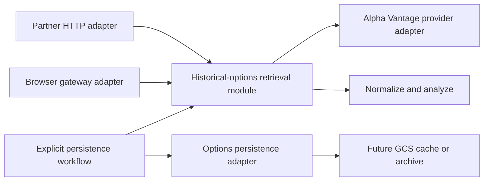

# Historical Options Retrieval Architecture

**Status:** Phase 1 implemented; Phase 2 (legacy writer quarantine) and Phase 3 (GCS persistence adapter) remain pending approval
**Scope:** `HISTORICAL_OPTIONS` retrieval, normalization, analysis, and optional persistence
**Last updated:** 2026-07-21

---

## 1. Purpose

This document expands architecture-review candidate #3: make historical-options retrieval a single deep module.

It records the implemented behavior, explains the split between retrieval and persistence, and prescribes an additive refactor that preserves the public `partnerHistoricalOptionsV2` contract.

This is not a proposal to persist raw options chains in Firestore. The existing one-document storage model remains unsafe for potentially large chains. Any future cache or archive remains a separate GCS-oriented design decision.

## 2. Current Architecture

### 2.1 Call paths

There are two public retrieval paths for `AlphaVantageEndpoint.HISTORICAL_OPTIONS`:

1. **Partner path**
   - `partnerHistoricalOptionsV2` authenticates and validates the request.
   - `historicalOptionsPartnerHandler` creates `HistoricalOptionsRetrievalService` directly.
   - `HistoricalOptionsRetrievalService.fetch()` fetches, validates, normalizes, analyzes, and returns `{ response, analysis }`.
   - The partner handler enforces the serialized-response limit and returns the public envelope with the retrieval result.
   - This path intentionally does not write the raw chain to Firestore.

2. **Browser gateway path**
   - `alphaVantageApiV2` validates browser origin and selects `AvHistoricalOptionsHandler` through the shared factory.
   - The gateway invokes the handler's `fetch()` method.
   - `AvHistoricalOptionsHandler.fetch()` now delegates to `HistoricalOptionsRetrievalService.fetch()` and wraps the result in the base handler's response envelope.
   - The legacy Firestore write path (`saveAvHistoricalOptions`) remains unreachable from the new retrieval module; it is still invoked by the base handler only if an existing caller reaches it.

### 2.2 Current module responsibilities

| Module | Current responsibility | Architectural observation |
|---|---|---|
| `HistoricalOptionsRetrievalService` | Provider request, validation, normalization, error conversion, and analysis; returns `{ response, analysis }` | The single canonical retrieval seam; no persistence side effect. |
| `AvHistoricalOptionsHandler` | Thin adapter that delegates `fetch()` to `HistoricalOptionsRetrievalService`; still used by the browser gateway during migration | Legacy `fetchWithoutPersistence()` removed; persistence path is not reached by ordinary retrieval. |
| `historicalOptionsPartnerHandler` | Partner auth, request parsing, provider-error mapping, response-size enforcement, response logging; consumes `{ response, analysis }` from retrieval | No longer creates a handler; injects the retrieval seam directly. |
| `saveAvHistoricalOptions` | Tracked-symbol guard and Firestore document write | Correctly isolates Firestore I/O, but its filename does not match the project's writer convention. Quarantined from the new retrieval path. |
| `alphaVantageApiV2` | Browser-origin guard, endpoint routing, handler invocation, generic response handling | Exposes `HISTORICAL_OPTIONS` through the generic `fetch()` path. |

## 3. Finding

`AvHistoricalOptionsHandler` historically presented two different interfaces:

- `fetch()` meant **retrieve, normalize, analyze, and best-effort persist**.
- `fetchWithoutPersistence()` meant **retrieve and normalize only**.

The caller had to know which verb was safe for its use case, making the persistence decision a caller-level concern rather than an internal implementation choice.

The normal `fetch()` path had additional ambiguity:

- It calculated analysis only to support a persistence side effect; the returned base response did not include that analysis.
- It started `saveAvHistoricalOptions()` without awaiting completion, so a successful response did not indicate persistence success.
- Persistence errors were logged and intentionally suppressed, so callers could not distinguish a retrieval success from a retrieval-and-storage success.
- The write was conditionally skipped for untracked symbols, yet this was not visible in the return type.
- The browser gateway reached this persistence-capable path even though the partner release is explicitly documented as on-demand with no raw-chain persistence.

**Phase 1 resolution:** `HistoricalOptionsRetrievalService` now owns a single seam that returns both `response` and `analysis` with no persistence side effect. The partner handler consumes this seam directly, and `AvHistoricalOptionsHandler.fetch()` delegates to the same seam. `fetchWithoutPersistence()` has been removed.

## 4. Risks

| Risk | Consequence | Current mitigation | Remaining gap |
|---|---|---|---|
| Accidental raw-chain write | A caller reaches `AvHistoricalOptionsHandler.fetch()` and triggers the one-document Firestore write | `HistoricalOptionsRetrievalService` is pure; the partner path never reaches the handler's persistence code | The browser gateway still uses `AvHistoricalOptionsHandler`, which retains the legacy write path until the gateway migrates. |
| False persistence expectation | Caller interprets a resolved response as a completed write | Retrieval returns only `{ response, analysis }`; persistence is a separate, nonexistent workflow | No persistence workflow exists yet; Phase 2/3 must explicitly define the outcome shape if ever approved. |
| Drift between retrieval paths | Validation, normalization, upstream error conversion, or analysis diverges | All consumers call `HistoricalOptionsRetrievalService.fetch()` | The browser gateway adapter adds response wrapping; parity tests cover partner and retrieval directly. |
| Inconsistent analysis ownership | Analysis is calculated in both the handler and the partner HTTP module | `HistoricalOptionsRetrievalService` computes analysis once and returns it with the response | None for Phase 1. |
| Incomplete test surface | Regressions in storage policy or retrieval parity are not caught | Retrieval, partner, and GCS adapter tests cover the new seam and absence of handler reuse | Add a regression test asserting the partner `fetchOptions` does not construct `AvHistoricalOptionsHandler` once the gateway also migrates. |

## 5. Target Design

### 5.1 Deep module and seam

Create one historical-options retrieval module with a small interface that returns one complete retrieval result:

- normalized provider response;
- derived analysis;
- typed upstream failures;
- no persistence side effect.

The external seam is the retrieval interface. Both the partner HTTP module and any future internal consumer call that same interface.

Provider transport and optional persistence are adapters behind separate seams. They are not represented by ambiguous retrieval method names.

### 5.2 Target flow

The partner path remains: authenticate, validate, retrieve, enforce response limits, and return the existing envelope.

Persistence becomes an explicit workflow that consumes an already-retrieved result. It must not run as an unawaited background effect inside retrieval.

### 5.3 Interface requirements

The proposed retrieval interface must:

- accept a normalized `symbol` and optional `date`;
- return normalized response and analysis together;
- use one typed upstream error model;
- make no Firestore or object-storage write;
- be independently testable with a provider adapter;
- avoid altering the partner endpoint request, response, status codes, authentication, or 10 MiB response limit.

The proposed persistence interface must:

- accept a completed retrieval result, not re-fetch data;
- return an explicit storage outcome: stored, skipped-untracked, skipped-policy, or failed;
- await durable storage before reporting `stored`;
- use a storage target appropriate for large chains; Firestore raw-chain storage is not an approved target;
- remain unavailable to browser or partner callers unless separately approved.

## 6. Prescribed Fixes

### Phase 1 — Remove retrieval/persistence ambiguity ✅ Implemented

1. Extract the shared provider request, validation, normalization, typed-error conversion, and analysis into a dedicated historical-options retrieval module — done (`HistoricalOptionsRetrievalService`).
2. Replace both `fetch()` and `fetchWithoutPersistence()` call sites with that module — done for the partner path; the browser gateway still uses `AvHistoricalOptionsHandler` as a thin adapter.
3. Make `AvHistoricalOptionsHandler` either:
   - a thin adapter to the retrieval module while preserving its public compatibility temporarily; or
   - a removed implementation detail after all callers migrate.
   - **Current state:** thin adapter; `fetchWithoutPersistence()` removed.
4. Stop calculating analysis solely for an implicit persistence side effect. Retrieval returns the analysis as part of its result — done.
5. Preserve the partner endpoint's current public response envelope exactly — verified by tests.

**Acceptance criteria**

- The partner endpoint still returns the same successful payload and endpoint-generated error envelopes ✅
- One controlled provider response produces identical normalized data and analysis for every retrieval consumer ✅
- The partner path performs no Firestore writes ✅
- Typed provider failures still map to `429`, `502`, and `504` through the existing partner contract ✅

### Phase 2 — Quarantine the legacy raw-chain writer

1. Rename `av-options-firestore-helper.ts` to an options writer name that follows the writer convention.
2. Remove the historical-options writer from any general-purpose handler import surface unless an approved persistence workflow requires it.
3. If the legacy Firestore document must remain temporarily reachable, place it behind an explicit policy guard that defaults to disabled.
4. Return a typed storage outcome from the persistence workflow; do not log-and-suppress failures as success.
5. Do not use a tracked-symbol existence check as the only storage-safety policy. Payload size and storage target must be assessed before a write.

**Acceptance criteria**

- No ordinary retrieval call can trigger the legacy raw-chain writer.
- A storage attempt has observable outcome and request correlation.
- Any retained Firestore write has a tested size guard that prevents documents at or over Firestore's limit.
- Documentation continues to state that raw-chain Firestore persistence is unsupported for production.

### Phase 3 — Add a future persistence adapter only after storage approval

1. Decide whether the product needs a cache, archive, or both.
2. Use a GCS-oriented object-storage adapter for raw-chain payloads, following the cache-key, TTL, checksum, retention, and IAM requirements in `historical-options-prd.md`.
3. Keep Firestore limited to small metadata when queryability is needed.
4. Add cache state only as an additive response field behind a separately approved contract version or compatibility decision.
5. Introduce a shared Alpha Vantage throttling module before activating cache-miss fetches at material volume.

**Acceptance criteria**

- Cache hit, miss, expiry, invalid-object, write failure, and upstream failure with an existing valid object are tested.
- A provider failure never replaces a valid cached object.
- No raw contract array is written to Firestore.
- Partner callers do not receive direct bucket access.

## 7. Test Plan

| Layer | Required coverage |
|---|---|
| Retrieval module | Valid response normalization; missing/invalid contract fields; provider rate limit; timeout; malformed provider payload; analysis parity. |
| Partner HTTP module | Retain current auth, validation, error mapping, success, and 10 MiB response tests; inject the retrieval interface rather than a handler method. |
| Persistence workflow | Stored, skipped-untracked, skipped-policy, storage failure, and no re-fetch when persisting an existing retrieval result. |
| Regression guard | Assert partner retrieval does not invoke Firestore or object storage. |
| Optional GCS adapter | Cache hit, miss, expiration, corrupt object, checksum failure, atomic replacement, and prior-valid-object retention on provider error. |

## 8. Migration and Compatibility

- Keep `partnerHistoricalOptionsV2` URL, HTTP method, authentication, request validation, response fields, and response-size behavior unchanged — verified by tests.
- Perform the refactor behind internal modules first; do not expose a new partner endpoint or request parameter.
- Retain compatibility wrappers only while known internal callers migrate. The browser gateway still uses `AvHistoricalOptionsHandler` as the remaining wrapper.
- Do not enable the legacy Firestore persistence path as part of this refactor.
- The as-built guide has been updated to remove references to `fetchWithoutPersistence()` as a permanent architecture decision.

## 9. Decision Status

Phase 1 is implemented. The remaining open decisions are:

- Approve or reject Phase 2 (legacy raw-chain writer quarantine) and Phase 3 (GCS cache/archive adapter).
- Decide when the browser gateway migrates off `AvHistoricalOptionsHandler` so the handler can be removed entirely.

## 10. Related Documents

- `historical-options-prd.md` — partner contract and future GCS-cache requirements.
- `historical-options-discovery.md` — partner onboarding and availability.
- `partner-historical-options-v2-as-built.md` — current deployed implementation.
- `historical-options-code-review.md` — completed endpoint correctness remediation.
