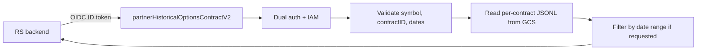
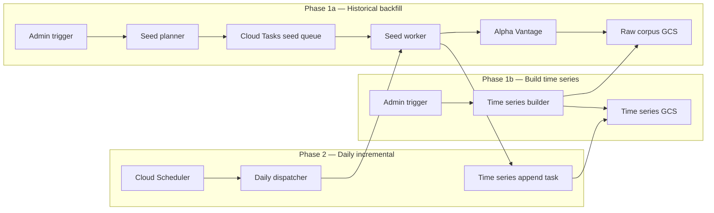

# PRD: Historical Options Per-Contract Time Series

**Status:** Implemented; in production for `QQQ`; 2019–2024 backfill complete; 2025 backfill complete; 2026 backfill complete (Q1: 25,746 contracts, Q2–Q4: 39,650 contracts); safety-net flush bug fixed; `TQQQ` pending  
**Owner:** Savant API  
**Audience:** Savant API engineering, RS engineering, partner administrators, operations  
**Last updated:** 2026-07-23

---

## 1. Summary

Build a Google Cloud Storage (GCS) archive of historical option contract time series and expose a partner-facing HTTPS endpoint. RS selects a specific option contract in its backtesting engine and calls Savant to retrieve the complete daily observation history for that contract.

The initial release covers `QQQ` and `TQQQ` only, from `2019-01-01` through the most recent completed trading day. Data is stored as small per-contract JSONL objects and updated by a daily incremental worker.

## 2. Problem

The existing GCS corpus stores one object per `(symbol, date)` containing the entire option chain for that day. This is useful for archival but is not the shape RS needs for backtesting. A backtester needs the life-of-contract time series for an individual contract (e.g., `QQQ 250 call expiring 2026-08-29`). Pivoting daily snapshots into per-contract series is the service's responsibility, not the consumer's.

## 3. Goals

- Create one ordered time series file per option contract for `QQQ` and `TQQQ`.
- Historical coverage starts at `2019-01-01` and extends through the current completed trading day.
- Provide `partnerHistoricalOptionsContractV2` so RS can request a contract's time series by `contractID`.
- Support optional `startDate`/`endDate` filtering in the consumer request.
- Run a daily worker that fetches the latest raw snapshot and appends each contract's observation to its existing time series.
- Keep Firestore usage limited to small operational ledgers; no option contract payload or time series data in Firestore.
- Leave the existing `partnerHistoricalOptionsV2` request and response contract unchanged.

## 4. Non-Goals

- Contract discovery, selection, or strategy logic. RS owns the "which contract" and "when to trade" decisions.
- Backtesting, signal generation, or trade outcome calculation.
- Joining underlying equity prices. RS can join equity data on `date` if needed.
- Coverage beyond `QQQ` and `TQQQ` in the initial release.
- Real-time or intraday updates. The worker operates on completed trading days.
- Direct GCS access, signed URLs, or browser access to the time series bucket.
- Corporate-action-adjusted contract identity in the initial release.

## 5. Consumer Contract

### 5.1 Endpoint

| Property | Value |
|---|---|
| Function | `partnerHistoricalOptionsContractV2` |
| Method | `GET` |
| Caller | Allowlisted server-side partner service account |
| Required parameters | `symbol`, `contractID` |
| Optional parameters | `startDate`, `endDate` (`YYYY-MM-DD`) |
| Source | GCS per-contract time series object |
| Auth | Existing dual-auth middleware (`ALLOWED_SERVICE_ACCOUNT_EMAILS` / `EXPECTED_GOOGLE_AUDIENCE`) |

### 5.2 Request validation

- `symbol` is trimmed, uppercased, and must be non-empty.
- `contractID` is non-empty and must start with the supplied `symbol`.
- `startDate` and `endDate`, if supplied, must match `YYYY-MM-DD` and represent a valid calendar range.
- `startDate` must be less than or equal to `endDate`.
- Unknown parameters are ignored.

### 5.3 Success response

```json
{
  "ok": true,
  "symbol": "QQQ",
  "contractID": "QQQ260829C00250000",
  "expiration": "2026-08-29",
  "type": "call",
  "strike": "250",
  "startDate": "2024-07-01",
  "endDate": "2026-08-29",
  "series": [
    {
      "date": "2024-07-01",
      "last": "12.30",
      "mark": "12.25",
      "bid": "12.10",
      "bid_size": "10",
      "ask": "12.40",
      "ask_size": "10",
      "volume": "155",
      "open_interest": "1002",
      "implied_volatility": "0.24",
      "delta": "0.51",
      "gamma": "0.02",
      "theta": "-0.04",
      "vega": "0.11",
      "rho": "0.03"
    }
  ]
}
```

- Numeric fields remain strings, consistent with Alpha Vantage normalization.
- `series` is ordered ascending by `date`.
- When `startDate`/`endDate` are supplied, only observations in the inclusive range are returned.
- When no observation falls in the requested range, the endpoint returns `ok: true` with an empty `series` array.
- The response enforces a maximum serialized size guard (e.g., 10 MiB).

### 5.4 Error contract

Endpoint-generated failures return the existing partner envelope:

```json
{ "ok": false, "error": string, "code": string, "timestamp": string }
```

| HTTP status | Code | Meaning |
|---|---|---|
| 400 | `BAD_REQUEST` | Missing or invalid `symbol`, `contractID`, or date range |
| 401 / 403 | Authentication middleware envelope | Missing, invalid, or unauthorized authentication |
| 404 | `NOT_FOUND` | Time series object does not exist or symbol is not covered |
| 405 | `METHOD_NOT_ALLOWED` | Method is not `GET` |
| 413 | `RESPONSE_TOO_LARGE` | Serialized response exceeds the size guard |
| 500 | `INTERNAL_ERROR` | Unexpected service failure |

## 6. Storage Contract

### 6.1 Buckets

- **Raw corpus bucket** (existing): `av-hist-options-corpus-bucket`
  - Objects: `historical-options/v1/{SYMBOL}/{YYYY-MM-DD}.json.gz`
  - Contains the validated Alpha Vantage response envelope.
- **Time series bucket** (new): `av-options-time-series-bucket`
  - Objects: `time-series/v1/{SYMBOL}/{CONTRACT_ID}.jsonl`
  - Contains one ordered time series per contract.

Both buckets are regional, colocated with the Cloud Functions workload, with public access prevention enabled.

### 6.2 Time series object layout

```text
time-series/v1/QQQ/QQQ260829C00250000.jsonl
time-series/v1/TQQQ/TQQQ260829P00250000.jsonl
```

- One file per contract.
- File name is the contract ID.
- Prefix `time-series/v1` leaves room for future schema versions.

### 6.3 File format

Each object is a newline-delimited JSON (`.jsonl`) file. One observation per line, ordered ascending by `date`.

Storage uses compact aliases to reduce object size and read latency. The API expands aliases back to full field names.

**Storage line example:**

```json
{"d":"2024-07-01","l":"12.30","m":"12.25","b":"12.10","bs":"10","a":"12.40","as":"10","v":"155","oi":"1002","iv":"0.24","de":"0.51","g":"0.02","t":"-0.04","ve":"0.11","r":"0.03"}
```

**Alias table:**

| Alias | API / consumer field |
|---|---|
| `d` | `date` |
| `l` | `last` |
| `m` | `mark` |
| `b` | `bid` |
| `bs` | `bid_size` |
| `a` | `ask` |
| `as` | `ask_size` |
| `v` | `volume` |
| `oi` | `open_interest` |
| `iv` | `implied_volatility` |
| `de` | `delta` |
| `g` | `gamma` |
| `t` | `theta` |
| `ve` | `vega` |
| `r` | `rho` |

Constant contract metadata (`symbol`, `contractID`, `expiration`, `type`, `strike`) is not repeated in each line; it is derived from the file path and returned in the API envelope.

### 6.4 Object metadata

GCS custom metadata on each `.jsonl` object may include:

- `symbol`
- `expiration`
- `type`
- `strike`
- `firstObserved` (ISO date)
- `lastObserved` (ISO date)
- `observationCount`
- `schemaVersion`

These fields enable cheap existence and freshness checks without downloading the full object.

### 6.5 Write invariants

- Each `.jsonl` is strictly ordered by `d` ascending.
- No duplicate `d` values in a file.
- New daily observations are appended to the end.
- Writes are generation-aware (`ifGenerationMatch`) to prevent lost updates.
- Objects are immutable except for append operations; no silent overwrites of historical data.

## 7. Architecture

### 7.1 Consumer read flow



### 7.2 Ingestion and build pipeline



## 8. Pipeline Phases

### 8.1 Phase 1a — Historical backfill of raw snapshots

Extend the existing pilot/backfill trigger into a full historical seed.

- New or extended admin HTTP function: `triggerHistoricalOptionsBackfill`
- Parameters:
  - `symbol` — `QQQ` or `TQQQ`
  - `startDate` — defaults to `2019-01-01`
  - `endDate` — defaults to the last completed trading day
  - `execute` — when `false`, returns the plan; when `true`, enqueues tasks
- The planner enumerates expected US options trading dates using the project market-calendar source.
- For each `(symbol, date)`, it enqueues a task on the existing `OPTIONS_CORPUS_SEED_TASK_QUEUE`.
- The seed worker fetches `HISTORICAL_OPTIONS` from Alpha Vantage and writes `historical-options/v1/{SYMBOL}/{date}.json.gz` idempotently (skips existing validated objects).
- Status is recorded in the existing Firestore `options_corpus_runs` metadata.

### 8.2 Phase 1b — Build per-contract time series

After the raw corpus is complete, run the time series builder.

- Admin HTTP function: `triggerHistoricalOptionsTimeSeriesBuild`
- Parameters:
  - `symbol` — `QQQ` or `TQQQ`
  - `execute` — plan vs enqueue
- The planner determines which `(symbol, date)` raw objects have not yet been incorporated.
- It enqueues tasks on a new `OPTIONS_TIME_SERIES_BUILD_TASK_QUEUE`.
- Builder task:
  1. Read raw `historical-options/v1/{SYMBOL}/{date}.json.gz` objects in chronological order.
  2. Extract each contract from the normalized `response.data` array.
  3. Accumulate `Map<contractID, observations[]>`.
  4. Sort each contract's observations by `date`.
  5. Write `time-series/v1/{SYMBOL}/{contractID}.jsonl` for each contract.

**Memory strategy:** The builder processes raw files in date chunks (e.g., 3 months) to bound memory. After each chunk it flushes/appends per-contract files. A one-shot large-memory build is acceptable for the initial `QQQ`/`TQQQ` backfill if approved, but chunked processing is the default design.

### 8.3 Phase 2 — Daily incremental worker

A Cloud Scheduler job triggers the daily dispatcher after market close.

- Job name: `historical-options-daily-dispatcher`
- Schedule: `0 18 * * *` (6 PM ET daily; non-trading days are no-ops)
- For each configured options symbol:
  1. Determine the most recent completed trading date not yet in the raw corpus.
  2. Enqueue a seed task for that `(symbol, date)`.
  3. When the seed task succeeds, enqueue a time-series append task for `(symbol, date)`.

**Append task:**

1. Read the raw `historical-options/v1/{SYMBOL}/{date}.json.gz` object.
2. For each contract in the snapshot:
   - Read `time-series/v1/{SYMBOL}/{contractID}.jsonl` if it exists.
   - If the new `date` is already present, skip.
   - Append the new observation to the end.
   - Rewrite the file with generation-aware preconditions.
3. Record completion in the `options_time_series_append` ledger.

On the first day a contract is observed, the append task creates the file; on later days it appends.

## 9. Idempotency and Ledger

Firestore stores only small operational state. No contract payload is written to Firestore.

- `options_corpus_runs/{runId}` — existing seed run metadata.
- `options_corpus_runs/{runId}/items/{SYMBOL}_{date}` — existing seed item status.
- `options_time_series_build/{SYMBOL}_{date}` — raw snapshot incorporated into time series.
  - Fields: `incorporatedAt`, `builderRunId`, `observationCount`, `retryCount`.
- `options_time_series_append/{SYMBOL}_{date}` — daily append completed.
  - Fields: `appendedAt`, `contractCount`, `observationCount`, `error`.

These ledgers enable safe resume, prevent duplicate appends, and provide operator visibility.

## 10. Security and IAM

- `av-options-time-series-bucket` is created with public access prevention enabled.
- The bucket is linked to Firebase Storage and uses locked rules (`allow read, write: if false`) because consumers do not access the bucket directly.
- The Cloud Functions runtime service account receives `storage.objectAdmin` on `av-options-time-series-bucket` (scope may be limited to the `time-series/v1` prefix if IAM conditions permit).
- Partner authentication reuses the existing dual-auth middleware and secrets.
- Consumers never receive signed GCS URLs or bucket-level IAM.
- The Alpha Vantage API key remains a bound secret; it is never exposed in payloads, metadata, logs, or task data.
- Logs include symbol, contractID, date range, response size, and latency. They never include raw option chains, tokens, or API keys.

## 11. Latency and Cost

### 11.1 Latency

- Most per-contract `.jsonl` objects are tens to low-hundreds of KB.
- A same-region GCS read plus JSONL parse is typically under 200 ms.
- RS backtests pull ~300 contracts per run; these should be requested in parallel from the RS backend.
- Multi-leg strategies request each leg's contract in parallel.
- A future batch endpoint returning multiple contracts in one call is a deferred optimization.

### 11.2 Cost

- **GCS storage:** For `QQQ` and `TQQQ` from 2019, expect roughly 100k–150k small `.jsonl` objects totaling a few GB of text. Regional Standard storage cost is low.
- **GCS operations:** Daily incremental update requires approximately one read and one write per contract per symbol. At ~5,000 contracts per symbol, this is ~10,000 operations per day for both symbols. Operation costs are negligible.
- **Backfill builder:** One-time heavier GCS read/write volume; still dominated by object operations, which are cheap at this scale.
- **Firestore:** Only ledger documents per `(symbol, date)`; no payload reads or writes.

## 11.5. Implementation Progress (2026-07-23)

The per-contract time-series pipeline is implemented and in production for `QQQ`:

- `av-options-time-series-bucket` created and linked; `OPTIONS_TIME_SERIES_BUCKET` environment variable configured.
- `TimeSeriesBuilderService` deployed behind `triggerHistoricalOptionsTimeSeriesBuild`.
- `GcsTimeSeriesAdapter` writes compact aliased JSONL objects and now retries transient network errors (`EPIPE`, `ECONNRESET`, `ETIMEDOUT`, `ECONNREFUSED`) up to 3 times with exponential backoff.
- `partnerHistoricalOptionsContractV2` deployed; returns the expanded `TimeSeriesApiObservation` envelope from GCS.
- Full-year QQQ backfills completed for 2019, 2020, 2021, 2022, 2023, and 2024.
- 2025 QQQ backfill is in progress after raising the builder timeout from 540s to 1200s and lowering write concurrency from 100 to 20.
- `TQQQ` time-series backfill has not started.

## 12. Rollout / Implementation Slices

1. Approve this PRD and the bucket governance decisions (bucket name, region, lifecycle, retention, IAM).
2. Create `av-options-time-series-bucket` and configure Firebase Storage rules.
3. Add `OPTIONS_TIME_SERIES_BUCKET` environment variable to the functions runtime.
4. Extend the admin backfill trigger for the full `2019-01-01` range.
5. Implement the time series builder (chunked by symbol and date range).
6. Implement `partnerHistoricalOptionsContractV2`.
7. Implement the daily dispatcher and append task.
8. Run Phase 1a backfill for `QQQ` and `TQQQ`.
9. Run Phase 1b builder for `QQQ` and `TQQQ`.
10. Verify Phase 2 daily incremental behavior.
11. Deliver endpoint contract and sample requests to RS.

## 13. Acceptance Criteria

- `QQQ` and `TQQQ` raw snapshots exist for every expected trading date from `2019-01-01` through the current completed day.
- A `.jsonl` time series file exists for every contract observed in the corpus.
- `partnerHistoricalOptionsContractV2` returns a correctly ordered series for a known contract.
- `startDate`/`endDate` filtering returns the correct subset and handles out-of-range requests gracefully.
- The daily worker appends the next trading day's observations without creating duplicate dates.
- Re-running the backfill or the daily worker is idempotent.
- No option contract payload or time series data is written to Firestore.
- GCS access remains private; consumers use only the partner endpoint.
- The existing `partnerHistoricalOptionsV2` contract is unchanged.

## 14. Risks and Controls

| Risk | Control |
|---|---|
| Alpha Vantage quota exhausted during backfill | Use shared throttle, low initial rate, resumable date chunks, and a hard call cap. |
| Builder runs out of memory | Process in 3-month date chunks and flush per-contract files incrementally. |
| Duplicate observations on rerun | Ledger checks plus in-file date deduplication. |
| Concurrent append conflicts | One append task per `(symbol, date)`; generation-aware writes. |
| Large contract files (e.g., multi-year LEAPS) | Monitor file sizes; split by year if a threshold is approached. |
| Consumers request direct bucket access | Locked Firebase Storage rules; no signed URLs. |
| Scope expands to broad universe | Fixed symbol allowlist (`QQQ`, `TQQQ`); new PRD required for additional symbols. |
| Corporate action changes an OCC contractID | Deferred; handle if/when it occurs for covered symbols. |

## 15. Deferred Decisions

- Multi-contract batch endpoint.
- Adding underlying equity price to each observation.
- Additional symbols beyond `QQQ` and `TQQQ`.
- Splitting long contract files by calendar year.
- Long-term archive storage class or lifecycle policy.
- ContractID normalization for corporate actions.
