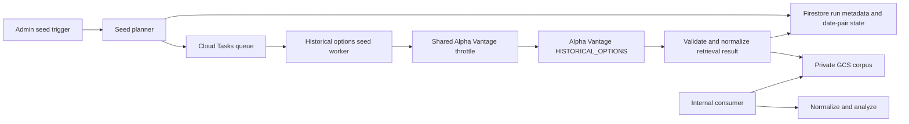

# QQQ/TQQQ Historical Options Corpus — Implementation Plan

**Status:** Phase 1a raw corpus and Phase 1b per-contract time series implemented for `QQQ`; 2019–2024 complete; 2025 backfill in progress; `TQQQ` pending final approval gates  
**Scope:** Private GCS corpus for `QQQ` and `TQQQ` historical options from 2019 onward  
**Last updated:** 2026-07-23

---

## 1. Objective

Build a private, reproducible historical-options corpus for `QQQ` and `TQQQ` that supports Savant development and initial strategy research without repeatedly calling Alpha Vantage for already-seeded historical dates.

The corpus stores one validated Alpha Vantage `HISTORICAL_OPTIONS` response for each expected US options trading date from `2019-01-01` through the completed trading day when the seed run begins. Strategy tooling reads the corpus through an internal adapter. The existing `partnerHistoricalOptionsV2` HTTP contract remains unchanged unless a later cache-read phase is separately approved.

This plan does not authorize:

- raw options-chain storage in Firestore;
- direct RS or browser access to GCS;
- broad-universe backfills;
- a change to the partner endpoint response contract;
- use of another organization's database or exported dataset.

## 2. Success Definition

The assignment is complete when:

1. Every expected `{ symbol, tradingDate }` pair for `QQQ` and `TQQQ` is represented in a durable run manifest as `stored`, `not_available`, or `failed`.
2. Every stored object has passed provider-response validation, schema validation, checksum verification, and object-size recording.
3. A rerun resumes safely without re-fetching validated immutable dates or overwriting them accidentally.
4. Development/strategy code can retrieve and normalize a stored object through a private internal interface without calling Alpha Vantage.
5. No raw option chain is written to Firestore, exposed through a direct GCS URL, or silently substituted for a live provider response in the existing partner endpoint.
6. Provider-call volume, retry behavior, stored-byte growth, coverage, and failures are observable.
7. A scheduled incremental job seeds both symbols for each completed trading day after market close without duplicating existing valid objects.

## 3. Preconditions and Explicit Decisions

Complete these before writing implementation code:

| Decision | Required owner outcome |
|---|---|
| Alpha Vantage entitlement | Confirm the active plan permits `HISTORICAL_OPTIONS`, approximately 3,700–3,900 seed requests plus retries, retention, and the intended internal development/strategy use. Confirm partner redistribution separately. |
| Provider rate | Record the contracted per-minute limit and choose a seed rate at or below 50% of that limit. The default must be configurable and conservative. |
| GCP location | Select the project and region, co-located with the Cloud Functions workload where possible. |
| Bucket governance | Approve private bucket name, retention period, lifecycle rules, encryption posture, deletion policy, and operational access principals. |
| Shared throttling | Approve the account-wide Alpha Vantage quota-control design. The seed must participate in it; it must not independently consume provider capacity. |
| Architecture seam | Approve the historical-options retrieval/persistence separation plan so the seed consumes a pure retrieval result and cannot invoke the legacy Firestore writer. |
| Strategy consumer | Name the first internal strategy consumer, its service account, expected read volume, and its required normalized data shape. |

If any of these decisions is missing, stop at planning/proof-of-concept work. Do not start the full provider backfill.

## 4. Proposed Architecture



### 4.1 Why each component exists

- **Pure retrieval module:** Makes one provider request, validates/transforms it, maps typed failures, and returns an in-memory result. It performs no storage I/O.
- **Cloud Tasks:** Provides bounded concurrency, retry, and durable per-date execution. A long 3,800-request backfill must not be a single HTTP request or a single Cloud Function invocation.
- **Seed worker:** Owns one `{ symbol, tradingDate }` attempt, storage validation, idempotency, and outcome recording.
- **GCS:** Stores the raw provider payload and metadata envelope as immutable historical objects.
- **Firestore metadata only:** Tracks small operational records such as run state, queue progress, status, attempt count, object generation, checksum, and failure reason. It never contains a full raw chain.
- **Internal consumer:** Uses `GcsCorpusAdapter.readItem()` to read one validated object and normalize it for strategy code. The adapter prevents consumers from knowing GCS paths or Alpha Vantage credentials. A standalone `strategy-reader` wrapper is not used.

Firestore metadata is recommended for this production-ready plan because it provides cheap queryable progress, retry, and operator visibility. It remains optional for the raw corpus itself.

## 5. Storage Contract

### 5.1 Bucket and paths

Use a private regional bucket with a project-specific name selected during approval. Store immutable objects at:

```text
historical-options/v1/QQQ/2019-01-02.json.gz
historical-options/v1/TQQQ/2019-01-02.json.gz
```

Store run artifacts separately:

```text
historical-options/v1/manifests/{runId}.json
historical-options/v1/reports/{runId}.json
```

Do not treat path existence alone as proof of a usable object.

### 5.2 Object envelope

The gzipped object must contain a versioned JSON envelope:

```text
{
  "schemaVersion": "v1",
  "provider": "alpha-vantage",
  "endpoint": "HISTORICAL_OPTIONS",
  "symbol": "QQQ",
  "requestedDate": "2019-01-02",
  "fetchedAt": "2026-07-21T00:00:00.000Z",
  "rawResponse": {},
  "normalizedData": {},
  "integrity": {
    "sha256": "...",
    "uncompressedBytes": 0,
    "compressedBytes": 0
  }
}
```

The stored normalized result must be sufficient for the internal adapter to return a consistent retrieval shape without recontacting Alpha Vantage. Persisting both raw and normalized data is acceptable only after measuring object size in the pilot; if it creates unnecessary duplication, store raw data plus a deterministic normalization schema version instead.

### 5.3 Write invariants

- Validate the provider response before creating an object.
- Compute the checksum from a defined canonical uncompressed representation.
- Use a GCS generation precondition equivalent to `doesNotExist` for ordinary seed writes.
- Never overwrite a valid historical object during a normal run.
- Permit replacement only through an explicit repair mode with an operator-provided reason and an audit record.
- Record GCS generation, checksum, compressed bytes, uncompressed bytes, and schema version in the Firestore metadata record.

## 6. Firestore Metadata Model

Use a dedicated small-metadata namespace. Proposed documents:

```text
options_corpus_runs/{runId}
options_corpus_runs/{runId}/items/{SYMBOL}_{YYYY-MM-DD}
```

### 6.1 Run document

The run document records:

- target symbols and requested date range;
- planner version and retrieval schema version;
- configured provider request rate and task concurrency;
- run state: `planned`, `running`, `paused`, `completed`, `completed_with_failures`, or `cancelled`;
- expected, stored, not-available, failed, queued, and running counts;
- started, updated, completed timestamps;
- cumulative provider calls, retries, and stored bytes.

### 6.2 Item document

Each item document records:

- normalized symbol and requested trading date;
- status: `pending`, `queued`, `running`, `stored`, `not_available`, `retryable_failure`, `failed`, or `skipped_existing`;
- attempt count and last attempt timestamp;
- typed failure category when applicable;
- GCS object name and generation;
- checksum and byte sizes when stored;
- provider request correlation ID and worker correlation ID;
- explicit repair reason if a replacement was approved.

No item document may include the raw provider response or raw contract array.

## 7. Implementation Slices

Implement and deploy one slice at a time. Each slice must compile and pass focused tests before the next begins.

### Slice 1 — Retrieval and persistence boundary

**Work**

1. Extract a historical-options retrieval service from the existing handler behavior.
2. Make it responsible for provider request construction, response validation, normalization, typed error conversion, and analysis.
3. Preserve compatibility adapters only where existing callers require them.
4. Quarantine the legacy Firestore raw-chain writer behind an explicit disabled policy.

**Done when**

- Partner retrieval behavior and its response/error contract are unchanged.
- The new retrieval service has no Firestore or GCS dependency.
- Tests prove an ordinary retrieval cannot trigger a raw-chain Firestore write.

### Slice 2 — GCS corpus adapter

**Work**

1. Add a single-purpose GCS object writer/reader module.
2. Implement versioned envelope serialization, gzip compression, checksum generation, schema validation, and generation-precondition writes.
3. Implement a reader that verifies the envelope/checksum before returning data.
4. Add a small metadata repository for run/item state only.

**Done when**

- A fixture response can be stored, read, decompressed, checksum-verified, and converted back to the retrieval result.
- Corrupt, wrong-schema, missing, and checksum-mismatched objects fail safely.
- Raw option contracts do not appear in Firestore test fixtures or writes.

### Slice 3 — Planner and date calendar

**Work**

1. Generate the expected trading-date set from `2019-01-01` to the selected seed end date.
2. Use the project market-calendar source or an approved exchange-calendar source; do not approximate solely by removing weekends.
3. Create an idempotent administrative trigger that creates a run manifest and item records.
4. Skip existing validated objects by default and produce a deterministic plan summary before enqueuing work.

**Done when**

- The date list is reproducible and tests include weekends, US market holidays, and known shortened sessions.
- Planning the same range twice does not duplicate valid work.
- Operators can review expected item count before execution.

### Slice 4 — Cloud Tasks seed worker and rate control

**Work**

1. Add a dedicated task queue and one worker for one `{ symbol, date }` item.
2. Integrate the approved shared provider throttle before each Alpha Vantage call.
3. Configure queue concurrency and dispatch rate below the provider budget.
4. Classify outcomes: stored, not available, retryable provider failure, terminal validation failure, or cancelled.
5. Use bounded exponential retry for retryable errors and preserve state for operator resume.

**Done when**

- The worker cannot exceed the configured account-wide provider budget.
- A retry does not overwrite a valid object or duplicate a completed item.
- Pause/cancel/resume behavior is tested.
- A provider `429`, timeout, malformed payload, and GCS write failure produce observable typed outcomes.

### Slice 5 — Internal consumer read path

**Work**

1. Define the internal strategy-facing request/result type for one symbol/date.
2. Read the corpus through `GcsCorpusAdapter.readItem()` and return the validated, normalized result.
3. Make missing/not-available objects explicit; do not silently fall back to Alpha Vantage.
4. Keep any live-provider fallback behind a separately approved configuration, with shared throttling and logs.

**Done when**

- Internal consumers read an existing `QQQ` or `TQQQ` object through `GcsCorpusAdapter` without an Alpha Vantage call.
- Missing data has a typed outcome distinguishable from provider failure.
- No consumer has direct bucket-path knowledge or broad bucket IAM.
- A standalone `strategy-reader` wrapper is not introduced; the adapter is the read seam.

### Slice 6 — Pilot, full seed, and handoff

**Work**

1. Run a controlled pilot: 20 trading dates for both symbols.
2. Measure response size, compressed size, processing time, provider behavior, rate-control behavior, and cost signal.
3. Review pilot report and approve the full run.
4. Seed the full range in resumable batches.
5. Produce a final coverage and quality report, then enable the internal strategy reader for the corpus.

**Done when**

- The final manifest accounts for every expected pair.
- The final report records actual provider calls, retries, total bytes, storage cost estimate, and unresolved items.
- Operations accepts the corpus as usable for dev/initial strategies.

### Slice 7 — Nightly incremental maintenance

**Work**

1. Add a dedicated scheduled function that runs at `7:00 PM` Pacific, Monday through Friday, using the `America/Los_Angeles` timezone.
2. Preserve the existing `6:00 PM` Pacific Alpha Vantage run as the preceding workload; the options-corpus schedule must not run before it.
3. Resolve the current Pacific date and exit without creating a run or task when the US options market is closed.
4. Create a non-pilot, one-trading-day run for `QQQ` and `TQQQ`, then enqueue only items that are not already recorded as successful or represented by a valid GCS object.
5. Reuse the existing Cloud Tasks seed worker, configured provider throttle, storage contract, and retry behavior.
6. Emit the daily run ID, target date, queued count, skipped-existing count, and terminal failure count to the existing operational logs.

**Done when**

- The job uses `0 19 * * 1-5` with the `America/Los_Angeles` timezone.
- A trading-day execution enqueues at most one missing task per symbol.
- Weekend and market-holiday executions enqueue no tasks and create no empty run document.
- Re-running the same scheduled date does not issue an additional Alpha Vantage request for a successful or valid stored item.
- Focused Jest tests cover trading-day, weekend/holiday, and previously-completed-item behavior.

## 8. Rate, Cost, and Duration Plan

### 8.1 Seed volume

Assume approximately 1,850–1,950 US trading dates per symbol from 2019 through mid-2026, yielding 3,700–3,900 source calls before retries.

### 8.2 Initial rate policy

Use the lower of:

- 50% of the contracted Alpha Vantage per-minute quota; or
- the configured shared-throttle budget remaining after protected production workloads.

For planning, 50 requests/minute is a reasonable upper initial bound only if the provider plan allows it. It gives a theoretical source-call floor near 76 minutes for 3,800 calls. The production job must plan for several hours, not the theoretical floor, because it needs retries, pauses, validation, GCS writes, and protection for other workloads.

### 8.3 Cost controls

- Set a Cloud Billing budget alert for the GCP project before the pilot.
- Record actual compressed object-size percentiles in the pilot before estimating long-term storage.
- Keep the bucket regional and colocated with processing to avoid avoidable network charges.
- Keep initial storage in Standard class while actively used for development; evaluate lifecycle transitions only after actual access patterns are known.
- Set a maximum provider-call count for each run; require explicit operator approval to exceed it.
- Require a manifest-based resume. Never restart the whole range after a partial failure.

## 9. IAM and Security Plan

- Bucket-level public access prevention remains enabled.
- The seed worker runtime service account receives the minimum GCS object create/read permissions limited to the corpus prefix if supported by the selected policy model.
- The internal consumer service account receives read-only access limited to the corpus prefix.
- Administrative operators receive narrowly scoped object and run-metadata permissions; they do not receive Alpha Vantage API keys.
- The Alpha Vantage key remains a bound secret in the Cloud Function runtime and is never included in task payloads, object metadata, logs, reports, or manifests.
- Cloud Tasks workers verify their expected invocation identity and do not expose an unauthenticated HTTP seed endpoint.
- Logs include run ID, item ID, symbol, date, status, attempt, object generation, byte size, and typed error category. They never include raw chains, tokens, or API keys.

## 10. Test Plan

| Area | Required tests |
|---|---|
| Retrieval | Provider request, normalization, analysis parity, rate-limited response, timeout, malformed response, and no storage side effect. |
| GCS adapter | Round trip, gzip handling, checksum mismatch, schema mismatch, corruption, missing object, conditional-write conflict, and repair mode. |
| Metadata repository | State transitions, idempotent item creation, attempt counting, and aggregate counters. |
| Planner | Date generation, weekends, holidays, duplicate plan request, pre-existing valid object, and date outside configured range. |
| Worker | Stored, not available, provider `429`, timeout, malformed data, GCS failure, task retry, cancellation, and no duplicate overwrite. |
| Throttle | Shared-budget denial, queue pacing, retry delay, and protected production workload reservation. |
| GCS read path | Existing object, missing object, invalid/corrupt object, typed absence, checksum verification, and proof that no provider request occurs. |
| Pilot acceptance | Both symbols, 20 dates each, manifest/report correctness, actual byte measurements, and zero raw Firestore writes. |
| Nightly incremental job | 7:00 PM Pacific schedule, trading-day enqueue for both symbols, weekend/holiday no-op, existing-success no-op, and task dispatch failure. |

Use Jest tests in the mirrored `functions/tests` structure. Run the affected focused tests and both TypeScript compilation projects after each slice.

## 11. Observability and Operations

Create structured events and log-based metrics for:

- run planned, started, paused, resumed, cancelled, and completed;
- items queued, stored, skipped-existing, not available, retried, and failed;
- provider calls, provider `429`s, timeouts, and other upstream failures;
- throttle waits and denied-budget attempts;
- GCS writes, reads, validation failures, checksum failures, and storage bytes;
- coverage percentage, retry count, age of last successful corpus update, and unresolved item count;
- scheduled nightly run target date, queue count, skipped-existing count, and terminal-failure count.

Create an operator runbook covering:

1. start a pilot;
2. inspect progress and failed items;
3. pause or cancel a run;
4. resume retryable items;
5. approve an explicit repair;
6. produce the final coverage report; and
7. respond to a provider-limit or storage-integrity incident.

## 12. Risks and Controls

| Risk | Control |
|---|---|
| Provider terms do not permit the intended retention or use | Obtain written/recorded confirmation before any full seed. |
| Provider quota interferes with production | Use shared throttle, reserved production capacity, low initial rate, and a hard run-call cap. |
| Partial corpus is mistaken for complete | Require manifest statuses and final coverage report for every expected date pair. |
| Chain payloads exceed expected size | Pilot first, gzip storage, record size distribution, and reject unsafe HTTP responses independently of storage. |
| Corrupt or incompatible stored data | Versioned envelope, checksum, schema validation, immutable normal writes, and explicit repair workflow. |
| GCS becomes a public data channel | Public access prevention, minimum IAM, internal adapter only, no signed URLs. |
| Legacy Firestore writer is activated accidentally | Complete retrieval/persistence separation before seed implementation; test no raw Firestore writes. |
| Scope grows into a market-wide archive | Enforce allowlisted symbols and fixed date range in the first release; require a new PRD approval for expansion. |

## 13. Backfill and Time-Series Progress (2026-07-23)

The QQQ/TQQQ historical options corpus implementation has progressed through the following milestones:

- **Raw corpus (Phase 1a)**
  - `QQQ` raw daily snapshots seeded for every expected US options trading date from 2019-01-01 through 2024-12-31.
  - Objects stored at `historical-options/v1/QQQ/{YYYY-MM-DD}.json.gz` in `av-hist-options-corpus-bucket`.
  - Seed worker and `GcsCorpusAdapter` validate, gzip, and checksum each object; manifest status tracked in Firestore `options_corpus_runs`.
- **Per-contract time series (Phase 1b)**
  - `TimeSeriesBuilderService` deployed behind `triggerHistoricalOptionsTimeSeriesBuild`.
  - Builder reads the raw corpus, accumulates per-contract observations, and writes merged `time-series/v1/QQQ/{CONTRACT_ID}.jsonl` objects to `av-options-time-series-bucket`.
  - Builder supports an optional `contractID` filter and an `execute` plan mode.
  - Full-year QQQ backfills completed for 2019, 2020, 2021, 2022, 2023, and 2024 with zero missing or corrupt dates.
  - 2025 QQQ backfill is in progress after raising `timeoutSeconds` to 1200s, lowering `DEFAULT_WRITE_CONCURRENCY` to 20, and adding a GCS `EPIPE`/`ECONNRESET`/`ETIMEDOUT`/`ECONNREFUSED` retry in `GcsTimeSeriesAdapter`.
- **TQQQ**
  - Not yet backfilled; Phase 1a/1b for `TQQQ` remains pending.
- **Operational fixes**
  - `OPTIONS_CORPUS_BUCKET` and `OPTIONS_TIME_SERIES_BUCKET` environment variables configured on deployed functions.
  - Initial environment variable mangling corrected via `gcloud run services update`.
  - `timeoutSeconds` on `triggerHistoricalOptionsTimeSeriesBuild` raised from 540s to 1200s.
  - `DEFAULT_WRITE_CONCURRENCY` in `TimeSeriesBuilderService` reduced from 100 to 20.
  - `GcsTimeSeriesAdapter.writeLines` now retries up to 3 times with exponential backoff for `EPIPE`, `ECONNRESET`, `ETIMEDOUT`, and `ECONNREFUSED` errors.

## 14. Final Acceptance Checklist

- [ ] All preconditions and licensing/governance decisions are approved.
- [ ] Retrieval is pure and cannot invoke the legacy raw-chain Firestore writer.
- [ ] Private bucket, IAM, lifecycle, retention, and billing alert are configured.
- [ ] GCS envelope and metadata repository pass their focused tests.
- [ ] Shared provider throttle and Cloud Tasks worker pass pacing/retry/resume tests.
- [ ] Pilot report for 20 dates per symbol is accepted.
- [ ] Full seed manifest accounts for every expected `QQQ` and `TQQQ` date.
- [ ] `GcsCorpusAdapter.readItem` returns validated stored data without an Alpha Vantage call.
- [ ] Final quality/cost/coverage report is reviewed and accepted.
- [ ] Nightly incremental job runs at 7:00 PM Pacific on trading days and safely skips closed-market days.
- [ ] No raw chain is in Firestore and no direct GCS consumer access exists.

## 15. Deferred Decisions

The following are intentionally outside this assignment:

- adding symbols beyond `QQQ` and `TQQQ`;
- enabling the existing partner endpoint to read from this corpus;
- serving the corpus to RS or other partners;
- long-term archive tier selection;
- cross-region replication;
- full-market historical-options coverage;
- a data-lake or warehouse analytics design.
