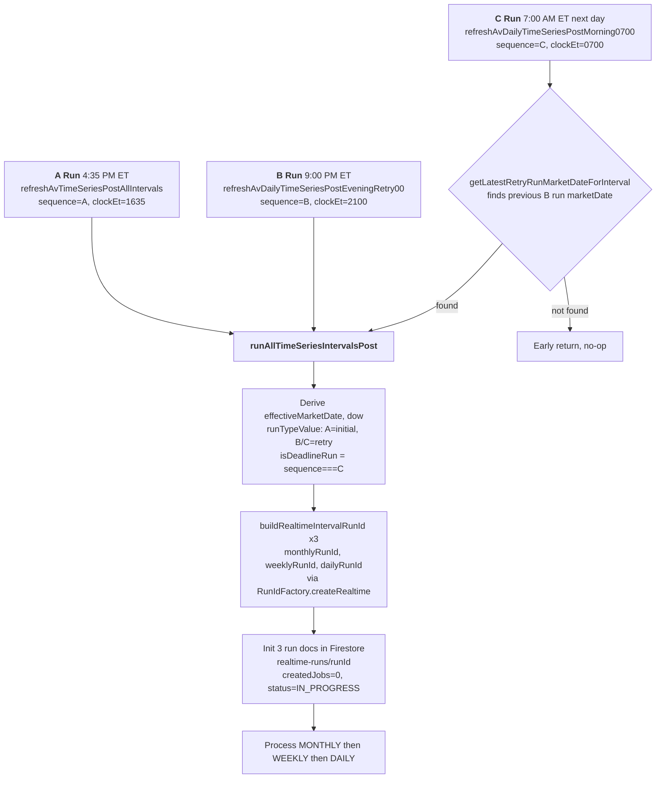
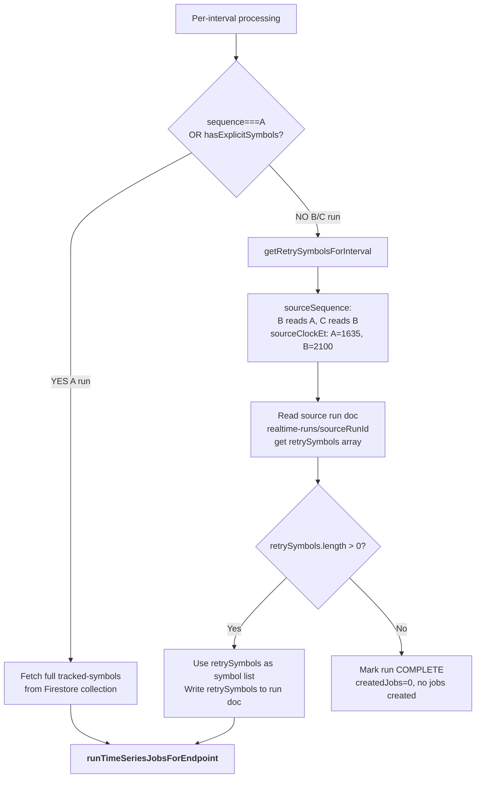
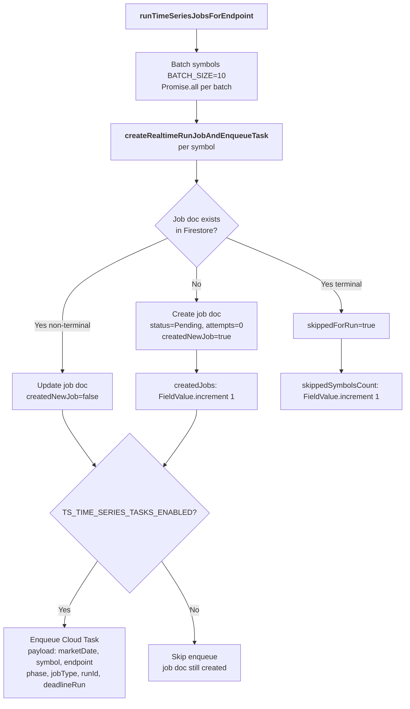
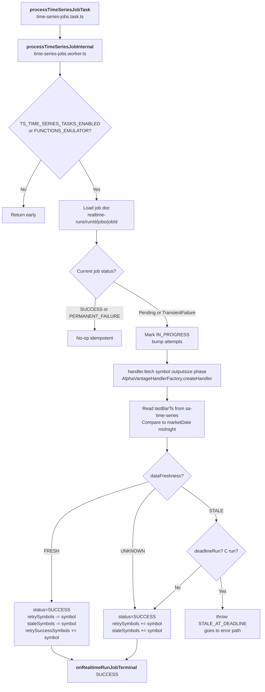
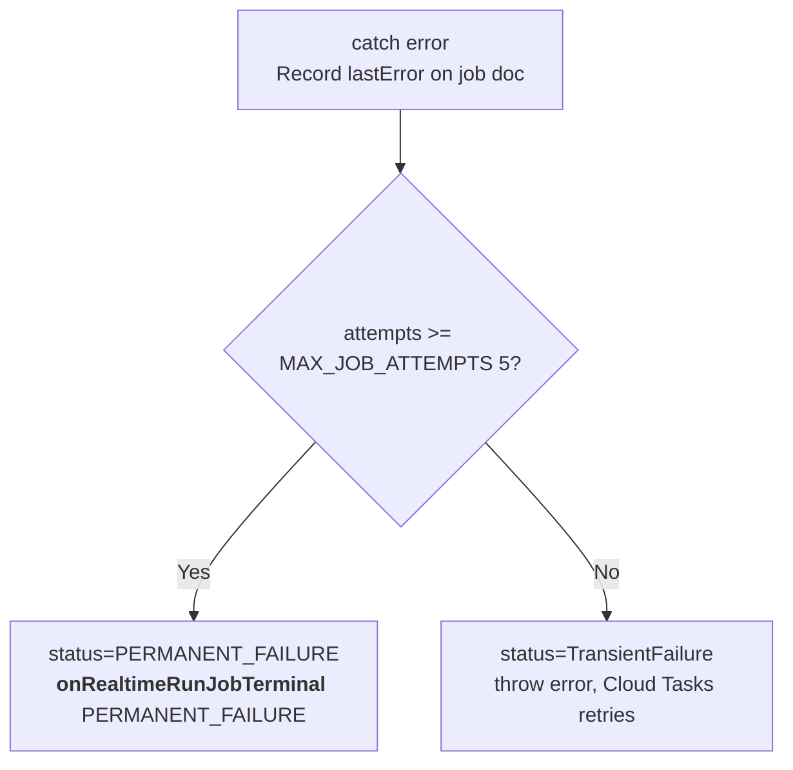
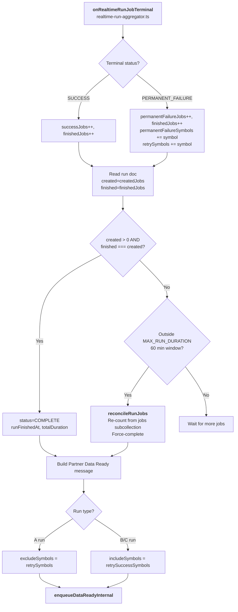
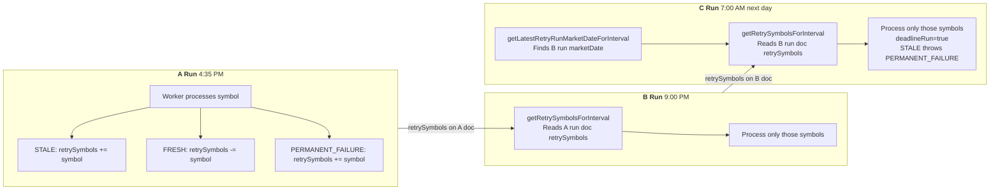

# ABC Run Pipeline — Complete Flow

### Related Documents

| Document | Purpose | Audience |
|----------|---------|----------|
| **`pipeline/time-series-job-pipeline-plan.md`** | Design rationale, architecture decisions, migration plan, and future work. The "why + what". | Internal SA engineers |
| **`pipeline/time-series-job-pipeline-deep-dive.md`** | Technical appendix with concrete TypeScript types, code paths, Firestore shapes, and step-by-step algorithms. The "how". | Internal + RS engineering |
| **`partner/rs-partner-integration.md`** | Consumer-facing contract: Pub/Sub payloads, subscription filters, `includeSymbols`/`excludeSymbols` semantics, HTTPS endpoints, quick start. | RS backend engineers |
| **`pipeline/abc-run-pipeline-flowchart.md`** (this doc) | Mermaid flowcharts documenting the A/B/C pipeline visually with filenames and function names. | Internal + RS engineering |

---

## Schedule Summary

| Run | Cron (ET) | Scheduler Function | Sequence | clockEt |
|-----|-----------|-------------------|----------|---------|
| **A** | `35 16 * * 1-5` (4:35 PM) | `refreshAvTimeSeriesPostAllIntervals` | `A` | `1635` |
| **B** | `0 21 * * 1-5` (9:00 PM) | `refreshAvDailyTimeSeriesPostEveningRetry00` | `B` | `2100` |
| **C** | `0 7 * * 1-5` (7:00 AM next day) | `refreshAvDailyTimeSeriesPostMorning0700` | `C` | `0700` |

### Key Files

| File | Purpose |
|------|---------|
| `function-schedules.ts` | Cron schedule constants |
| `av-time-series-refresh-manager.ts` | Scheduler entry points, orchestrator, job creation |
| `runid-factory.ts` | Run ID generation, validation, parsing |
| `time-series-jobs.task.ts` | Cloud Task entry point |
| `time-series-jobs.worker.ts` | Worker: fetches AV data, determines freshness, updates job/run docs |
| `realtime-run-aggregator.ts` | Aggregator: increments run counters, detects completion, publishes PDR |
| `job-config.ts` | Constants (MAX_JOB_ATTEMPTS, batch sizes, rate limits) |
| `time-series-jobs.model.ts` | TypeScript interfaces and enums |

---

## 1. Scheduler to Orchestrator



## 2. Per-Interval Branching: A Run vs B/C Retry



## 3. Job Creation Loop



## 4. Worker: Fetch Data and Determine Freshness



## 5. Error and Retry Path



## 6. Run Aggregator and Completion



## Run ID Format

```
YYYY-MM-DD-DOW-SEQ-INTERVAL-LIVE|MANUAL-POST-HHMM
```

**Example:** `2026-02-13-FRI-A-DAILY-LIVE-POST-1635`

Generated by `RunIdFactory.createRealtime()` in `runid-factory.ts`.

## Firestore Document Structure

```
realtime-runs/
  {runId}/                          ← Run document
    runId, runType, sequence, marketDate, phase, interval, trigger
    status: IN_PROGRESS | COMPLETE
    createdJobs, finishedJobs, successJobs, permanentFailureJobs
    retrySymbols[], staleSymbols[], retrySuccessSymbols[]
    partnerDataReady: { messageSent, sendTime, messagePayload }
    runCreatedAt, runStartedAt, runFinishedAt, totalDuration
    jobsCreationStartedAt, jobsCreationCompletedAt

    jobs/                           ← Job subcollection
      {SYMBOL-ENDPOINT-phase}/      ← Job document
        symbol, endpoint, interval, phase
        status: Pending | InProgress | Success | TransientFailure | PermanentFailure
        attempts, createdAt, updatedAt, firstAttemptedAt, lastAttemptAt
        dataFreshness: FRESH | STALE | UNKNOWN
        periodStatus: IN_PROGRESS | PERIOD_END
        lastError?
```

## Retry Symbol Flow


