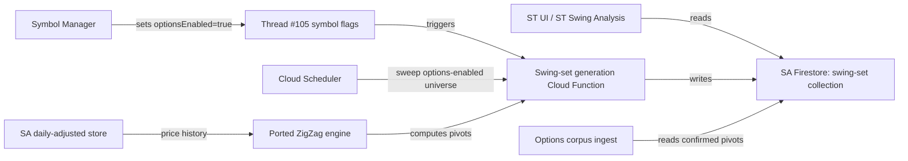

**Topic:** Swing-driven options corpus platform  
**Topic Slug:** swing-driven-options-corpus  
**Thread:** Swing-set generation platform  
**Thread Slug:** swing-set-platform  
**Issue:** #104  
**Thread Parent:** #103  
**Topic Parent:** #102  
**Domain:** OPTIONS-DATA  
**Type:** PRD  
**Status:** Approved  
**Created:** 2026-09-23  
**Last Updated:** 2026-09-23  

---

> **SUPERSEDED (2026-09-26):** The multi-config + served-swing design in this document was replaced: SA stores one dev2/L2/R2 dates-only swing doc per enabled symbol — a corpus-internal date sampler, not a served artifact — and partnerSwingSetsV2 was removed. See 102-107-DECISION-swing-doc-slim-shape.md. This doc remains as the historical record of the shipped implementation.

# PRD: Swing-set generation platform

- **SA** — SavantApi, this backend project.
- **ST** — SavantTrader, the consumer client application that calls SA endpoints and reads SA data.

## Problem Statement

ST's swing-analysis and option-chain percent-change grid depend on ZigZag swing files. Today those files are generated in ST (`st-zigzag.engine.ts`) and stored in ST's `st-swing-sets` Firestore collection. Because SA is becoming the source of truth for all shared data, ST cannot remain the swing-file owner. Moving swing generation to SA lets the options-corpus seeding pipeline react to confirmed pivots internally, instead of watching ST's output.

## Solution

Port ST's ZigZag engine into SA and run it as a backend service. For every **options-enabled** symbol, generate swing files under the four canonical ZigZag configs. Persist the results in a SA-owned collection keyed `{symbol}_{paramsId}`. Expose the data to ST consumers **only through partner endpoints**; external direct Firestore reads are not allowed. Generation happens in two stages:

1. **Backfill:** one-time run over all currently options-enabled symbols.
2. **Ongoing:** when a symbol becomes options-enabled (including at ingestion), generate its swing files and keep them current via scheduled sweep.

The options-corpus pipeline (Thread #106) will read these swing files to obtain:

1. **Confirmed pivot dates** — endpoints of completed swings. These are immutable and retained as GCS corpus snapshots.
2. **Current ongoing swing + latest extreme date** — while a swing is unfolding, the latest extreme date may advance. Thread #106 owns fetching that day's snapshot, updating per-contract time-series docs, and deleting the prior interim snapshot for that swing to avoid corpus bloat.

Thread #103 is responsible for producing a swing file that exposes both pieces of state.

**Dependency:** This Thread depends on Thread #105 (`Symbol flags curation`) adding the `optionsEnabled` boolean to `tracked_symbols` and exposing it in Symbol Manager so operators can set it at symbol ingestion and edit it later. Swing-set generation reads the flag and skips symbols that are not options-enabled.

## User Stories

1. **As an SA operator**, I want swing files generated for every **options-enabled** symbol under 4 canonical configs, so that ST consumers have a consistent, canonical dataset.
   - *Acceptance:* All options-enabled symbols have swing files for configs 10/10/10, 5/5/5, 3/3/3, 2/2/2.
   - *Verification:* Query the swing-set collection and assert each options-enabled symbol × config combination exists.

2. **As an ST consumer**, I want to read SA-generated swing files that match ST's existing `{symbol}_{paramsId}` doc keys, so that I can retire ST's swing-set engine without changing my document lookups.
   - *Acceptance:* Doc keys and payload shape match the ported ST format.
   - *Verification:* Compare SA-generated payload for a known symbol against ST-generated payload.

3. **As the options-corpus pipeline**, I want to read both confirmed pivots and the current ongoing swing's latest extreme date from a swing file, so that I can update corpus snapshots and per-contract time-series docs correctly.
   - *Acceptance:* The swing file exposes (a) fully confirmed pivots and (b) the current swing direction + latest extreme date. Thread #106 implements the ingest/cleanup policy for confirmed vs. interim extremes.
   - *Verification:* When the current extreme date changes, Thread #106 receives enough information to fetch the new date, update time series, and remove the prior interim snapshot. When a swing completes, the final extreme is recorded as a confirmed pivot.

4. **As a symbol manager user**, I want swing files created automatically when a symbol becomes **options-enabled**, so that the symbol is useful for swing analysis and options corpus without manual steps.
   - *Acceptance:* A flag-update or near-real-time sweep generates swing files for the newly options-enabled symbol.
   - *Verification:* After `optionsEnabled` flips on, swing files for that symbol appear within a bounded time.

5. **As an SA operator**, I want the generation pipeline to be idempotent and bounded, so that re-running it does not duplicate work or explode vendor calls.
   - *Acceptance:* Re-running the sweep skips symbols/configs whose swing files are already current.
   - *Verification:* Second run produces no new daily-adjusted fetches for unchanged underlying data.

## Implementation Decisions

- **Engine port:** Port `computeZigZagPivots`, `deriveSwings`, and `computeSwingStats` from `rel-str/src/app/features/shared/components/flex-chart/indicators/st-zigzag.engine.ts` into a new SA TypeScript module. No Angular dependencies.
- **Canonical configs:** Generate exactly the four fixed configs documented in the ST handoff: `(devThreshold, leftDepth, rightDepth) = (10,10,10), (5,5,5), (3,3,3), (2,2,2)`, with `allowZigZagOnOneBar=true`, `projectionPivots=true`, `showTriggerDots=true`.
- **paramsId:** Port `deriveParamsId` from `rel-str/src/app/features/savant-trader/swing-analysis/swing-analysis.types.ts` unchanged so SA doc keys match ST's existing keys.
- **Data source:** Swing computation reads the symbol's daily adjusted price history from SA's existing daily-adjusted store (maintained by the data-maintainer pipeline). Swing generation does not call Alpha Vantage directly.
- **Persistence:** Store one document per `(symbol, paramsId)` in a SA Firestore collection. The exact collection name is TBD in blueprint (`st-swing-sets` for ST compatibility or a new domain-prefixed name). Payload mirrors ST's swing file shape.
- **Access:** ST reads swing files only through SA partner endpoints; external direct Firestore reads are not permitted.
- **Triggering (two-stage):**
  1. **Backfill:** one-time run over all currently options-enabled symbols.
  2. **Ongoing:** when `optionsEnabled` flips to `true` (including at symbol ingestion, covered in Thread #105), enqueue generation for that symbol. A scheduled sweep keeps existing options-enabled symbols current and skips symbols that are tracked but not options-enabled.
- **Confirmation semantics:** The engine must preserve ST's paint-vs-confirm semantics. The swing file records:
  - **Confirmed pivots** — endpoints of completed swings (immutable).
  - **Current ongoing swing** — direction, start pivot, and latest extreme date. This is exposed so the options-corpus pipeline (Thread #106) can fetch/update the latest extreme snapshot and delete prior interim snapshots; ST UI can also render the unfolding swing.
- **No migration:** ST's existing `st-swing-sets` docs are abandoned. SA generates fresh from canonical configs. ST verifies cutover coverage separately under Topic #261.

## Testing Decisions

- **Unit tests for the ported engine:** Pure-function tests against synthetic price series with known swing points. Compare output against the original ST engine for a sample of real symbols.
- **Integration tests:**
  - Read daily-adjusted data for a test symbol from SA store, generate a swing file, and assert it persists.
  - `optionsEnabled=true` path enqueues generation task and produces expected docs.
  - Scheduled sweep skips non-options-enabled symbols and already-current docs.
- **Contract tests:** Assert payload shape and `paramsId` derivation match ST expectations.
- **Seams:** The highest testable seam is the swing-generation service that receives a symbol and config and writes to Firestore. Lower seams (engine functions) are tested directly.

## Out of Scope

- Options chain snapshot ingest (Topic #102 Thread #106).
- `optionable` / `optionsEnabled` symbol flags (Topic #102 Thread #105).
- Endpoint contract changes to `partnerHistoricalOptionsV2` (Topic #102 Thread #107).
- ST-side grid compute, contract matching, rendering.
- Custom ZigZag configs (preview-only in ST, never persisted in SA).
- Migration of ST's existing `st-swing-sets` collection.

## Technical Context

- Swing generation depends on fresh daily adjusted OHLCV data. If the underlying data is stale, the swing file will be stale. The data-maintainer TTL for `TIME_SERIES_DAILY_ADJUSTED` should be shorter than or equal to the swing-file TTL.
- The four canonical configs are fixed for the entire platform. Changing a canonical config requires regenerating all swing files and is treated as a breaking platform change.
- Repaint semantics matter: confirmed pivots lag painted pivots by `rightDepth` bars. The current ongoing swing's extreme date can advance as price makes new highs/lows. Thread #103 must expose that latest extreme date; Thread #106 owns the policy of updating per-contract time series and deleting prior interim snapshots.
- AV rate limits are not directly consumed by swing generation (it reads SA stored daily data), but the daily-adjusted pipeline that feeds it must respect AV limits.

## System Context

## Further Notes

- The exact Firestore collection name, Cloud Function trigger shape, and sweep schedule will be decided in blueprint.
- Backfill strategy: initial run over all currently options-enabled symbols × 4 configs.
- Ongoing generation: whenever a symbol becomes options-enabled (including new symbol ingestion), generate its 4 swing files.
- Dependency: This Thread cannot start implementation until Thread #105 (`Symbol flags curation`) exposes and populates the `optionsEnabled` flag in Symbol Manager.
- Open question: Should swing files be versioned by the daily-adjusted data generation timestamp, or by the swing-file generation timestamp?
