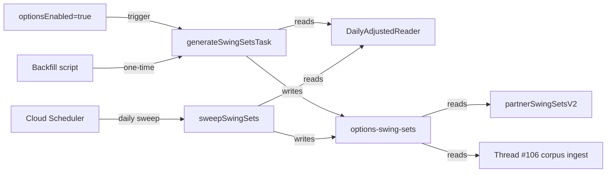

**Topic:** Swing-driven options corpus platform  
**Topic Slug:** swing-driven-options-corpus  
**Thread:** Swing-set generation platform  
**Thread Slug:** swing-set-platform  
**Issue:** #113  
**Thread Parent:** #103  
**Topic Parent:** #102  
**Domain:** OPTIONS-DATA  
**Type:** Implementation Plan  
**Status:** Approved  
**Created:** 2026-09-23  
**Last Updated:** 2026-09-23  

---
> **SUPERSEDED (2026-09-26):** The multi-config + served-swing design in this document was replaced: SA stores one dev2/L2/R2 dates-only swing doc per enabled symbol — a corpus-internal date sampler, not a served artifact — and `partnerSwingSetsV2` was removed. See `102-107-DECISION-swing-doc-slim-shape.md`. This doc remains as the historical record of the shipped implementation.


# Implementation Plan — BE: Swing-set generation, persistence, and availability

- **SA** — SavantApi, this backend project.
- **ST** — SavantTrader, the consumer client application that calls SA endpoints and reads SA data.

## Goal

Generate and persist canonical swing files for every options-enabled symbol, keep them current, and expose them to downstream consumers (ST via partner endpoints, corpus ingest via direct reads).

## Approach

### 1. Swing-set generation service

Create `SwingSetGenerationService` in `functions/src/v2/swing-set/`:

```typescript
export class SwingSetGenerationService {
  constructor(
    reader: DailyAdjustedReaderLike,   // narrow seam over DailyAdjustedReader.read
    repository: SwingSetRepository,    // Firestore write layer
    logger: LoggerLike = console,
  ) {}

  async generateForSymbol(symbol: string): Promise<SwingSetGenerationResult>;
  async generateForConfig(symbol: string, config: ZigZagConfig): Promise<SwingSetDoc | null>;
}
```

- `generateForSymbol` reads the symbol's bars once, then iterates `CANONICAL_ZIGZAG_CONFIGS` building+upserting one `SwingSetDoc` per config (it does not delegate to `generateForConfig`, which would re-read bars per config).
- `generateForConfig` is the standalone single-doc variant: reads bars, maps to `PriceBar`, calls `computeZigZagPivots` + `deriveSwings` + `computeSwingStats`, builds a `SwingSetDoc`, and writes it via the repository. Returns `null` when the symbol has no daily-adjusted data.
- `generatedAt` is `Timestamp.now()` — docs are idempotent modulo that field.

### 2. Firestore repository

Create `SwingSetRepository` in `functions/src/v2/swing-set/`:

```typescript
export class SwingSetRepository {
  constructor(private readonly db: Firestore) {}

  async upsert(doc: SwingSetDoc): Promise<void>;
  async get(symbol: string, paramsId: string): Promise<SwingSetDoc | null>;
  async listBySymbol(symbol: string): Promise<SwingSetDoc[]>;
  async listConfirmedPivots(symbol: string, paramsId: string): Promise<Pivot[]>;
  async getCurrentSwing(symbol: string, paramsId: string): Promise<{ direction: 'up'|'down'; extremeDate: string } | null>;
}
```

- **Collection name:** `options-swing-sets` (new domain-prefixed collection; ST's `st-swing-sets` is not migrated).
- **Doc id:** `{symbol}_{paramsId}`.
- **Writes:** `set(doc, { merge: true })` so repeated generation updates the same doc.
- **Indexes:** none required beyond single-field `symbol` for listing.

### 3. Daily-adjusted reader

Create `DailyAdjustedReader` in `functions/src/v2/swing-set/`:

```typescript
export interface DailyAdjustedReader {
  read(symbol: string): Promise<DailyAdjustedBar[]>;
}
```

- Implementation reads from the existing SA daily-adjusted store (`symbol-data/{SYMBOL}/sa-time-series/av-daily-adjusted/...` or `market_data/{symbol}/data_points/...` — exact path TBD in blueprint).
- Returns bars sorted ascending by date.

### 4. Triggers

#### 4a. Symbol-enable trigger

When `optionsEnabled` flips to `true` (Thread #105), enqueue a Cloud Task `generateSwingSetsTask` with payload `{ symbol }`. The task calls `SwingSetGenerationService.generateForSymbol`.

- Queue: `generateSwingSetsTask`
- Retry: transient failures retried; permanent failures logged.
- Bounded: skips symbols already up-to-date.

#### 4b. Scheduled sweep

A Cloud Scheduler job `sweepSwingSets` runs daily (after market close + daily-adjusted refresh). It:

1. Lists all `tracked_symbols` where `optionsEnabled=true`.
2. For each symbol, calls `generateForSymbol`.
3. Skips symbols whose swing files are already fresh (TTL or based on underlying data timestamp).

The sweep is idempotent and bounded; it does not recompute symbols that are current.

#### 4c. Backfill

A one-time admin script / Cloud Function `backfillSwingSets` runs over all currently options-enabled symbols and generates swing files. Idempotent; can be run manually by an operator.

### 5. Partner read endpoint

Create `partnerSwingSetsV2` in `functions/src/v2/partner/`:

- **Endpoint:** `GET /partnerSwingSetsV2?symbol={symbol}&paramsId={paramsId}`
- **Auth:** same service-account / Firebase dual-auth as `partnerHistoricalOptionsV2`.
- **Behavior:**
  - If `symbol` is not tracked → `404`.
  - If `symbol` is tracked but `optionsEnabled=false` → `OPTIONS_NOT_ENABLED`.
  - If `paramsId` omitted → return all four canonical swing files for the symbol.
  - If `paramsId` provided → return that swing file or `NOT_FOUND`.
- **Response shape:** `{ ok: true, symbol, paramsId, source: 'sa', data: SwingSetDoc, timestamp, processingTimeMs }`.

This endpoint is the only external read path; external direct Firestore reads are not allowed.

### 6. Internal read path for Thread #106

The options-corpus ingest pipeline reads `options-swing-sets` directly (same project, internal service account). No public endpoint needed for that flow.

## Module layout

```text
functions/src/v2/swing-set/
├── services/
│   ├── swing-set-generation.service.ts
│   ├── swing-set.repository.ts
│   └── daily-adjusted-reader.service.ts
├── handlers/
│   ├── generate-swing-sets.task.ts
│   ├── sweep-swing-sets.scheduler.ts
│   └── backfill-swing-sets.http.ts
├── types.ts
└── index.ts
```

## Data flow



## Risks and mitigations

| Risk | Mitigation |
|------|------------|
| Daily-adjusted store schema/location unknown | Add a dedicated `DailyAdjustedReader` seam; confirm exact path in blueprint or first task |
| Swing files could be large | Store only confirmed pivots, projection, swings, stats — no raw bars |
| Concurrent generation for same symbol | Doc-id key `{symbol}_{paramsId}` + `set(merge)` makes writes idempotent |
| Scheduled sweep runs too early (daily data not ready) | Schedule after the daily-adjusted refresh window; add freshness check in sweep |

## Open questions

- Exact collection name: `options-swing-sets` is preferred for domain clarity; confirm in blueprint.
- Exact daily-adjusted read path needs verification against the existing data-maintainer storage.
- Should the sweep use a per-symbol `lastGeneratedAt` timestamp or compare against the daily-adjusted data timestamp? Prefer data timestamp for freshness.

## Acceptance criteria

- [ ] `SwingSetGenerationService` generates all four canonical swing files for a symbol.
- [ ] `options-swing-sets` docs are keyed `{symbol}_{paramsId}` and match the shared `SwingSetDoc` shape.
- [ ] `generateSwingSetsTask` triggers on `optionsEnabled=true` and is idempotent.
- [ ] `sweepSwingSets` runs on schedule and skips current docs.
- [ ] `backfillSwingSets` generates files for all options-enabled symbols.
- [ ] `partnerSwingSetsV2` serves swing files to ST and enforces `optionsEnabled`.
- [ ] Thread #106 can read confirmed pivots and current swing state from the collection.
