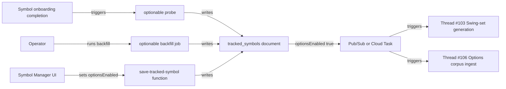

**Topic:** Swing-driven options corpus platform  
**Topic Slug:** swing-driven-options-corpus  
**Thread:** Symbol flags curation  
**Thread Slug:** symbol-flags-curation  
**Issue:** #109  
**Thread Parent:** #105  
**Topic Parent:** #102  
**Domain:** OPTIONS-DATA  
**Type:** PRD  
**Status:** Approved  
**Created:** 2026-09-23  
**Last Updated:** 2026-09-23  

---

# PRD: Symbol flags curation

- **SA** — SavantApi, this backend project.
- **ST** — SavantTrader, the consumer client application that calls SA endpoints and reads SA data.

## Problem Statement

The options corpus must be bounded to a curated, known universe of symbols. Vendor calls for option chains cost money, and an unbounded corpus grows with every exploratory user click. SA currently has no way to distinguish:

1. Symbols that have listed options (`optionable`).
2. Symbols worth spending vendor calls on (`optionsEnabled`).

Without these flags, the swing-set and corpus-ingest pipelines cannot know which symbols to process.

## Solution

Add two booleans to every `tracked_symbols` document:

- **`optionable`** — system-derived via a cheap probe. `true` if the symbol has a non-empty option chain on a recent trading day.
- **`optionsEnabled`** — curated by an operator. `true` only for symbols that should participate in the options corpus.

Expose both flags in Symbol Manager (read-only for `optionable`, editable for `optionsEnabled`). Provide a backfill job to probe existing tracked symbols and an on-add probe for newly tracked symbols. When `optionsEnabled` flips from `false` → `true`, trigger downstream seeding of swing files and options corpus for that symbol.

## User Stories

1. **As an SA operator**, I want to see whether each tracked symbol has listed options, so that I can make informed curation decisions.
   - *Acceptance:* The `optionable` flag is visible in Symbol Manager and returned by symbol-list/detail endpoints.
   - *Verification:* Query a tracked symbol and see a non-null `optionable` value.

2. **As an SA operator**, I want a default state where all symbols are `optionsEnabled=false`, so that the corpus universe starts empty and grows only through explicit curation.
   - *Acceptance:* Every existing and newly added tracked symbol has `optionsEnabled=false` until explicitly enabled.
   - *Verification:* Query tracked symbols and confirm `optionsEnabled` is `false` by default.

3. **As an SA operator**, I want to enable options analysis for a batch of symbols by providing a list to a script, so that I can curate the corpus universe efficiently without building a new endpoint.
   - *Acceptance:* A documented script accepts a list of symbols and sets `optionsEnabled=true` for each, writing audit history and triggering downstream seeding.
   - *Verification:* Run the script with a list of symbols and verify each document flips to `optionsEnabled=true` and downstream seeding begins.

4. **As an SA operator**, I want to enable/disable options analysis for an individual symbol in Symbol Manager, so that I can make one-off curation changes.
   - *Acceptance:* `optionsEnabled` is editable per symbol in Symbol Manager and via the symbol-save endpoint. The flag persists in `tracked_symbols`.
   - *Verification:* Toggle `optionsEnabled` and verify the document updates.

5. **As a symbol-manager user**, I want the system to probe whether a new symbol has options when I add it and prompt me to enable options analysis, so that I can opt the symbol into the corpus during ingestion.
   - *Acceptance:* After a new symbol completes price-data onboarding, the system probes `optionable`. If `optionable=true`, Symbol Manager prompts to enable options. If the user confirms, `optionsEnabled` flips to `true` and downstream seeding (swing-set generation + corpus ingest) begins. If `optionable=false`, the symbol is bypassed and cannot be enabled.
   - *Verification:* Add a known optionable symbol, confirm the prompt appears, enable it, and verify downstream seeding starts. Add a non-optionable symbol and verify it cannot be enabled.

6. **As an SA operator**, I want a one-time backfill that probes all existing tracked symbols for `optionable`, so that I don't manually check each one.
   - *Acceptance:* A backfill job runs against all tracked symbols, sets `optionable=true` for symbols with non-empty chains, and records liquidity summary metrics.
   - *Verification:* Run the backfill and inspect that `optionable` is populated for all tracked symbols.

7. **As the swing-set / corpus pipeline**, I want to react when `optionsEnabled` becomes `true`, so that I can start generating swing files and seeding option chains for that symbol.
   - *Acceptance:* A Pub/Sub event or Cloud Task enqueue occurs when `optionsEnabled` flips to `true`. Downstream Threads (#103, #106) consume this signal.
   - *Verification:* Enable a symbol and observe the downstream trigger within a bounded time.

8. **As an SA operator**, I want an audit trail of `optionsEnabled` changes, so that I can understand why a symbol was added to or removed from the corpus universe.
   - *Acceptance:* Each `optionsEnabled` change records `changedBy`, `changedAt`, and optional reason.
   - *Verification:* Inspect the symbol document and see history entries for toggles.

## Implementation Decisions

- **Schema changes:** Add `optionable: boolean | null` and `optionsEnabled: boolean` (default `false`) to `TrackedSymbolV2` in `@shared/alpha-vantage` and to `TRACKED_SYMBOL_V2_FIELDS`. Also add `optionableProbeSummary` and `optionsEnabledHistory` fields.
- **Default state:** All existing tracked symbols are migrated to `optionsEnabled=false`. All newly added symbols are saved with `optionsEnabled=false`.
- **Bypass non-optionable symbols:** A symbol with `optionable=false` cannot have `optionsEnabled=true` and is ignored by the swing-set and options-corpus pipelines.
- **Batch enable script:** A TypeScript admin script accepts a list of symbols and sets `optionsEnabled=true` for each optionable symbol, writing audit history and triggering downstream seeding for symbols whose flag transitions `false→true`. The script is intended to be run manually by an operator; it does not expose an HTTP endpoint. It ships with a full README and usage guide.
- **Enable at symbol add:** After price-data onboarding completes and the optionable probe returns, Symbol Manager prompts the user to enable options only if `optionable=true`. If confirmed, `optionsEnabled` flips to `true` and triggers downstream seeding (swing-set generation followed by corpus ingest — implemented in Threads #103 and #106).
- **Probe implementation:** A new service probes `HISTORICAL_OPTIONS` via the existing `HistoricalOptionsRetrievalService` for a recent trading date. Non-empty `response.data` → `optionable=true`. Store the response's `analysis.summary` metrics (contracts, volume, OI, strikes, expirations) in `optionableProbeSummary` to support curation.
- **Backfill for `optionable`:** A one-time Cloud Function / Task invoked by an operator. It enumerates all active tracked symbols, probes each one, and sets `optionable` plus summary metrics. Rate-limited to respect AV limits.
- **Who sets what:**
  - `optionable` is set only by the system (probe or backfill).
  - `optionsEnabled` is set by an authenticated operator per-symbol in Symbol Manager or in batch via the admin script. It defaults to `false` at ingestion and can be edited later.
- **Permission model:** Only users with a Symbol Manager curation role can toggle `optionsEnabled` in the UI. The batch script is run manually by an operator. Exact role/claim TBD in blueprint; default is that any authenticated Symbol Manager user can view, only admins can toggle.
- **Trigger on enable:** When `optionsEnabled` transitions `false→true`, emit a Pub/Sub message or enqueue a Cloud Task that downstream Threads (#103 swing-set generation, #106 options corpus ingest) consume to begin seeding.
- **No auto-disable cascade:** Setting `optionsEnabled=false` stops new corpus growth but does not delete existing swing files or corpus snapshots.
- **On-add probe:** Hook into the symbol onboarding completion path (after price data is ready) to run the optionable probe once. Do not block ingestion on probe failure; mark `optionable=false` and surface failure reason.

## Testing Decisions

- **Unit tests:**
  - Probe service returns `optionable=true/false` for mocked AV responses.
  - `optionsEnabled` toggle emits the downstream trigger exactly once per `false→true` transition.
- **Integration tests:**
  - Save a symbol with `optionsEnabled=true` and verify the downstream Cloud Task/Pub/Sub signal.
  - Run the batch-enable script against a list of symbols and verify each document flips to `optionsEnabled=true` and triggers seeding.
  - Confirm default `optionsEnabled=false` on newly added symbols.
  - Run backfill against a small test set and verify `optionable` populated.
- **Contract tests:**
  - `TrackedSymbolV2` serializes the new fields correctly for ST consumers.
  - Symbol-list endpoint supports filtering by `optionable`/`optionsEnabled`.
- **Seams:** Highest seam is the symbol-save callable with `optionsEnabled` toggle. Lower seams test the probe service in isolation.

## Out of Scope

- Swing-set generation itself (Topic #102 Thread #103).
- Options corpus ingest itself (Topic #102 Thread #106).
- Endpoint contract for serving chains (Topic #102 Thread #107).
- Automatic removal/deletion of existing corpus data when `optionsEnabled` becomes `false`.
- Real-time monitoring of option listing changes (e.g., an IPO suddenly listing options).

## Technical Context

- The probe uses the existing `HistoricalOptionsRetrievalService`, which calls Alpha Vantage `HISTORICAL_OPTIONS`. It consumes one AV call per symbol probed and must be rate-limited.
- `optionable` may be stale if a symbol delists options; a future enhancement could re-probe periodically, but that is not in this Thread.
- The downstream trigger must be durable (Pub/Sub or Cloud Tasks) so that even if the swing-set or corpus functions are temporarily unavailable, the signal is not lost.
- The `optionsEnabled` history is stored inline in the symbol document; if history grows large, a subcollection may be needed later.

## System Context

## Further Notes

- Exact role/claim for toggling `optionsEnabled` will be decided in blueprint.
- The backfill job's batch size and rate limits will be calibrated against AV rate limits in blueprint.
- Consider adding list-symbol filters `optionable=true` and `optionsEnabled=true` for operator UI convenience.
