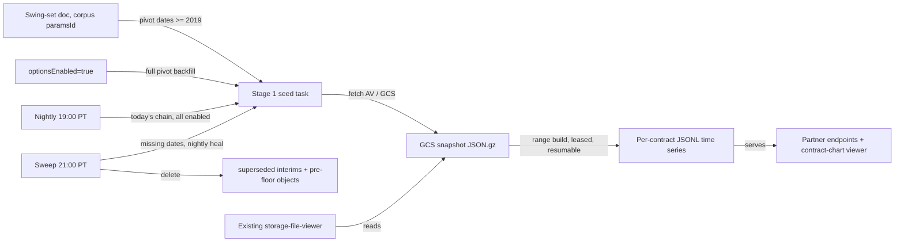

**Topic:** Swing-driven options corpus platform  
**Topic Slug:** swing-driven-options-corpus  
**Thread:** Options corpus ingest  
**Thread Slug:** options-corpus-ingest  
**Issue:** #110  
**Thread Parent:** #106  
**Topic Parent:** #102  
**Domain:** OPTIONS-DATA  
**Type:** PRD  
**Status:** Approved  
**Created:** 2026-09-23  
**Last Updated:** 2026-09-23  

---
> **SUPERSEDED (2026-09-26):** The multi-config + served-swing design in this document was replaced: SA stores one dev2/L2/R2 dates-only swing doc per enabled symbol — a corpus-internal date sampler, not a served artifact — and `partnerSwingSetsV2` was removed. See `102-107-DECISION-swing-doc-slim-shape.md`. This doc remains as the historical record of the shipped implementation.

# PRD: Options corpus ingest

- **SA** — SavantApi, this backend project.
- **ST** — SavantTrader, the consumer client application that calls SA endpoints and reads SA data.

## Problem Statement

ST's option-chain percent-change grid and swing-analysis surfaces need historical option-chain data for specific dates. Today, SA has only a QQQ/TQQQ pilot corpus. The corpus must expand to cover every options-enabled symbol, and it must be seeded automatically from the confirmed pivot dates produced by the swing-set platform. SA also needs per-contract Firestore time-series docs so the existing contract-chart viewer can serve historical contract prices.

## Solution

Build on the existing QQQ/TQQQ historical-options-corpus infrastructure and extend it to all options-enabled symbols. The pipeline has two stages:

1. **Stage 1 — GCS chain snapshots:** One immutable, gzipped JSON envelope per `(symbol, date)` stored in GCS. Dates come from two sources: pivot dates (confirmed pivots + the current developing extreme) and a nightly daily snapshot for every enabled symbol.
2. **Stage 2 — Per-contract time series:** GCS JSONL files that accumulate observations from each stored snapshot for each contract seen across the corpus, plus a Firestore contract index.

**Coverage contract:** the corpus is bounded to `optionsEnabled` symbols and dates **on or after 2019-01-01**. SA's daily-adjusted/swing data may reach further back (to ~1999), but the FE-facing options corpus never plans, fetches, builds, or retains pre-2019 dates. The floor is enforced at every entry point: the pivot planner filters pre-floor dates, the seed worker skips them without an AV call, the time-series builder clamps or skips pre-floor ranges, and the reconcile sweep deletes any pre-floor object regardless of provenance.

The overall pipeline runs in two phases:

1. **Batch backfill:** After Thread #103 batch-generates swing files, this Thread batch-fetches every historical confirmed pivot date for every options-enabled symbol into GCS and generates all per-contract time series.
2. **Ongoing maintenance:** A function consumes new confirmed pivots (and current-swing extreme advances), fetches the corresponding snapshots, and updates the time series. Prior interim snapshots are deleted when superseded.

The pipeline is triggered when a symbol becomes options-enabled and whenever a new pivot is confirmed for that symbol. Historical backfills run once per enabled symbol × canonical ZigZag config. No fetch-on-miss is allowed.

## User Stories

1. **As the swing-set platform**, I want every confirmed pivot date for an options-enabled symbol to produce a chain-snapshot ingest, so that the corpus captures all analytically interesting dates.
   - *Acceptance:* When a confirmed pivot appears in a swing file, a Stage 1 ingest task is enqueued for `(symbol, pivot date)`.
   - *Verification:* Inspect the task queue / metadata collection after a new confirmed pivot and see a pending or success item for that date.

2. **As the options-corpus pipeline**, I want Stage 1 snapshots to be immutable and idempotent, so that re-running the same date never fetches the same AV data twice.
   - *Acceptance:* If a GCS object exists for `(symbol, date)`, the worker skips the AV call and records a GCS hit.
   - *Verification:* Run the same seed task twice and confirm the second run consumes zero AV calls.

3. **As the options-corpus pipeline**, I want Stage 2 to update per-contract time-series data whenever a new snapshot is ingested, so that the contract-chart viewer can show a complete life-of-contract series.
   - *Acceptance:* After a Stage 1 snapshot is stored, a Stage 2 builder merges its observations into existing per-contract series and writes new series for unseen contracts.
   - *Verification:* Ingest two snapshots for the same symbol on different dates and verify a contract's time series contains observations for both dates.

4. **As an SA operator**, I want a one-time historical backfill for every options-enabled symbol, so that the corpus is bootstrapped without waiting for new pivots.
   - *Acceptance:* A backfill job enumerates all confirmed pivots in the canonical swing doc for each enabled symbol, restricted to dates on or after 2019-01-01, and seeds missing snapshots.
   - *Verification:* Run the backfill for a test symbol and verify all post-2019 historical confirmed-pivot dates appear in the corpus and no pre-2019 objects are created.

4a. **As an SA operator**, I want pre-2019 coverage to be structurally impossible, so that corpus spend stays inside the agreed window even if upstream data goes back decades.
   - *Acceptance:* No planner output, seed task, or build range may carry a date before 2019-01-01; stored pre-2019 objects are deleted by the reconcile sweep.
   - *Verification:* Enqueue a seed task for a pre-2019 date and confirm it exits without an AV call; place a pre-2019 object in GCS and confirm the sweep deletes it.

5. **As the options-corpus pipeline**, I want to handle the current unfolding swing correctly, so that the latest extreme date is fetched and prior interim snapshots are deleted.
   - *Acceptance:* When the current swing extreme advances, fetch the new date's snapshot, merge it into per-contract time series, and delete the prior interim snapshot for that swing. When the swing completes, the final snapshot remains.
   - *Verification:* Simulate a swing with two interim highs and one final high; confirm only the final-high snapshot remains in GCS while all three dates appear in the time series.

6. **As an SA operator**, I want the corpus to reject work for non-options-enabled symbols, so that vendor spend stays bounded.
   - *Acceptance:* The pipeline ignores any trigger for a symbol whose `optionsEnabled` flag is not `true`.
   - *Verification:* Trigger a seed for a non-enabled symbol and verify it is dropped with a clear log/status reason.

7. **As the contract-chart viewer**, I want to continue reading per-contract time series from SA storage, so that no ST-side changes are required.
   - *Acceptance:* The Stage 2 output format and access paths remain compatible with the existing viewer.
   - *Verification:* Load a contract in the chart viewer after ingestion and confirm it displays the expected series.

## Implementation Decisions

- **Extend existing pilot:** Re-use the `HistoricalOptionsRetrievalService`, `GcsCorpusAdapter`, `CorpusMetadataService`, and `TimeSeriesBuilderService` from the QQQ/TQQQ pilot. Remove the `CorpusSymbol` restriction so any symbol can be processed.
- **Trigger sources:**
  - Symbol becomes `optionsEnabled=true` (from Thread #105) → enqueue Stage 1 seeds for all historical confirmed pivots across all canonical configs.
  - New confirmed pivot appears in a swing file (from Thread #103) → enqueue Stage 1 seed for that `(symbol, date)`.
  - Current swing extreme advances (from Thread #103) → fetch new date, run Stage 2, delete prior interim snapshot.
- **Stage 1 storage:** One gzipped JSON envelope per `(symbol, date)` at `historical-options/v1/{SYMBOL}/{YYYY-MM-DD}.json.gz`. The envelope contains the full AV response, analysis, and SHA-256 checksum.
- **Stage 2 storage:** Per-contract JSONL files at `time-series/v1/{SYMBOL}/{CONTRACT_ID}.jsonl` plus the Firestore contract index (`ts-contracts` / `options-contract-index`). The builder merges new observations and deduplicates by date; a fully-covered contract costs zero writes.
- **Stage 2 execution model:** build tasks are range-capable (`{symbol, startDate, endDate}`; single-date payloads normalize to a one-day range). A per-symbol Firestore lease prevents concurrent same-symbol writes; contending tasks defer rather than race. A task that exhausts its ~15-minute budget re-enqueues a continuation at `resumeDate`, so a symbol's full history builds incrementally without losing progress. A per-contract GCS read failure marks only that contract failed — it never falls through to a write that would overwrite stored history.
- **Idempotency:** Stage 1 checks GCS metadata before calling AV. Stage 2 merges observations and deduplicates by date, so reprocessing a snapshot is a no-op.
- **Nightly daily snapshot:** A weekday 19:00 PT job stores the just-closed day's chain for every enabled symbol — the daily snapshot stream independent of pivots. Idempotent; covered items skip. The corpus sweep re-runs this service before reconciling so a failed nightly self-heals same day.
- **Batch backfill:** The sweep and the enable-trigger fanout enumerate each enabled symbol's canonical swing doc and seed every missing ≥2019 pivot date; a range ts-build per symbol derives the time series. Idempotent — rerunnable, skips existing snapshots.
- **Ongoing maintenance:** A weekday 21:00 PT sweep diffs each enabled symbol's planned pivot dates against GCS coverage: seeds missing dates, deletes interim snapshots superseded by a moving current extreme, deletes any pre-2019 object, and heals a missed nightly.
- **Ongoing swing policy:** When the current swing extreme advances, Stage 1 fetches the new date's snapshot, Stage 2 merges it, and then deletes the prior interim snapshot for that swing. When the swing completes, the final snapshot is the confirmed end pivot and is retained.
- **No fetch-on-miss:** The partner endpoint (Thread #107) may fall back to live AV for missing snapshots, but the corpus itself never grows because of a partner request.
- **Failure handling:** Stage 1 retries transient AV failures up to a max. Permanent failures are recorded and do not block the pipeline. Stage 2 failures are logged and retried independently.

## Testing Decisions

- **Unit tests:**
  - Seed worker skips existing GCS snapshots.
  - Time-series builder merges and deduplicates observations correctly.
  - Ongoing-swing cleanup deletes the right interim snapshot and retains the final one.
- **Integration tests:**
  - Trigger a seed for a confirmed pivot date and verify GCS object + metadata doc.
  - Trigger Stage 2 and verify JSONL file contents for a representative contract.
  - Run backfill for a test symbol and verify idempotency on second run.
- **Contract tests:**
  - Stage 1 envelope format unchanged from pilot.
  - Stage 2 JSONL format compatible with contract-chart viewer.
- **Seams:** Highest seam is the end-to-end `(symbol, date)` ingest (Stage 1 + Stage 2). Lower seams test worker and builder in isolation.

## Out of Scope

- Swing-set generation (Thread #103).
- Symbol flag curation (Thread #105).
- Partner endpoint contract changes (Thread #107).
- Real-time options chain ingestion.
- Deleting per-contract time-series data when `optionsEnabled` becomes `false`.
- UI for browsing the corpus (existing storage-file-viewer remains).

## Technical Context

- The pipeline consumes Alpha Vantage `HISTORICAL_OPTIONS` calls; rate limits and cost drive the need for idempotency and bounded symbols.
- Stage 1 snapshots are immutable; changing AV response normalization requires a new schema version, not in-place edits.
- Stage 2 builder reads from GCS and writes to GCS (and optionally Firestore index). It is CPU and I/O bound; chunking and concurrency are inherited from the pilot.
- The corpus is driven by swing-file events, so freshness lags the daily-adjusted data and swing generation by a bounded amount.

## System Context

## Further Notes

- Whether Stage 2 outputs strictly GCS JSONL or also writes Firestore per-contract docs will be decided in blueprint; the existing viewer contract must be preserved.
- The exact Cloud Task queue names, function triggers, and backfill batch size are blueprint decisions.
- Consider a metadata collection that tracks per-symbol corpus coverage so operators can see which pivot dates are missing/failed.
