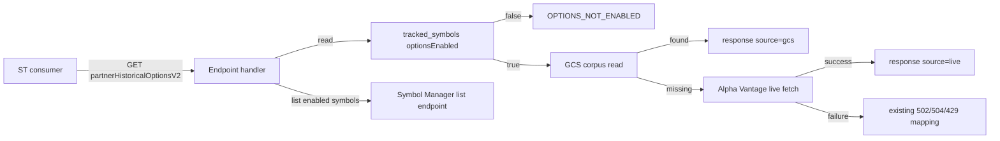

**Topic:** Swing-driven options corpus platform  
**Topic Slug:** swing-driven-options-corpus  
**Thread:** Endpoint contract  
**Thread Slug:** endpoint-contract  
**Issue:** #111  
**Thread Parent:** #107  
**Topic Parent:** #102  
**Domain:** OPTIONS-DATA  
**Type:** PRD  
**Status:** Approved  
**Created:** 2026-09-23  
**Last Updated:** 2026-09-23  

---

# PRD: Endpoint contract

- **SA** — SavantApi, this backend project.
- **ST** — SavantTrader, the consumer client application that calls SA endpoints and reads SA data.

## Problem Statement

ST's option-chain percent-change grid and swing-analysis surfaces call `partnerHistoricalOptionsV2` today. That endpoint always fetches live from Alpha Vantage. As SA becomes the corpus owner, the endpoint must serve stored snapshots when available, fall back to live upstream only for enabled symbols, and clearly signal when a symbol is not part of the options-enabled universe. ST also needs a way to discover that universe.

## Solution

Update `partnerHistoricalOptionsV2` so that:

1. It checks whether the requested symbol is `optionsEnabled`.
2. If not enabled, it returns a distinct `OPTIONS_NOT_ENABLED` error.
3. If enabled, it reads the corpus first.
4. If a corpus snapshot exists for `(symbol, date)`, it returns the stored response with `source: "gcs"`.
5. If the snapshot is missing, it fetches live from Alpha Vantage and returns the live response with `source: "live"`. **Live fallback responses are not persisted to the corpus.** Persist-then-delete applies only to the corpus-ingest pipeline (Thread #106), which deletes prior interim snapshots when the current swing extreme advances.
6. Existing transient-upstream and not-found error behavior is preserved.

Add (or extend) a tracked-symbols endpoint so ST can retrieve the list of `optionsEnabled` symbols.

## User Stories

1. **As an ST consumer**, I want `partnerHistoricalOptionsV2` to return a stored corpus snapshot with `source: "gcs"` when it exists, so that I avoid live vendor calls and get deterministic data.
   - *Acceptance:* When `(symbol, date)` exists in the GCS corpus, the response contains `ok: true`, `source: "gcs"`, and the same `data`/`analysis` envelope as before.
   - *Verification:* Request a seeded `(symbol, date)` and assert `source === "gcs"` and payload matches the stored envelope.

2. **As an ST consumer**, I want the endpoint to fall back to a live Alpha Vantage call with `source: "live"` when the corpus snapshot is missing, so that I can still retrieve recent dates that have not been seeded yet.
   - *Acceptance:* For an `optionsEnabled` symbol with no corpus snapshot for the requested date, the endpoint fetches live AV and returns `source: "live"`. The live response is not written to the corpus.
   - *Verification:* Request an unseeded date for an enabled symbol and assert `source === "live"`, zero new GCS objects, and the AV response shape is preserved.

3. **As an ST consumer**, I want a clear `OPTIONS_NOT_ENABLED` error when I request a symbol that is not options-enabled, so that I know the symbol is outside the curated corpus universe.
   - *Acceptance:* A request for a symbol with `optionsEnabled=false` returns `ok: false`, code `OPTIONS_NOT_ENABLED`, and a 4xx status.
   - *Verification:* Request a tracked but non-enabled symbol and assert the error code and status.

4. **As an ST consumer**, I want existing not-found behavior when the symbol is enabled but neither corpus nor live upstream has data for the date, so that my error handling stays unchanged.
   - *Acceptance:* Missing data for an enabled symbol returns the existing `NOT_FOUND` response and status.
   - *Verification:* Request an enabled symbol for a date with no corpus snapshot and no live AV data, and assert existing `NOT_FOUND` behavior.

5. **As an ST consumer**, I want existing transient-upstream error behavior when Alpha Vantage is rate-limited, times out, or fails, so that my retry logic stays unchanged.
   - *Acceptance:* Rate limits map to `RATE_LIMITED` (429), timeouts to `UPSTREAM_TIMEOUT` (504), and upstream errors to `UPSTREAM_ERROR` (502).
   - *Verification:* Trigger mocked AV failures and assert the same status/code mapping as today.

6. **As an ST consumer**, I want to retrieve the list of options-enabled symbols from SA, so that I can populate symbol pickers and validate user input locally.
   - *Acceptance:* A partner endpoint returns all symbols with `optionsEnabled=true`. Optionally supports `optionable=true` filtering.
   - *Verification:* Enable a few symbols and assert the endpoint returns exactly those symbols.

## Implementation Decisions

- **Modify `partnerHistoricalOptionsV2`:** Add a dependency on the `optionsEnabled` flag (read from `tracked_symbols` via `SymbolManagerService`) and a `GcsCorpusAdapter` read path.
- **Lookup order per request:**
  1. Validate request (symbol + optional date).
  2. Check `optionsEnabled`. If false, return `OPTIONS_NOT_ENABLED`.
  3. Try GCS corpus read for `(symbol, date)`.
  4. If found, return with `source: "gcs"`.
  5. If not found, call `HistoricalOptionsRetrievalService.fetch` live.
  6. If live succeeds, return with `source: "live"`.
  7. If live fails, map to existing error codes.
- **Live fallback is read-only:** Responses from live AV are not written back to GCS or Firestore corpus metadata. This prevents fetch-on-miss corpus growth.
- **Error code additions:** Add `OPTIONS_NOT_ENABLED` to `HistoricalOptionsErrorCode` and return an appropriate HTTP status (suggested 400 or 403; final status TBD in blueprint).
- **Options-enabled universe endpoint:** Extend `partnerListTrackedSymbolsV2` with query params `optionsEnabled=true` and/or `optionable=true`, or add a dedicated lightweight endpoint. Decision TBD in blueprint; either way, the response is a flat list of symbols plus the flags.
- **Backward compatibility:** Existing response envelope fields (`ok`, `symbol`, `date`, `data`, `analysis`, `timestamp`, `processingTimeMs`) are preserved. Only `source` is added.
- **Auth/permissions:** No auth model changes. The existing service-account allowlist and Firebase token paths remain.

## Testing Decisions

- **Unit tests:**
  - `OPTIONS_NOT_ENABLED` returned when `optionsEnabled=false`.
  - `source: "gcs"` returned when corpus snapshot exists.
  - `source: "live"` returned on corpus miss, and no GCS write occurs.
  - Existing error mappings unchanged.
- **Integration tests:**
  - End-to-end request against a seeded corpus object.
  - End-to-end request for a non-enabled symbol.
  - End-to-end options-enabled universe listing.
- **Contract tests:**
  - Response shape matches ST expectations.
  - `source` values are only `"gcs"` or `"live"`.
- **Seams:** Highest seam is the full partner handler with injected corpus and symbol-manager dependencies. Lower seams test the lookup decision and error mapping in isolation.

## Out of Scope

- Swing-set generation (Thread #103).
- Symbol flag curation (Thread #105).
- Options corpus ingest itself (Thread #106).
- Persisting live fallback responses to the corpus.
- Changing the contract-chart viewer or ST grid logic.

## Technical Context

- The endpoint must read `tracked_symbols` on every request, so the symbol-manager read path must be fast and well-cached. A slow read would add latency to every options request.
- Live fallback keeps the endpoint useful for dates not yet seeded, but it costs AV calls. ST should prefer known seeded dates to minimize vendor spend.
- `source` attribution lets ST distinguish deterministic corpus data from live data that may differ on re-fetch.

## System Context

## Further Notes

- Final HTTP status for `OPTIONS_NOT_ENABLED` (400 vs 403) to be decided in blueprint.
- Whether to extend the existing list endpoint or add a new one will be decided in blueprint.
- Consider adding a response header or metadata that exposes the corpus snapshot generation timestamp in a future Thread; not required here.
