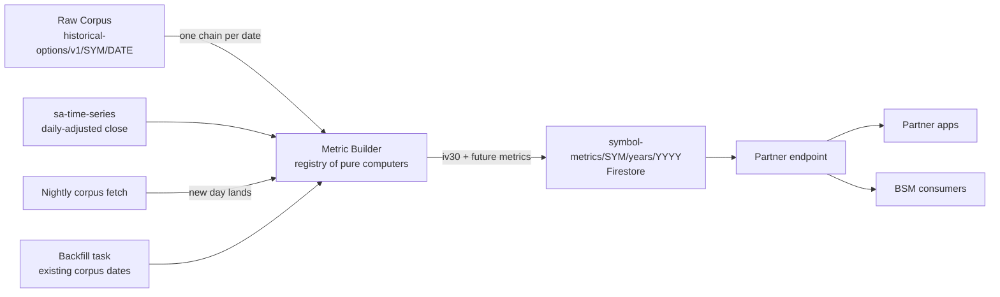

**Topic:** IV time series  
**Topic Slug:** iv-time-series  
**Thread:** IV history for all tracked symbols  
**Thread Slug:** iv-history-tracked-symbols  
**Issue:** #160  
**Thread Parent:** #159  
**Topic Parent:** #158  
**Domain:** OPTIONS-DATA  
**Type:** PRD  
**Status:** Approved  
**Created:** 2026-09-26  
**Last Updated:** 2026-09-26  

# PRD — IV history time series for options-enabled symbols

## Problem Statement

Consumers — partner apps and internal pricing jobs — need an implied-volatility number for the underlying on any given day: the σ input for Black-Scholes-style calculations, and a chartable "how did this stock's IV evolve" line. No provider sells a symbol-level IV history, and Alpha Vantage has no such endpoint. What we do have is the entire options corpus: thousands of per-contract IVs per symbol per day, already ingested and stored.

## Solution

Synthesize the underlying's IV ourselves from the daily option-chain snapshots already in the Raw Corpus. Scope is strictly `optionsEnabled` symbols — the same curation gate as corpus spend; tracked-but-disabled symbols produce no metric data. For each `(symbol, date)` that has a chain snapshot, a pluggable **metric computer** derives a constant-maturity at-the-money IV — **IV30**: per expiration, linear-interpolate the OTM-side IV (put below, call above) across the two strikes bracketing the underlying's daily-adjusted close, then interpolate the two expirations bracketing 30 days in total variance (σ²·T). Results persist as **year-sharded Firestore docs** supporting both fast single-day reads (BSM inputs) and range reads (series), served through a partner endpoint. The metric-registry design makes the pipeline extensible: additional metrics (iv60/90, model-free IV, skew) are new functions and new fields — not new pipelines.

## User Stories

1. As a **partner app**, I want to request a symbol's IV30 series over a date range, so that I can chart and quantify how implied volatility evolved.
   - AC: the endpoint returns an ascending array of `{date, iv30, method}` for every corpus-covered date in the range; an uncovered range returns an empty array, not an error.

2. As an **internal pricing consumer**, I want a fast single-date IV lookup for a symbol, so that I can feed σ into per-day Black-Scholes calculations without scanning a series.
   - AC: one document read per `(symbol, year)`; the response yields that date's IV30 or an explicit absence — never a silent wrong value.

3. As a **partner app**, I want each observation to carry a method/quality indicator, so that I can filter degraded points (e.g., nearest-expiry fallbacks) out of my analysis.
   - AC: every emitted point exposes its method (`interpolated` vs fallback) in the response.

4. As the **platform**, I want the series to extend automatically every trading day for each options-enabled symbol, so that consumers never trigger provider fetches themselves.
   - AC: after each nightly chain snapshot lands, that date's metrics are computed and stored; no manual step required.

5. As an **operator**, I want an idempotent backfill over all existing corpus dates, so that the series gains full available history at zero new API spend.
   - AC: re-running the backfill produces identical documents; covered dates equal the set of corpus snapshot dates.

6. As the **platform owner**, I want metrics computed only for options-enabled symbols, so that curation gates compute and storage just as it gates corpus spend.
   - AC: symbols with `optionsEnabled=false` produce no metric writes.

7. As a **partner app**, I want the new endpoint to follow the established partner contract — service-account auth, `404` for untracked symbols, `OPTIONS_NOT_ENABLED` for disabled symbols — so integration is predictable.
   - AC: error codes match the existing partner endpoint conventions.

8. As a **future developer**, I want to add a new metric (e.g., `iv60`, model-free IV, skew) as a new pure function plus new fields on the day entry, so that extending the metric set never requires a new pipeline.
   - AC: adding a metric changes neither document structure nor the endpoint contract beyond new optional fields.

9. As a **consumer**, I want the sparse-history semantics explicit, so that I never mistake missing dates for zero-IV days.
   - AC: the endpoint documentation and/or response envelope states that coverage equals the set of corpus snapshot dates.

10. As an **operator**, I want build reports (dates found/computed/skipped/failed) logged per symbol, so that gaps and data problems are diagnosable.
   - AC: builder runs emit per-symbol counts and error lists like the existing corpus builders.

## Implementation Decisions

- **New metric-build pipeline** in the options-corpus area, mirroring existing corpus-builder conventions: a builder service that walks a symbol's corpus dates, plus a **registry of pure metric computers** `(chain snapshot, context{bars, calendar}) → per-date values`. v1 registers exactly one computer: `iv30`.
- **IV30 recipe** (decided): per expiration, OTM-side bracketing-strike linear IV interpolation around the underlying's daily-adjusted close from `sa-time-series`; the two expirations bracketing 30 days are interpolated in **total variance** (σ²·T), not raw IV. When no expiration pair brackets the tenor, the nearest expiration is used and the observation is stamped with a fallback method instead of being dropped. Degenerate chains (one-sided brackets, wide strike gaps, garbage tail IVs) still emit a value with a quality flag.
- **Storage** (decided): year-sharded Firestore documents — `symbol-metrics/{SYMBOL}/years/{YYYY}` — whose `days` map keys dates to metric entries, e.g. `days['2026-01-07'] = { iv30: 0.284, iv30Method: 'interpolated' }`. Matches the `sa-time-series` year-shard convention; supports single-doc point reads and per-year range reads; dedupe and idempotent rebuilds come free from map keys.
- **Write path** (decided): a compute hook fires after the nightly corpus fetch lands a day's chain for an enabled symbol; an idempotent backfill task walks existing corpus dates and fills missing entries. Both gated on `optionsEnabled`.
- **Density** (decided): historical coverage = corpus snapshot dates (pivot dates under the current date-sampler); forward coverage = every trading day, since the nightly fetch already lands a chain daily.
- **Serving surface**: a new partner endpoint for range and single-date reads, following the existing partner auth and error-code conventions.
- **Rejected alternatives**: GCS JSONL store (no point reads — rejected for the per-day BSM access pattern); doc-per-day sharding (too many docs vs the year-shard precedent); OI/volume-weighted mean IV (not a defensible σ); leading with VIX-methodology model-free vol (deferred to a later metric in the registry).

## Testing Decisions

- **Metric computers** — pure-function unit tests. Fixtures are real-shape chain snapshots (e.g., the QQQ 2019-01-07 payload structure); golden outputs for normal days; edge cases: one-sided strike brackets, garbage tail IVs, missing bracketing expiration, thin chains, string-parsing.
- **Builder** — unit tests over fake Firestore/GCS seams, same pattern as the existing `ts-build`/swing-set tests (`createFakeFirestore`, adapter dependency injection). Dedupe-by-date, idempotent reruns, optionsEnabled gating.
- **Endpoint** — handler-seam tests like the existing partner-endpoint suites: auth failures, untracked symbol, disabled symbol, range slicing across year boundaries.
- **Verification scripts** — a permanent prod round-trip script under `functions/scripts/verify/` per project convention: compute known dates for a real symbol, read back, assert series + point reads.

## Technical Context

- **Historical coverage is sparse by design**: points exist only for dates that have a corpus snapshot (pivot dates under the current swing-driven date sampler). The series is not daily-dense in the past.
- **Forward coverage is daily**: once a symbol is options-enabled, the nightly fetch lands a chain every trading day, so the series grows one point per day.
- **Values are synthesized estimates**, not vendor-published IVs. The method/quality field marks each point's provenance; consumers should treat `nearest`-method points as lower-confidence.
- **Freshness**: a new point appears only after that day's nightly corpus run completes — end-of-day latency, not intraday.

## Out of Scope

- Dense historical backfill (paying AV calls per symbol per day for non-pivot history) — possible future augmentation; the builder is idempotent so densifying later only adds points.
- Additional metrics in v1 — model-free (VIX-methodology) IV, other tenors (iv60/90), skew, term slope. The registry is designed for them; they are follow-on work.
- Per-contract IV series — already exists and is served via `partnerHistoricalOptionsV2`.
- Client-side (ST) charting or consumption work.
- Risk-free-rate and dividend-yield series — BSM inputs sourced outside this thread.

## System Context

## Further Notes

- Origin: Idea issue #160 — "IV history time series for all tracked symbols."
- The BSM motivation is bidirectional with the existing enrichment pass: today contract IV → interpolated prices; this thread derives underlying-level IV for downstream pricing consumers.
- If the date-sampler ever changes (e.g., denser corpus coverage), historical density follows automatically — the builder emits whatever the corpus contains.
