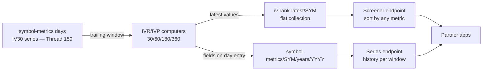

**Topic:** IV time series  
**Topic Slug:** iv-time-series  
**Thread:** IV rank  
**Thread Slug:** iv-rank  
**Issue:** #164  
**Thread Parent:** #163  
**Topic Parent:** #158  
**Domain:** OPTIONS-DATA  
**Type:** PRD  
**Status:** Approved  
**Created:** 2026-09-26  
**Last Updated:** 2026-09-26  

# PRD — IV rank for options-enabled symbols

## Problem Statement

A raw IV number doesn't answer the question a trader actually asks: *is this symbol's implied vol high or low **for this symbol**?* Options-selling strategies want high-IVR names; option-buying wants low-IVR names. Answering it requires ranking today's IV against that symbol's own recent history — and doing it across every **options-enabled** symbol so the answer is a sortable table, not a one-symbol lookup.

## Solution

Compute **IV Rank and IV Percentile** per options-enabled symbol per day over rolling 30/60/180/360-day windows, on top of the Thread #159 Symbol IV Series (IV30). Scope is strictly `optionsEnabled` symbols — the same curation gate as corpus spend; tracked-but-disabled symbols produce no metric data and never appear in the table:

- **IV Rank (rank-in-range):** `(currentIV − min) / (max − min) × 100` over the window.
- **IV Percentile:** `% of window samples with IV ≤ current` — robust to outlier spikes; the headline screening metric.

History lands as fields on the existing `symbol-metrics` day entries; a flat top-level **`iv-rank-latest/{SYMBOL}`** collection holds each symbol's current values for all windows, powering a sortable cross-symbol table via a partner endpoint. Forward-only by default — the series accrues from nightly corpus coverage — with optional densification (≤1 year of chains per enabled symbol) through the existing corpus seed machinery when deeper history is wanted.

## User Stories

1. As a **partner app**, I want a table of all options-enabled symbols' IV rank and IV percentile across 30/60/180/360-day windows, sortable high→low by any metric, so that I can surface option-selling or option-buying candidates.
   - AC: one request returns every options-enabled symbol's latest values; results can be ordered by any single metric field.

2. As a **partner app**, I want to filter the table by a minimum sample count, so that immature windows (few observations) don't produce misleading ranks.
   - AC: each row exposes per-window `n`; the endpoint supports a min-sample parameter applied per window.

3. As a **partner app**, I want a symbol's IVR/IVP history per window, so that I can chart rank over time, not just the current snapshot.
   - AC: the series endpoint returns `{date, ivRank30…, ivPct30…, n…}` for every date the symbol has an IV observation.

4. As the **platform**, I want IVR/IVP computed automatically for every new IV30 point, so that the table is always current after the nightly run.
   - AC: each new day entry carries all four windows' rank + percentile + sample counts; the `iv-rank-latest` doc updates in the same pass.

5. As an **operator**, I want IVR values to reflect whatever corpus coverage exists — including dates added later via ad-hoc seed fetches — so that densifying a symbol's corpus automatically deepens its windows.
   - AC: recomputing a symbol's metric entries incorporates any corpus date without manual intervention beyond seeding that date.

6. As a **platform owner**, I want IVR computed only for options-enabled symbols — and removed when a symbol is disabled — consistent with corpus spend gating.
   - AC: disabled symbols produce no metric writes, do not appear in `iv-rank-latest`, and a false-transition removes the symbol's `iv-rank-latest` doc (stale rows never linger in the table).

7. As a **consumer**, I want each window's sample count exposed, so that a 360-day rank computed over 40 samples is distinguishable from one over 240.
   - AC: every windowed value carries `n`; documentation states that windows are calendar-day-based over corpus-covered dates.

8. As a **future developer**, I want new windows or rank variants to be new metric fields/functions in the registry, not new infrastructure.
   - AC: adding a window touches the metric registry and the `iv-rank-latest` schema only.

## Implementation Decisions

- **Separate IVR pass** (decided 2026-09-27): IV30 lands via `MetricBuildService.computeForDate`; a second pass (`RankBuildService`) reads the symbol's trailing IV30 rows from the year-shard docs and writes rank fields onto the same day entry + updates `iv-rank-latest`. Two writes per day — keeps the Thread #159 metric-registry seam (chain → fields) untouched.
- **IVR computers** are second-order: `ivRank{W}` and `ivPct{W}` for W ∈ {30, 60, 180, 360}, computed over the symbol's IV30 series — not over the raw chain. Distinct fields so both definitions are always available.
- **Windows are calendar-day-based** (confirmed 2026-09-27) back from the observation date, evaluated over corpus-covered dates — i.e., over the IV30 rows present in the trailing W-day span. Every windowed value carries `n` (sample count) — always emitted, flagged rather than suppressed when immature; the screener applies a min-`n` filter by default.
- **Storage** (decided): rank/percentile fields ride on the same `symbol-metrics/{SYMBOL}/years/{YYYY}` day entries from Thread #159 — same lifecycle. A flat top-level **`iv-rank-latest/{SYMBOL}`** doc per symbol (`{symbol, asOfDate, ivRank{W}, ivPct{W}, ivN{W} for W ∈ {30,60,180,360}, updatedAt}` — same field names as the day entries) supports the sortable cross-symbol table with a single `where`/`orderBy` query.
- **Latest-only freshness** (decided 2026-09-27): a day entry's rank fields are frozen at write time ("rank-as-of-that-day under then-known coverage"). When the 360-day corpus backfill inserts older IV30 rows, historical ranks are NOT recomputed; only the newest day's rank and `iv-rank-latest` reflect full coverage. This keeps the pass stateless-per-date; an explicit recompute task can be added later if stale-window ranks prove to matter.
- **Density** (decided): forward-only for enabled symbols — no dedicated IVR backfill. The inbound 360-day corpus backfill feeds both IV30 (via the #171 hook) and rank windows automatically as it lands.
- **Serving surface**: new **`partnerIvRankV2`** table endpoint (decided 2026-09-27) — all enabled symbols' latest IVR/IVP per window, `?sort=`/`?minN=` params, reading `iv-rank-latest`. Series/point reads come free on `partnerIvMetricsV2` once `SYMBOL_METRIC_FIELDS` gains the rank fields.

## Testing Decisions

- **Rank/percentile computers** — pure-function unit tests over synthetic IV series: known windows, boundary ties (IV ≤ vs <), constant series (rank 0/0-division guard), single-sample windows, immature windows with correct `n`.
- **Rank pass integration** — fake-Firestore tests: the second pass reads trailing IV30 rows, day entries gain IVR fields, `iv-rank-latest` doc written/updated/deleted on disable; re-runs idempotent.
- **Endpoints** — handler-seam tests: `partnerIvRankV2` sort-by-each-metric, min-`n` filtering, enabled-only membership, empty table; `partnerIvMetricsV2` carries the new rank fields in `metrics=` automatically.
- **Verification script** — prod round-trip per `functions/scripts/verify/` convention.

## Technical Context

- **Windows warm up over time.** A 30-day rank needs ~a month of coverage to be meaningful; a 360-day rank ~a year. `n` makes maturity explicit on every row.
- **Sparse history skews windows** — pre-densification, a window's samples are pivot dates (vol-extreme dates), a biased sample; values remain computable but `n` and coverage honesty matter.
- **Rank and percentile diverge by design** — rank is range-sensitive (one spike compresses later readings); percentile is outlier-robust. Both are stored so consumers choose.
- **Historical ranks are point-in-time** — under latest-only freshness a stored `ivRank30` on an old date reflects the window known when it was written, not a recomputed window including later-backfilled data. The `iv-rank-latest` doc and today's day entry are always full-coverage.
- Same end-of-day freshness as the IV series: a new point appears after the nightly corpus run.

## Out of Scope

- Full dense history for arbitrary symbols (except via optional seed densification — existing machinery, operator action).
- **Recompute of historical rank fields** after densification — latest-only by decision; an explicit recompute task is follow-on work if needed.
- Alerting/notification on IVR thresholds — read-only table in v1.
- IVR over metrics other than IV30 (e.g., per-tenor ranks) — registry-ready, follow-on.
- Robinhood or other provider as a historical source.
- Client-side (ST) table/chart work.

## System Context

## Further Notes

- Origin: Idea issue #164. Motivation: screening — high IVR → option-selling candidates; low IVR → option-buying candidates.
- Hard dependency on Thread #159 (IV30 series must exist first); the two threads share the `symbol-metrics` storage.
- Optional corpus densification (≤1 yr per enabled symbol ≈ ~250 AV calls) is a supported operation, not a deliverable of this thread.
