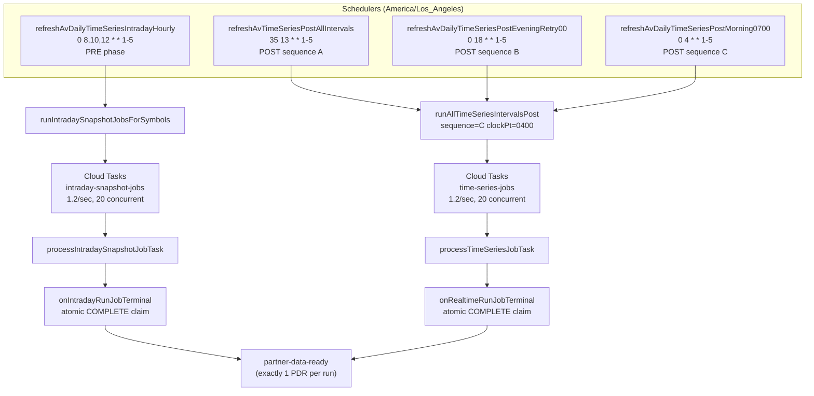

**Topic:** Update PDR message, migrate to PT timezone and consolidate schedules
**Issue:** #48 (Idea)
**Topic Parent:** #47
**Domain:** AV-ENDPOINTS
**Type:** PRD
**Status:** Approved
**Created:** 2026-08-22
**Last Updated:** 2026-08-22

# PRD: PDR Message, PT Timezone Migration, and Schedule Consolidation

## Summary

The time-series pipeline has three operational issues: (1) schedulers run on `America/New_York` (ET) but the team operates in PT, causing confusion and misaligned cron windows; (2) concurrent workers racing to mark a run COMPLETE produce duplicate PDR (Partner Data Ready) messages; (3) Cloud Tasks rate limits are under-tuned, leaving AV API throughput on the table.

This Topic consolidates the scheduler fleet to PT, fixes the duplicate PDR race condition with atomic completion claims, and tunes rate limits to 72 req/min (under AV's 75 req/min cap).

## User stories

### US-1: PT timezone migration

**As a** pipeline operator
**I want** all time-series schedulers to run on `America/Los_Angeles`
**So that** cron windows, run IDs, and logs use PT consistently and I don't have to mentally convert ET→PT.

**Acceptance criteria:**
- All `onSchedule` registrations use `timeZone: 'America/Los_Angeles'`
- `clockEt` renamed to `clockPt` in `RunIdFactory` interface, factory, validator, and parser
- All callers pass PT clock labels (e.g. `1335` for 1:35 PM PT, not `1635` for 4:35 PM ET)
- Cron times updated to PT equivalents (e.g. `35 13` not `35 16`)
- `infer-trigger-for-logs.ts` references updated schedules only

### US-2: Deprecated scheduler cleanup

**As a** pipeline operator
**I want** deprecated no-op schedulers removed
**So that** the deployed function list and GCP console are clean and not cluttered with placeholders.

**Acceptance criteria:**
- 6 deprecated no-op schedulers removed: `refreshAvIntradayRthClose1615Pre`, `refreshAvDailyTimeSeriesPostClose`, `refreshAvWeeklyTimeSeriesPostClose`, `refreshAvMonthlyTimeSeriesPostClose`, `refreshAvDailyTimeSeriesPostEveningRetry30`, `refreshAvDailyTimeSeriesPostMorning0630`
- 5 deprecated schedule constants removed: `TS_DAILY_PRE_CLOSE_SCHEDULE`, `TS_POST_CLOSE_SCHEDULE`, `TS_INTRADAY_RTH_CLOSE_1615`, `TS_DAILY_POST_EVENING_RETRY_MINUTE_30`, `TS_DAILY_POST_MORNING_CATCHUP_0630`
- Exports in `index.ts` and `v2/alpha-vantage/index.ts` updated to remove deprecated handlers
- `createdJobs` increment moved inside Firestore transaction for atomicity

### US-3: Duplicate PDR fix

**As a** PDR consumer (e.g. RS)
**I want** exactly one PDR message per run completion
**So that** I don't process duplicate "data is ready" signals.

**Acceptance criteria:**
- Run completion wrapped in `db.runTransaction` with `didComplete` flag in `realtime-run-aggregator.ts` (both fast path and reconcile path)
- Same atomic completion claim in `intraday-snapshot-jobs.aggregator.ts`
- Only the winning worker publishes PDR; losers log and skip
- Per-symbol `publishSymbolsReadyBatch` calls removed from `time-series-jobs.worker.ts` (RS was not reacting to these)
- Redundant `runStartedAt` stamping removed from worker (orchestrator sets it at run doc creation)
- `symbols-ready.publisher.ts` documents that the publisher is currently unused

### US-4: Rate limit tuning

**As a** pipeline operator
**I want** Cloud Tasks rate limits tuned to 1.2 req/sec
**So that** the pipeline uses 72 of AV's 75 req/min budget while leaving headroom for non-pipeline calls.

**Acceptance criteria:**
- `JOB_EXECUTION_DELAY_MS` set to 0 (redundant with Cloud Tasks rate limiter)
- `maxDispatchesPerSecond` set to 1.2 in `CLOUD_TASKS_RATE_LIMITS` and `intraday-snapshot-jobs.task.ts`
- Comments document the 75 req/min AV tier and the 1.2/sec (72/min) choice

## Technical Context

- **AV API tier:** 75 req/min. Rate limiter set to 1.2/sec (72/min) leaves 3 req/min headroom for manual triggers, onboarding, etc.
- **Cloud Tasks rate limiter:** With `JOB_EXECUTION_DELAY_MS=0`, the rate limiter is the sole throughput controller. The previous 1000ms delay was redundant.
- **PDR race condition:** When N jobs finish concurrently, N workers may see `finished === created` and all attempt to set `status: COMPLETE`. The Firestore transaction ensures only one wins.
- **`partner-symbols-ready` topic:** The per-symbol notification path was removed because RS was not reacting to these messages. The Pub/Sub topic should be manually deleted from GCP if no longer needed.

## System Context Diagram

## Open questions

- Should the `partner-symbols-ready` Pub/Sub topic be manually deleted from GCP?
- Should `symbols-ready.publisher.ts` be deleted entirely, or kept for future use?

## Related docs

- [PDR Message Guide](../../functions/docs/pdr-message-guide.md) — consumer-facing guide for RS documenting all PDR messages and scheduler cadence
