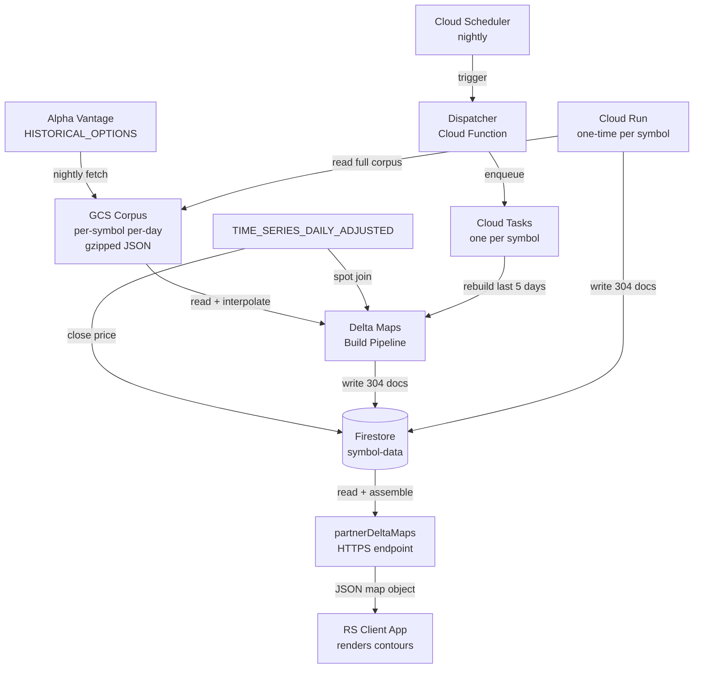

**Topic:** Delta Maps  
**Issue:** #59  
**Topic Parent:** #58  
**Domain:** DELTA-MAPS  
**Type:** PRD  
**Status:** Approved  
**Created:** 2026-08-31  
**Last Updated:** 2026-08-31

## Problem Statement

Consumer applications (RS) need to visualize how options delta levels have moved relative to underlying price over time — "same-delta" contour lines overlaid on a price chart. This reveals how the options market's implied positioning has shifted: the 0.50-delta line tracks roughly at-the-money, lower-delta call contours fan above price, higher-delta call contours below; puts mirror with negative deltas.

Currently, the raw material for this exists — the historical-options corpus stores per-contract `(strike, delta, date, expiration, type)` time series in GCS — but there is no derived data product that a consumer can fetch and render without doing interpolation, expiration selection, and series assembly itself. A consumer would have to fetch raw per-contract time series, select the right expiration per day, interpolate strikes at target delta levels, and assemble contour series — all client-side logic that doesn't belong in a rendering layer.

## Solution

Build a backend data product that pre-computes delta maps and stores them in Firestore, served to consumers via a partner HTTP endpoint (`partnerDeltaMaps`). A delta map is, for each `(symbol, DTE bucket, type)`, a time series of interpolated price levels at 19 fixed delta values (0.05–0.95 for calls, −0.05 to −0.95 for puts). The consumer receives an assembled map object and renders contour lines with zero logic.

The build pipeline reads the historical-options corpus (GCS), selects one expiration per DTE bucket per day using a constant-maturity rule (smallest DTE ≥ target), interpolates the price at each target delta using linear interpolation in strike space, and writes 304 docs per symbol to Firestore. A one-time backfill populates full history per symbol; a nightly daily update rebuilds the last ~5 days to absorb late-arriving corpus data.

## User Stories

### Consumer application developer

1. Fetch a delta map for a symbol and DTE bucket, so that I can render "same-delta" contour lines overlaid on a price chart without performing any interpolation or expiration selection logic.
2. Fetch both call and put delta maps for a symbol and DTE bucket in one request, so that I can render the full delta fan above and below the price line.
3. Fetch only call maps or only put maps for a symbol and DTE bucket, so that I can reduce payload size when I only need one side.
4. Filter a delta map by date range (`from`/`to`), so that I can render a recent view without downloading the full history.
5. Filter a delta map by delta range (`deltaMin`/`deltaMax`), so that I can render only the ATM band or only OTM contours without fetching all 19 levels.
6. Have each contour point include the expiration date it was derived from, so that I can detect roll discontinuities in the contour line.
7. Have the map object include the interpolation method used, so that I know how the contour points were derived.
8. Have each contour point include the interpolated option mark price (`optionMark`), so that I can plot option price nodes on the delta contour line showing what the option at that delta cost on that day.

### System operator

9. Run a one-time backfill to populate delta maps for each symbol to its earliest available corpus data, so that full-history contours are available immediately.
10. Run a nightly daily update to rebuild the last ~5 days of each symbol's delta maps, so that late-arriving corpus data and missed runs are self-healing without manual intervention.
11. Have the daily update run as one Cloud Task per symbol dispatched by a scheduled job, so that a failed symbol retries independently without aborting the night's run.
12. Have delta maps built only for symbols that have historical-options corpus data, so that the pipeline doesn't attempt maps for symbols with no options data.

### Developer

13. Have the build pipeline use a constant-maturity expiration selection rule (smallest DTE ≥ target), so that contour lines stay piecewise-continuous as contracts roll forward.
14. Have the build pipeline produce no point for a (day, DTE bucket, delta) when no qualifying expiration or no bracketing strikes exist, so that the series is sparse and honest rather than padded with fabricated values.
15. Have the interpolation method be a swappable build-time component, so that I can revisit the method if real data shows visible artifacts in the tails without changing the storage schema.
16. Have the build pipeline code live in `functions/src/v2/delta-maps/` with `services/`, `handlers/`, and `jobs/` subdirectories, so that it mirrors the corpus's proven structure and keeps a clean one-directional dependency (delta-maps → corpus, never the reverse).
17. Have the `partnerDeltaMaps` endpoint live in `functions/src/v2/partner/` alongside existing partner endpoints, so that all partner endpoints are in one place.
18. Have the endpoint reject requests with `symbol` but no `dteBucket`, so that a 304-doc response is never attempted.
19. Have the endpoint return 400 with a list of valid DTE buckets when an invalid `dteBucket` is passed, so that the consumer knows what's supported.
20. Have the endpoint return 413 when the assembled response exceeds 10MB, so that the consumer is told to narrow the date range rather than receiving a truncated response.
21. Have the endpoint use the same dual-auth (`authenticateRequestEither`) as existing partner endpoints, so that authentication is consistent across all partner endpoints.
22. Have delta maps stored under `/symbol-data/{symbol}/delta-maps/{dteBucket}-{type}-{delta}`, so that they follow the existing per-symbol subcollection pattern without introducing a new root collection.
23. Have puts stored with negative delta values (−0.05 to −0.95), so that the call/put symmetry is explicit in the data and the actual Greek value is preserved.
24. Have the daily close (spot) come from `TIME_SERIES_DAILY_ADJUSTED` via the existing `sa-time-series` data, so that moneyness derivation by consumers is consistent with every other price-based view in the app.

## Implementation Decisions

### Data source

The historical-options corpus in GCS. Each corpus object is a gzipped JSON at `{prefix}/{SYMBOL}/{YYYY-MM-DD}.json.gz` containing all contracts for that symbol on that date. Each contract carries `strike`, `delta`, `expiration`, `type` (call/put), and `date`. The corpus does not carry the underlying spot price — that is joined from `TIME_SERIES_DAILY_ADJUSTED` close (stored in `symbol-data/{symbol}/sa-time-series/av-daily-adjusted`).

Corpus coverage: QQQ and TQQQ now; SPY and SPXL coming for full time history; selected symbols for one-year history. The pipeline produces maps for whichever symbols have corpus data — no separate symbol list to maintain.

### DTE buckets

8 constant-maturity DTE buckets: `1wk, 2wk, 1mo, 2mo, 3mo, 6mo, 12mo, 24mo`. Each DTE bucket produces a call map and a put map. Target DTEs: 7, 14, 30, 60, 90, 180, 365, 730.

### Expiration selection rule

Smallest DTE ≥ target (constant-maturity construction). For each (day, DTE bucket), the pipeline selects the expiration with the smallest days-to-expiration that is at or above the DTE bucket's target DTE. If no expiration meets this criterion, no point is produced for that DTE bucket on that day (sparse at the DTE bucket level).

### Delta ladder

0.05 to 0.95 in 0.05 increments = 19 levels. Calls: positive (0.05, 0.10, ..., 0.95). Puts: negative (−0.05, −0.10, ..., −0.95), mirroring the call ladder. 0.00 and 1.00 are excluded — they are asymptotes with no finite strike.

### Interpolation

Linear in strike space. For each (day, DTE bucket, type, target-delta), find the two bracketing contracts (delta₁ < target < delta₂), then interpolate: `price = strike₁ + (target − delta₁)/(delta₂ − delta₁) × (strike₂ − strike₁)`. The same interpolation weights are applied to the bracketing contracts' `mark` prices to derive `optionMark`: `optionMark = mark₁ + (target − delta₁)/(delta₂ − delta₁) × (mark₂ − mark₁)`. If no bracketing pair exists for a target delta on a given day, that target delta's series gets no point for that day (sparse, no padding, no extrapolation).

The interpolation method is a swappable build-time component. The stored `interpolationMethod` field records which method produced each doc. If a future analysis shows visible artifacts in the tails (far OTM/ITM on sparse-strike symbols), the build pipeline can be re-run with a different method — the storage schema doesn't change.

### Storage schema

304 docs per symbol at `/symbol-data/{symbol}/delta-maps/{dteBucket}-{type}-{delta}`.

Doc ID format: `{dteBucket}-{type}-{delta}` with explicit sign (e.g., `1mo-call-0.50`, `1mo-put--0.50`, `3mo-call-0.25`).

Doc body:
```json
{
  "symbol": "QQQ",
  "dteBucket": "1mo",
  "type": "call",
  "delta": 0.50,
  "series": [
    { "date": "2024-01-02", "price": 387.50, "expiration": "2024-02-16", "optionMark": 4.25 },
    { "date": "2024-01-03", "price": 388.25, "expiration": "2024-02-16", "optionMark": 4.18 }
  ],
  "lastUpdated": "2026-08-31T19:30:00Z",
  "interpolationMethod": "linear-strike"
}
```

- `series` is sparse — absent days mean no bracketing data existed. No padding, no nulls, no extrapolation.
- `price` is the interpolated price at which delta equals the target value (not a real strike from the chain — a derived value between two real strikes).
- `optionMark` is the interpolated option mark price at the same strike, derived from the same two bracketing contracts' `mark` values using the same interpolation weights. Enables consumers to plot option price nodes on the delta contour line.
- `expiration` is the expiration date of the contract whose data was interpolated (for roll detection).
- `lastUpdated` is the timestamp of the last build run that touched this doc.
- `interpolationMethod` records the method used (currently `"linear-strike"`).

Series doc size: ~5,000 points × ~48 bytes ≈ 240KB per doc for full-history symbols. Well under Firestore's 1MB limit. No sharding needed.

### Backfill

One Cloud Run job per symbol. The job reads that symbol's entire corpus from GCS (streaming, with parallelism for concurrent reads), folds the data into 304 series-docs, and writes them to Firestore. Backfills each symbol to its earliest corpus doc. Cloud Run is chosen over Cloud Functions 2nd-gen for the 60-minute timeout — a full-history symbol (QQQ, ~5,000 trading days) is estimated at 5–15 minutes with parallel GCS reads.

### Daily update

Scheduled dispatcher (Cloud Scheduler, nightly) + one Cloud Task per symbol. Each task rebuilds the last ~5 trading days of that symbol's 304 docs (read-modify-write: truncate last 5 days' points, append new points). The 5-day window is tunable and self-heals gaps from late-arriving corpus data or missed runs. Cloud Tasks provides automatic retries and rate-limiting per symbol.

### Partner endpoint

`partnerDeltaMaps` — HTTPS endpoint in `functions/src/v2/partner/`.

Query params:
- `symbol` (required) — ticker symbol, case-insensitive
- `dteBucket` (required) — one of: `1wk, 2wk, 1mo, 2mo, 3mo, 6mo, 12mo, 24mo`
- `type` (optional) — `call` or `put`; omit for both
- `from` (optional) — inclusive start date (YYYY-MM-DD)
- `to` (optional) — inclusive end date (YYYY-MM-DD)
- `deltaMin` (optional) — minimum delta value (filters which delta-series are included in the map)
- `deltaMax` (optional) — maximum delta value

Response: assembled map object(s). One map per (DTE bucket, type) combination. Each map:
```json
{
  "ok": true,
  "symbol": "QQQ",
  "dteBucket": "1mo",
  "type": "call",
  "interpolationMethod": "linear-strike",
  "lastUpdated": "2026-08-31T19:30:00Z",
  "deltas": [0.05, 0.10, 0.15, 0.20, 0.25, 0.30, 0.35, 0.40, 0.45, 0.50, 0.55, 0.60, 0.65, 0.70, 0.75, 0.80, 0.85, 0.90, 0.95],
  "series": {
    "0.05": [{ "date": "2024-01-02", "price": 410.25, "expiration": "2024-02-16", "optionMark": 0.32 }],
    "0.10": [{ "date": "2024-01-02", "price": 405.50, "expiration": "2024-02-16", "optionMark": 0.85 }],
    ...
    "0.95": [{ "date": "2024-01-02", "price": 350.10, "expiration": "2024-02-16", "optionMark": 38.40 }]
  }
}
```

When `type` is omitted, the response contains two map objects (call + put). When `type` is specified, one map object.

Error handling:
- Missing `symbol` or `dteBucket` → 400
- Invalid `dteBucket` → 400 with list of valid DTE buckets
- `symbol` without `dteBucket` → 400 (too broad)
- Symbol not in corpus → 404
- Response > 10MB → 413 (consumer should narrow with `from`/`to`)
- Auth: dual-auth via `authenticateRequestEither` (Firebase ID token OR Google OIDC SA in allowlist), matching existing partner endpoints

### Code placement

- `functions/src/v2/delta-maps/` — build pipeline (backfill + daily update)
  - `services/` — interpolation, expiration selection, series assembly, Firestore writer
  - `handlers/` — Cloud Run entry point for backfill, Cloud Task entry point for daily update
  - `jobs/` — scheduled dispatcher
- `functions/src/v2/partner/` — `partnerDeltaMaps` endpoint

Dependency direction: delta-maps → corpus (reads via `GcsCorpusAdapter`), never the reverse.

### Security rules

No new rules needed. The existing `symbol-data/{document=**}` rule allows reads for all and writes for admin. Backend functions use Admin SDK (bypasses rules) for writes. Delta maps inherit this coverage automatically.

## Testing Decisions

### What makes a good test

Test external behavior, not implementation details. The highest-value tests for this feature are:

1. **Interpolation correctness (pure function)** — given a set of `(strike, delta)` pairs and a target delta, the interpolator returns the correct interpolated price. This is the core algorithmic logic and should be exhaustively unit-tested with edge cases (bracket at boundary, no bracket, identical deltas, single contract).

2. **Expiration selection correctness (pure function)** — given a set of expirations with DTEs and a target DTE bucket, the selector returns the correct expiration (smallest DTE ≥ target) or nothing (no qualifying expiration).

3. **Series assembly (pure function)** — given per-day `(strike, delta)` data for a symbol/DTE bucket/type, the assembler produces the correct 19 series with sparse handling.

4. **Partner endpoint integration** — given Firestore docs in the expected shape, the endpoint returns the correct assembled map object with filtering (date range, delta range, type) applied. Test via the handler function with mocked Firestore reads.

5. **Backfill end-to-end** — given a small corpus fixture (a few days of GCS objects), the backfill produces the correct 304 docs in Firestore. This is the highest-seam test and gives the most confidence.

### Modules to be tested

- Interpolation service (pure functions)
- Expiration selection service (pure functions)
- Series assembly service (pure functions)
- Firestore writer (mocked Firestore)
- Partner endpoint handler (mocked Firestore reads)
- Backfill job (mocked GCS + Firestore)

### Prior art

- `functions/tests/v2/historical-options-corpus/` — existing corpus tests for GCS adapter, time-series builder, nightly service
- `functions/tests/v2/partner/` — existing partner endpoint tests with mocked auth and Firestore

## Out of Scope

- **RS internal UI for viewing delta maps** — separate Topic in the RS repo. This PRD covers only the SA backend data product + partner endpoint.
- **Real-time delta maps** — this is a daily-updated product, not real-time. Intraday delta maps from `OPTIONS_CHAIN` (realtime) are a future possibility.
- **Greeks other than delta** (gamma, theta, vega, rho) — this Topic is delta-only. Other Greek maps could follow the same pattern but are separate Topics.
- **Named ATM/ITM/OTM presets** — the `deltaMin`/`deltaMax` range filter lets consumers define their own cutoffs. Named presets (e.g., `slice=atm` mapping to 0.30–0.70) can be added later as sugar over the range filter.
- **Single-contour fetch** — the endpoint serves maps (the (symbol, DTE bucket, type) unit), not individual delta series. A `delta` query param for single-contour fetch is not included; can be added as a separate endpoint if needed.
- **Response compression (gzip)** — not included in this spec. The `from`/`to` filter is the primary size mitigation. Compression can be added if payload size becomes a problem at scale.

## Further Notes

### Open items for Blueprint stage

1. **Cloud Task queue configuration** — retry limits, rate limits, concurrency for the daily dispatcher. Blueprint implementation detail.
2. **Cloud Run job configuration** — memory, timeout, concurrency for the backfill job. Blueprint implementation detail.
3. **Interpolation accuracy validation** — a concrete method to validate that interpolated prices are accurate (e.g., compare against AV's own delta at exact strikes, or against a Black-Scholes model). Acceptance criterion for the implementation.
4. **ATM/ITM/OTM house convention** — the project may want to document a recommended delta range for "ATM band" in the API docs (e.g., 0.30–0.70). Not a code decision, but a documentation decision.

### System context diagram


