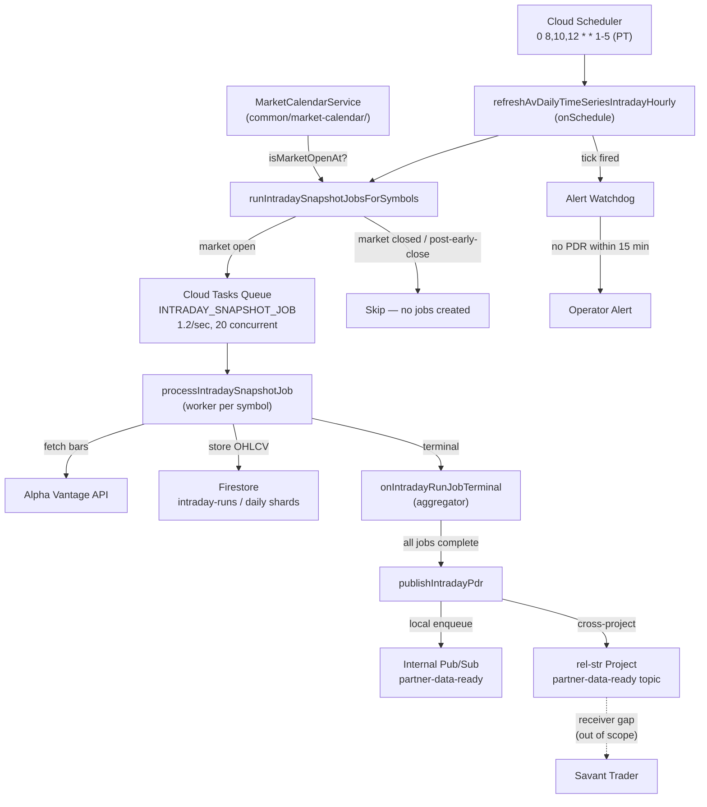

**Topic:** Fix Intraday PRE Delivery Reliability  
**Topic Slug:** intraday-run-reliability  
**Issue:** #64  
**Topic Parent:** #63  
**Domain:** AV-ENDPOINTS  
**Type:** PRD  
**Status:** Complete  
**Created:** 2026-09-09  
**Last Updated:** 2026-09-09  

## Problem Statement

The intraday PRE pipeline seems brittle. It works for weeks at a time, then breaks silently — often because of a code change that appears unrelated to the pipeline itself. The operator finds out from the consumer (Savant Trader), not from the producer (Savant API). There is no automated alerting; the operator must proactively check a dashboard to discover that runs are missing or delayed. The pipeline has no test coverage for its core components (scheduler, worker, aggregator, PDR publisher), so code changes to shared modules, constants, or Firestore collection names can silently break the flow with no regression net.

**Terminology:** A "tick" is one scheduled invocation of the intraday pipeline. The scheduler fires three ticks per trading day at 0800, 1000, and 1200 PT. Each tick creates a run, enqueues ~865 jobs, and publishes a PDR on completion.

The core problem is **general pipeline health**: the operator cannot trust that the pipeline will run flawlessly every trading day, cannot detect failures without manual monitoring, and cannot prevent regressions without tests. Individual incidents — such as the Labor Day 2026-09-07 holiday backlog, where 865 jobs were created on a closed market and delayed the next trading day's 08:00 tick by approximately 5 hours — are symptoms of the broader health gap, not the full scope. Intermittent failures also occur on normal trading days with no diagnosed root cause.

## Solution

Make the intraday PRE pipeline run reliably every trading day at 0800, 1000, and 1200 PT — like clockwork — by addressing five areas of pipeline health:

1. **Automated alerting** — notify the operator when a scheduled tick doesn't produce a PDR within the expected time window, so failures are detected from SA before ST notices.
2. **Test coverage** — add unit and integration tests for every pipeline component so code changes can't silently break the flow.
3. **Self-healing** — detect and force-complete stale runs from a previous tick before the next tick creates jobs, so backlogs don't cascade across ticks.
4. **PDR delivery SLA** — establish and monitor the expected delivery time for each tick so the operator can distinguish normal latency from a problem.
5. **Market holiday awareness** — prevent the scheduler from creating jobs on non-trading days and post-early-close ticks, eliminating one known failure mode.

## User Stories

1. As the SA operator, I want the intraday scheduler to skip non-trading days entirely, so that holiday jobs never create queue backlogs.
2. As the SA operator, I want the intraday scheduler to skip ticks that fire after an early-close time, so that post-close ticks don't generate retrying jobs.
3. As the SA operator, I want a single MarketCalendarService that wraps the holiday data source, so that the calendar source of truth is centralized and reusable.
4. As the SA operator, I want the MarketCalendarService to fail loudly when the requested year isn't covered by the holiday data, so that a missing year is a visible error, not a silent empty list.
5. As the SA operator, I want the market holiday data to live in a shared common location, so that both the intraday scheduler and the partner endpoint use the same source of truth.
6. As the SA operator, I want to be notified automatically when an intraday tick doesn't produce a PDR within the expected time window, so that I find out from SA before ST notices.
7. As the SA operator, I want the pipeline to have comprehensive test coverage, so that code changes in shared modules can't silently break the intraday flow.
8. As the SA operator, I want stale runs from a previous tick to be force-completed before the next tick creates jobs, so that backlogs don't cascade across ticks.
9. As the SA operator, I want to know the expected PDR delivery time for each tick, so that I can distinguish normal latency from a problem.
10. As the SA operator, I want the intraday pipeline to recover without manual intervention when a run degrades, so that the next tick starts clean.
11. As the SA operator, I want the alerting to produce structured health signals, so that the future Run Status Dashboard (Topic #61) can consume the same data.
12. As the SA operator, I want the calendar gate to apply to both scheduled and manual invocations, so that a manual trigger on a holiday is also blocked.

## Implementation Decisions

### Market Calendar Service

- Create a `MarketCalendarService` in `common/market-calendar/` that wraps the static holiday data.
- Move `market-holidays.data.ts` from `partner/` to `common/market-calendar/` alongside the service.
- The service exposes:
  - `isTradingDay(date)` — returns false for weekends and NYSE-observed holidays
  - `isMarketOpenAt(date, clockPt)` — returns false if the market is closed or if the tick fires after an early-close time
  - `getEarlyCloseEt(date)` — returns the early-close time (e.g. "13:00") or null
- The service includes a loud year-coverage guard: if the requested year is not present in the static data, it throws or logs an alert. It never silently returns an empty list.
- The static holiday list covers 2025-2026 and must be updated annually. This is a documented operational task.

### Calendar Gate

- The calendar gate lives inside `runIntradaySnapshotJobsForSymbols`, before any jobs are created. This ensures both scheduled and manual invocations are gated.
- The existing weekend guard in the scheduler is replaced by the `MarketCalendarService.isMarketOpenAt()` call, which subsumes weekend checking.
- The worker stays unchanged. If a job exists, the market was open when it was created. An empty AV response is treated as a transient failure and retried through the normal Cloud Tasks retry config.

### Automated Alerting

- A watchdog mechanism monitors whether each scheduled tick (0800, 1000, 1200 PT) produces a PDR within the SLA window.
- The alert fires through Cloud Logging alerts (or equivalent infrastructure) — not a new UI dashboard.
- The alert includes the tick time, the expected PDR delivery deadline, and a link to the relevant run doc in Firestore.
- The alerting produces structured health signals (e.g. Firestore health docs or Pub/Sub messages) that the future Run Status Dashboard (Topic #61) can consume.

### Self-Healing

- Before creating jobs for a new tick, the scheduler checks for any IN_PROGRESS run from a previous tick on the same market date.
- If a stale run is found, it is force-completed (marked COMPLETE with a stale-run indicator) so its lingering jobs don't block the new tick.
- The existing reconcile path in the aggregator (which handles runs exceeding `INTRADAY_MAX_RUN_DURATION_MS`) is preserved as a secondary safety net.

### Test Coverage

- Unit tests for `MarketCalendarService`: trading days, holidays, weekends, early-close days, year-coverage guard.
- Integration tests for the scheduler: verify it skips holidays, weekends, post-early-close ticks; verify it creates jobs on normal trading days.
- Integration tests for the aggregator: verify PDR publication on completion, verify force-completion of stale runs.
- Unit tests for the alerting watchdog: verify alerts fire when PDR is not delivered within the SLA window.
- Prior art: `trading-calendar.service.test.ts` in the historical-options-corpus tests.

### PDR Delivery SLA

- The expected end-to-end latency is ~25 minutes (SA trigger → run 5-10 min → PDR → ST processing 10-15 min → ST data ready).
- The SA-side SLA is: PDR published within 15 minutes of the scheduled tick time (0800, 1000, 1200 PT).
- If no PDR is published within 15 minutes, the watchdog fires an alert.
- The 25-minute end-to-end latency is not targeted for reduction in this Topic. It has been consistent when the pipeline works. This Topic targets reliability and detection, not latency optimization.

## Testing Decisions

- **What makes a good test:** test external behavior, not implementation details. The scheduler should be tested by verifying its observable effects (jobs created vs. skipped, run doc state), not by mocking internal function calls.
- **Modules to be tested:** MarketCalendarService, intraday scheduler (`runIntradaySnapshotJobsForSymbols`), intraday aggregator (`onIntradayRunJobTerminal`), alerting watchdog.
- **Prior art:** `trading-calendar.service.test.ts` (historical-options-corpus) for calendar testing patterns. The existing `av-intraday-aggregate.test.ts` for bar aggregation patterns.
- **Test seams:** the scheduler's Firestore writes and Cloud Tasks enqueues are the highest seams. Tests should verify the decision (create jobs vs. skip) without requiring a live Cloud Tasks queue.

## Out of Scope

- **rel-str receiver interval contract fix** — the `processDataReadyRunV2_missing_interval_contract` error is in the rel-str repo. The SA-side PDR payload format is correct. The receiver needs to add `intraday` to its contract registry. That is a separate effort.
- **Nightly pipeline reliability** — the nightly pipeline exhibits similar brittleness but will be addressed as a separate Topic/Thread.
- **UI run monitoring dashboard** — Topic #61 covers the dashboard. This Topic produces health signals the dashboard can consume, but the dashboard itself is out of scope.
- **PDR payload format changes** — the current `intervals: [intraday]` with `phase: PRE` format is correct for the intended use case.
- **Queue isolation or concurrency redesign** — the existing Cloud Tasks rate limiter (1.2/sec, 20 concurrent) is sufficient. The holiday backlog is prevented at the source by the calendar gate, not by queue reconfiguration.
- **Latency optimization** — the 25-minute end-to-end latency is consistent and not targeted for reduction.

## Technical Context

- The intraday scheduler runs via `onSchedule` at `0 8,10,12 * * 1-5` in `America/Los_Angeles` timezone.
- ~865 tracked symbols are processed per tick, enqueued as individual Cloud Tasks at 1.2 dispatches/sec (72/min, under AV's 75/min limit).
- Each job fetches the latest AV intraday bars, aggregates them into a single OHLCV bar, and writes to Firestore (daily/weekly/monthly shards).
- On run completion, the aggregator publishes a Partner Data Ready (PDR) message locally and cross-project to the rel-str `partner-data-ready` topic.
- The existing `INTRADAY_MAX_RUN_DURATION_MS` is 20 minutes. The reconcile path handles runs that exceed this window.
- The static holiday list in `market-holidays.data.ts` covers 2025-2026 and includes early-close metadata.
- The pipeline has extensive structured logging at every step (entry/exit logs with runId + clockPt). The gap is proactive notification, not logging.

## System Context

## Further Notes

- The existing `TradingCalendarService` in `historical-options-corpus/services/` is rule-based and stays where it is. It is not used by the intraday pipeline. The intraday pipeline uses the static `market-holidays.data.ts` as its source of truth because it is authoritative (manually verified, includes special closures and early-close metadata).
- The annual holiday list update is a manual operational task. The year-coverage guard makes a missing year a loud failure (throw or alert), not a silent empty list that causes the same holiday backlog problem.
- The alerting watchdog should be designed to produce data that the future Run Status Dashboard (Topic #61) can consume — e.g. Firestore health docs with runId, tick time, PDR delivery status, and alert state.
- The stale-run force-completion logic should distinguish between "stale because of a known holiday backlog" and "stale because of a genuine AV outage" so the alert message is actionable.
