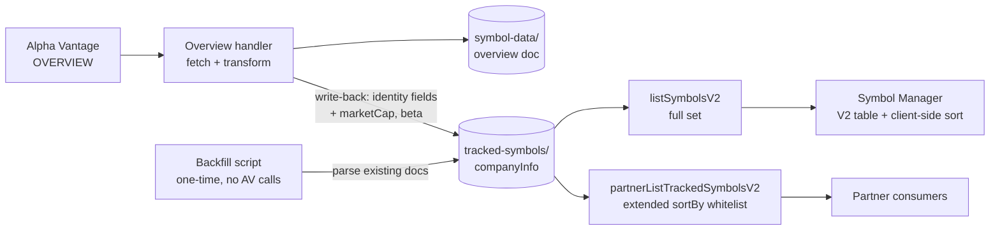

**Topic:** Add Company Overview Data to Symbol Manager  
**Topic Slug:** symbol-manager-company-overview  
**Thread:** Add Company Overview Data to Symbol Manager  
**Thread Slug:** add-company-overview  
**Issue:** #91  
**Thread Parent:** #89  
**Topic Parent:** #88  
**Domain:** SYMBOL-MANAGER  
**Type:** PRD  
**Status:** Approved  
**Created:** 2026-09-20  
**Last Updated:** 2026-09-20  

# PRD — Add Company Overview Data to Symbol Manager

## Problem Statement

The Symbol Manager V2 table displays only the identity fields captured at symbol-add time (symbol, name, type, region, timezone, currency, match score) plus system fields. The company overview data the backend already fetches — stored on each tracked symbol as `companyInfo` — is invisible to the user. There is no way to see which sector or industry a tracked symbol belongs to, how large it is, or its volatility proxy (beta), and no way to sort the tracked-symbol list by any of these dimensions.

## Solution

Surface company overview data in the Symbol Manager V2 table and make it sortable:

1. **Four new columns** — `Sector`, `Industry`, `Market Cap`, `Beta` — rendered from `companyInfo` plus two new numeric fields.
2. **Client-side sorting** on displayed columns. The view already loads the full tracked set (`limit=10000`; ~921 symbols today) and paginates via a computed signal — sorting the filtered array before slicing produces global ordering identical to server-side sort, with zero backend cost.
3. **Two new denormalized numeric fields** — `companyInfo.marketCap` and `companyInfo.beta` — written by the existing company-overview write-back, parsed from AV's string values (see ADR 0001).
4. **A one-time backfill script** that populates `marketCap`/`beta` (and any missing `companyInfo`) on existing tracked-symbol docs by reading the already-stored `symbol-data` overview documents — zero AV API calls.

## User Stories

1. As a Symbol Manager user, I want a Sector column in the symbols table, so that I can see each symbol's sector at a glance.
   - *Verify:* the table renders `companyInfo.Sector` for each row; symbols without `companyInfo` show a placeholder (`—`).
2. As a Symbol Manager user, I want an Industry column, so that I can distinguish sub-industry groupings within a sector.
   - *Verify:* the table renders `companyInfo.Industry` per row; placeholder when absent.
3. As a Symbol Manager user, I want a Market Cap column formatted for readability, so that large numbers are scannable.
   - *Verify:* `companyInfo.marketCap` renders as `$X.XXT` / `$X.XB` / `$XM`; placeholder when absent.
4. As a Symbol Manager user, I want a Beta column, so that I can gauge relative volatility.
   - *Verify:* `companyInfo.beta` renders with two decimals; placeholder when absent.
5. As a Symbol Manager user, I want to click a column header to sort ascending/descending, so that I can rank the list by that dimension.
   - *Verify:* clicking a sortable header reorders the full loaded set (sort applies before the page slice); the first page reflects global ordering, not just the loaded page.
6. As a Symbol Manager user, I want market-cap sorting to order numerically, so that `$9B` does not rank above `$1T`.
   - *Verify:* sorting by Market Cap desc orders NVDA-scale values before small caps — numeric, not lexicographic.
7. As a Symbol Manager user, I want sorting to compose with pagination, so that page 2 of a market-cap-desc sort continues the global ranking.
   - *Verify:* changing sort then paging returns the correct slice of the sorted set.
8. As a Symbol Manager user, I want the default view unchanged (symbol, ascending), so that existing behavior is preserved when I haven't chosen a sort.
   - *Verify:* initial load orders by symbol ascending as today.
9. As a Symbol Manager user, I want ETFs and symbols still onboarding not to break sorted views, so that sorting by sector doesn't produce errors or misleading rows.
   - *Verify:* rows missing the sorted field always sort to the end regardless of direction, rather than disappearing or erroring; the full loaded list is always rendered.
10. As the system, when a new symbol completes onboarding, I want `companyInfo` including `marketCap` and `beta` written to its tracked-symbol doc, so that it participates in display and sorting immediately.
    - *Verify:* after a successful OVERVIEW fetch, the tracked-symbol doc contains `companyInfo.marketCap` (number) and `companyInfo.beta` (number); absent when AV omits them (e.g., recent IPOs).
11. As an operator, I want existing tracked symbols backfilled with `marketCap`/`beta` without hitting the AV API, so that sorting works fleet-wide immediately rather than waiting for TTL expiry.
    - *Verify:* running the backfill script writes numeric fields parsed from each symbol's existing `symbol-data` overview doc; a re-run is idempotent.
12. As a partner API consumer, I want `sortBy` on the tracked-symbols endpoint to accept the new fields, so that integrations can retrieve the same ordering.
    - *Verify:* `partnerListTrackedSymbolsV2?sortBy=companyInfo.marketCap&sortDirection=desc` returns the numeric ordering; invalid values fall back to `symbol` as today.

## Technical Context

- `marketCap` and `beta` are only as fresh as the symbol's last OVERVIEW refresh (TTL ~7–30 days). Sorted order is approximate within that window — acceptable for ranking.
- UI sorting is client-side over the full loaded set (fetch cap 10,000; ~921 symbols today). If tracked symbols ever exceed the fetch cap, sorting silently covers only the loaded slice — the view must surface this (see Implementation Decisions).
- For the **partner endpoint**, Firestore `orderBy` on a field implicitly filters out documents missing it — the ~45 ETFs and mid-onboarding symbols drop out of partner-sorted views. Accepted per grilling.
- `MarketCapitalization` and `Beta` are strings in the AV payload; they are parsed to numbers at write-back time.
- The partner `sortBy` whitelist (`'symbol' | 'lastUpdated'`) is extended; invalid values keep the current `symbol` fallback.

## Implementation Decisions

- `TrackedSymbolCompanyInfo` gains optional numeric `marketCap` and `beta`; the overview handler's write-back parses `MarketCapitalization`/`Beta` and omits them when absent or non-numeric (see ADR 0001 for the trade-off).
- **UI sorting is client-side**: the existing `onSortChange`/`matSort` scaffold (already imported, currently a dead stub) drives a sort step inside the `filteredSymbols → displayedSymbols` computed chain — sort before slice, so ordering is global across the loaded set.
- Client-side guard: when `response.total > symbols.length` (fetched slice < total), surface a notice that sorting covers only the loaded subset.
- `ListSymbolsOptions.sortBy` widens to a whitelist for partner/internal callers: `symbol`, `name`, `type`, `region`, `currency`, `_createdAt`, `_lastUpdated`, `companyInfo.Sector`, `companyInfo.Industry`, `companyInfo.Country`, `companyInfo.marketCap`, `companyInfo.beta`.
- `firestore.indexes.json` gains composite indexes `(_isActive ASC, companyInfo.X ASC)` for each new server-sortable `companyInfo` field (required for `where(_isActive==true).orderBy(companyInfo.X)`).
- The V2 table gains `matSort` headers on the four new columns plus existing text columns.
- The backfill is a standalone script under `functions/scripts/` (consistent with existing diagnostics/backfill conventions), reading `symbol-data/{SYM}/company-overview/av-company-overview` and writing parsed fields onto `tracked-symbols/{SYM}`.
- No response-shape changes: `companyInfo` already serializes through `listSymbolsV2` and `partnerListTrackedSymbolsV2`; only `sortBy` enum values are added.

## Testing Decisions

- **Unit (Jest)**: AV-string → number parsing (valid, `"None"`, missing, malformed); sortBy whitelist fallback behavior; market-cap display formatting.
- **Integration**: `listSymbolsV2` sort contract — real query options produce correctly ordered results against emulator or a verify script.
- **Verification script**: per project convention, a permanent script under `functions/scripts/verify/` exercising the real endpoint's new sort values.
- **Prior art**: existing symbol-manager store/service tests, `functions/tests/v2/partner/historical-options-partner.test.ts` for partner-endpoint contract style.

## Out of Scope

- Sector/industry **filtering** UI (sorting only this Thread).
- A detail view for the remaining `companyInfo` fields (Description, Address, OfficialSite, FiscalYearEnd, CIK).
- Full company-overview drill-down (volatile fundamentals: ratios, analyst data) — separate feature.
- Stored realized volatility (computed from daily bars) or implied-volatility aggregation — evaluated and deferred.
- Market-cap data for ETFs (AV OVERVIEW returns nothing for them).

## System Context

